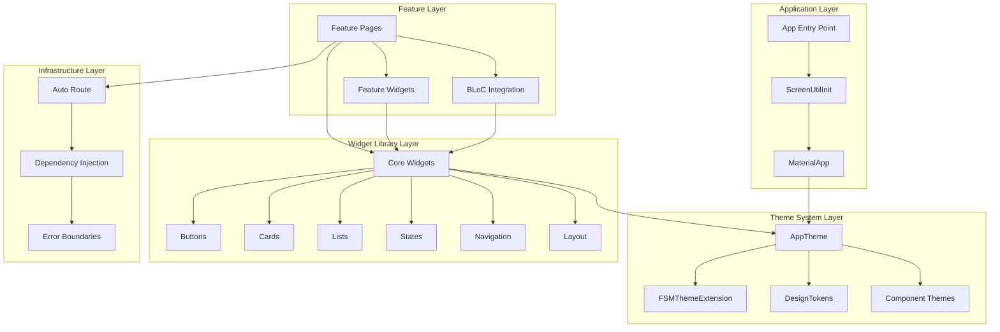

# Design Document

## Overview

This design document outlines the comprehensive architecture for refactoring the Flutter presentation layer into a production-ready design system. The solution eliminates hardcoded styling violations, consolidates duplicate components, enforces strict theming patterns through strongly-typed extensions, and establishes responsive design tokens while maintaining identical UX behavior.

The architecture follows Material 3 principles with FSM-specific domain extensions, leverages flutter_screenutil for responsive design, implements BLoC optimization patterns, and provides a component-based widget library with centralized theming and performance optimizations.

**Key Design Decisions:**
- **Material 3 Composition over Inheritance**: Wrap Material widgets rather than extending them for better maintainability and theme consistency
- **Strongly-Typed Domain Colors**: FSMThemeExtension provides compile-time safety and prevents hardcoded color usage
- **8pt Grid System**: Consistent spacing scale through DesignTokens with responsive helpers
- **Performance-First Approach**: Const constructors, RepaintBoundary usage, and optimized BLoC patterns
- **Zero Tolerance for Violations**: CI enforcement of theming rules and import hygiene

## Architecture

### System Architecture

The design system follows a layered architecture with clear separation of concerns and dependency injection through get_it. The architecture ensures strict theming compliance, performance optimization, and maintainable code organization.



### Design Principles

1. **Strict Theming Compliance**: Zero tolerance for hardcoded Colors.* usage (except Colors.transparent)
2. **Strongly-Typed Domain Colors**: FSMThemeExtension provides compile-time safety for domain-specific colors
3. **Responsive-First Design**: All spacing, sizing, and typography uses flutter_screenutil with consistent design tokens
4. **Performance Optimization**: Const constructors, RepaintBoundary usage, and BLoC rebuild optimization
5. **Component Composition**: Wrap Material widgets rather than inheritance for better maintainability
6. **Clean Architecture**: Pages under 300 lines, clear separation between presentation and business logic

### Project Structure

The design system follows clean architecture principles with clear separation between core infrastructure, shared widgets, and feature-specific implementations. This structure addresses Requirements 2.2, 2.3, and 4.2 for organized components and clean page architecture.

```
lib/
├── core/
│   ├── theme/
│   │   ├── app_theme.dart              # Material 3 theme configuration (Req 6.1, 6.4)
│   │   ├── design_tokens.dart          # Centralized spacing, sizing, responsive tokens (Req 1.3, 3.4)
│   │   ├── extensions/
│   │   │   └── fsm_theme_extension.dart # Strongly-typed domain colors (Req 1.2, 6.1)
│   │   ├── app_dimensions.dart         # @Deprecated - migrate to DesignTokens
│   │   ├── app_colors.dart             # @Deprecated - migrate to FSMThemeExtension
│   │   └── theme.dart                  # Barrel export
│   ├── widgets/
│   │   ├── buttons/
│   │   │   ├── fsm_button.dart         # Unified button with variants (Req 2.1, 6.2)
│   │   │   └── fsm_icon_button.dart    # Icon-only button component
│   │   ├── cards/
│   │   │   ├── fsm_card.dart           # Base card with theme integration (Req 9.3)
│   │   │   └── fsm_list_card.dart      # Optimized list item cards
│   │   ├── states/
│   │   │   ├── fsm_empty_state.dart    # Unified empty state component (Req 2.5)
│   │   │   ├── fsm_error_state.dart    # Error handling component (Req 2.5)
│   │   │   └── fsm_loading_indicator.dart # Loading states with shimmer
│   │   ├── layout/
│   │   │   ├── fsm_section_header.dart # Section headers with consistent styling
│   │   │   └── fsm_info_row.dart       # Information display rows
│   │   ├── inputs/
│   │   │   ├── fsm_search_bar.dart     # Themed search input
│   │   │   └── fsm_filter_chip_group.dart # Filter chip components
│   │   ├── navigation/
│   │   │   ├── fsm_drawer.dart         # Navigation drawer
│   │   │   └── fsm_bottom_sheet.dart   # Bottom sheet components (Req 2.5)
│   │   ├── feedback/
│   │   │   ├── fsm_status_badge.dart   # Status indicators with domain colors
│   │   │   └── fsm_priority_indicator.dart # Priority visual indicators
│   │   ├── media/
│   │   │   └── fsm_optimized_image.dart # Performance-optimized image loading
│   │   └── widgets.dart                # Single barrel export for all widgets (Req 2.3, 8.4)
│   ├── navigation/
│   │   ├── app_router.dart             # Auto Route configuration
│   │   ├── route_guards.dart           # Authentication guards
│   │   └── navigation.dart             # Navigation barrel export
│   └── utils/
│       ├── bloc_build_conditions.dart  # Reusable buildWhen patterns (Req 5.4, 5.5)
│       └── bloc_listener_helpers.dart  # Common BLoC listener patterns (Req 5.2)
└── features/
    └── [feature_name]/
        └── presentation/
            ├── pages/                  # Page implementations (max 300 LOC) (Req 4.1)
            ├── widgets/                # Feature-specific widgets (Req 4.2)
            └── blocs/                  # Feature BLoCs with optimization patterns (Req 5.1-5.6)
```

## Components and Interfaces

### Core Theme System

The theme system provides strongly-typed, responsive design tokens with Material 3 integration and FSM-specific domain colors.

#### 1. DesignTokens - Centralized Responsive System

**Addresses Requirements:** 1.3, 1.8, 3.2, 3.3, 3.4, 3.5, 3.6

The DesignTokens class provides a centralized 8pt grid system with responsive helpers that eliminate hardcoded spacing and sizing values throughout the application.

```dart
class DesignTokens {
  DesignTokens._();

  // SPACING SCALE (8pt grid) - Requirement 1.3
  static const double space0 = 0;
  static const double space1 = 4;   // 0.5x
  static const double space2 = 8;   // 1x base
  static const double space3 = 12;  // 1.5x
  static const double space4 = 16;  // 2x
  static const double space5 = 20;  // 2.5x
  static const double space6 = 24;  // 3x
  static const double space8 = 32;  // 4x
  static const double space10 = 40; // 5x
  static const double space12 = 48; // 6x (minimum touch target - Req 3.6)
  static const double space16 = 64; // 8x

  // ICON SIZES - Requirement 3.4
  static const double iconSmall = 16;
  static const double iconMedium = 24;
  static const double iconLarge = 32;
  
  // BORDER RADIUS - Requirement 3.4
  static const double radiusSmall = 4;
  static const double radiusMedium = 8;
  static const double radiusLarge = 12;
  static const double radiusXLarge = 16;

  // RESPONSIVE HELPERS - Requirements 1.8, 3.3
  static REdgeInsets get paddingAllSmall => REdgeInsets.all(space2);
  static REdgeInsets get paddingAllMedium => REdgeInsets.all(space4);
  static REdgeInsets get paddingAllLarge => REdgeInsets.all(space6);
  
  // Responsive SizedBox helpers using RSizedBox - Requirement 1.8
  static Widget verticalSpace(double height) => RSizedBox(height: height);
  static Widget horizontalSpace(double width) => RSizedBox(width: width);
  
  static const verticalSpaceSmall = RSizedBox(height: space2);
  static const verticalSpaceMedium = RSizedBox(height: space4);
  static const verticalSpaceLarge = RSizedBox(height: space6);
  
  // BREAKPOINT HELPERS - Requirement 3.5
  static bool get isMobile => 1.sw < 600;
  static bool get isTablet => 1.sw >= 600 && 1.sw < 1200;
  static bool get isDesktop => 1.sw >= 1200;
  
  // MINIMUM TOUCH TARGETS - Requirement 3.6
  static const double minTouchTarget = 48;
  static RSize get minTouchSize => RSize(minTouchTarget, minTouchTarget);
}
```

#### 2. FSMThemeExtension - Domain-Specific Color System

**Addresses Requirements:** 1.1, 1.2, 6.1, 6.4

The FSMThemeExtension provides strongly-typed domain colors that eliminate hardcoded Colors.* usage and ensure compile-time safety for FSM-specific color requirements.

```dart
@immutable
class FSMThemeExtension extends ThemeExtension<FSMThemeExtension> {
  // Strongly-typed domain colors for compile-time safety - Requirement 1.2
  final Color workOrderUrgent;
  final Color workOrderHigh;
  final Color workOrderMedium;
  final Color workOrderLow;
  
  final Color statusPending;
  final Color statusInProgress;
  final Color statusCompleted;
  final Color statusCancelled;
  
  // Component-specific colors
  final Color workOrderCardBackground;
  final Color searchBarBackground;
  final Color chipBackground;
  final Color fabBackground;
  
  const FSMThemeExtension({
    required this.workOrderUrgent,
    required this.workOrderHigh,
    required this.workOrderMedium,
    required this.workOrderLow,
    required this.statusPending,
    required this.statusInProgress,
    required this.statusCompleted,
    required this.statusCancelled,
    required this.workOrderCardBackground,
    required this.searchBarBackground,
    required this.chipBackground,
    required this.fabBackground,
  });

  // Light theme variant - Requirement 6.4
  static const FSMThemeExtension light = FSMThemeExtension(
    workOrderUrgent: Color(0xFFD32F2F),
    workOrderHigh: Color(0xFFFF9800),
    workOrderMedium: Color(0xFF2196F3),
    workOrderLow: Color(0xFF4CAF50),
    statusPending: Color(0xFFFFA726),
    statusInProgress: Color(0xFF42A5F5),
    statusCompleted: Color(0xFF66BB6A),
    statusCancelled: Color(0xFFEF5350),
    workOrderCardBackground: Color(0xFFFAFAFA),
    searchBarBackground: Color(0xFFF5F5F5),
    chipBackground: Color(0xFFE0E0E0),
    fabBackground: Color(0xFF2196F3),
  );

  // Dark theme variant - Requirement 6.4
  static const FSMThemeExtension dark = FSMThemeExtension(
    workOrderUrgent: Color(0xFFEF5350),
    workOrderHigh: Color(0xFFFFB74D),
    workOrderMedium: Color(0xFF64B5F6),
    workOrderLow: Color(0xFF81C784),
    statusPending: Color(0xFFFFA726),
    statusInProgress: Color(0xFF42A5F5),
    statusCompleted: Color(0xFF66BB6A),
    statusCancelled: Color(0xFFEF5350),
    workOrderCardBackground: Color(0xFF2C2C2C),
    searchBarBackground: Color(0xFF3C3C3C),
    chipBackground: Color(0xFF424242),
    fabBackground: Color(0xFF42A5F5),
  );

  @override
  FSMThemeExtension copyWith({
    Color? workOrderUrgent,
    Color? workOrderHigh,
    Color? workOrderMedium,
    Color? workOrderLow,
    Color? statusPending,
    Color? statusInProgress,
    Color? statusCompleted,
    Color? statusCancelled,
    Color? workOrderCardBackground,
    Color? searchBarBackground,
    Color? chipBackground,
    Color? fabBackground,
  }) {
    return FSMThemeExtension(
      workOrderUrgent: workOrderUrgent ?? this.workOrderUrgent,
      workOrderHigh: workOrderHigh ?? this.workOrderHigh,
      workOrderMedium: workOrderMedium ?? this.workOrderMedium,
      workOrderLow: workOrderLow ?? this.workOrderLow,
      statusPending: statusPending ?? this.statusPending,
      statusInProgress: statusInProgress ?? this.statusInProgress,
      statusCompleted: statusCompleted ?? this.statusCompleted,
      statusCancelled: statusCancelled ?? this.statusCancelled,
      workOrderCardBackground: workOrderCardBackground ?? this.workOrderCardBackground,
      searchBarBackground: searchBarBackground ?? this.searchBarBackground,
      chipBackground: chipBackground ?? this.chipBackground,
      fabBackground: fabBackground ?? this.fabBackground,
    );
  }

  @override
  FSMThemeExtension lerp(ThemeExtension<FSMThemeExtension>? other, double t) {
    if (other is! FSMThemeExtension) return this;
    return FSMThemeExtension(
      workOrderUrgent: Color.lerp(workOrderUrgent, other.workOrderUrgent, t)!,
      workOrderHigh: Color.lerp(workOrderHigh, other.workOrderHigh, t)!,
      workOrderMedium: Color.lerp(workOrderMedium, other.workOrderMedium, t)!,
      workOrderLow: Color.lerp(workOrderLow, other.workOrderLow, t)!,
      statusPending: Color.lerp(statusPending, other.statusPending, t)!,
      statusInProgress: Color.lerp(statusInProgress, other.statusInProgress, t)!,
      statusCompleted: Color.lerp(statusCompleted, other.statusCompleted, t)!,
      statusCancelled: Color.lerp(statusCancelled, other.statusCancelled, t)!,
      workOrderCardBackground: Color.lerp(workOrderCardBackground, other.workOrderCardBackground, t)!,
      searchBarBackground: Color.lerp(searchBarBackground, other.searchBarBackground, t)!,
      chipBackground: Color.lerp(chipBackground, other.chipBackground, t)!,
      fabBackground: Color.lerp(fabBackground, other.fabBackground, t)!,
    );
  }
}

// Extension method for convenient access - Requirement 1.2
extension FSMThemeExtensionAccessor on BuildContext {
  FSMThemeExtension get fsmTheme {
    final extension = Theme.of(this).extension<FSMThemeExtension>();
    assert(extension != null, 'FSMThemeExtension not found in theme');
    return extension!;
  }
}
```

#### 3. AppTheme - Material 3 Integration

**Addresses Requirements:** 1.4, 1.5, 3.7, 6.1, 6.3, 6.4, 6.5

The AppTheme class configures Material 3 themes with component themes, responsive typography, and FSM theme extensions for both light and dark variants.

```dart
class AppTheme {
  // Light theme configuration - Requirements 6.1, 6.4
  static ThemeData get lightTheme => ThemeData(
    useMaterial3: true,
    colorScheme: _lightColorScheme,
    textTheme: _createTextTheme(), // Requirement 1.5, 3.7
    extensions: const <ThemeExtension<dynamic>>[
      FSMThemeExtension.light,
    ],
    // Component themes for Material widgets - Requirement 1.4, 6.3
    elevatedButtonTheme: _elevatedButtonTheme,
    outlinedButtonTheme: _outlinedButtonTheme,
    textButtonTheme: _textButtonTheme,
    cardTheme: _cardTheme,
    appBarTheme: _appBarTheme,
    searchBarTheme: _searchBarTheme,
    chipTheme: _chipTheme,
    floatingActionButtonTheme: _fabTheme,
  );

  // Dark theme configuration - Requirements 6.1, 6.4
  static ThemeData get darkTheme => ThemeData(
    useMaterial3: true,
    colorScheme: _darkColorScheme,
    textTheme: _createTextTheme(), // Requirement 1.5, 3.7
    extensions: const <ThemeExtension<dynamic>>[
      FSMThemeExtension.dark,
    ],
    // Component themes for Material widgets - Requirement 1.4, 6.3
    elevatedButtonTheme: _elevatedButtonTheme,
    outlinedButtonTheme: _outlinedButtonTheme,
    textButtonTheme: _textButtonTheme,
    cardTheme: _cardTheme,
    appBarTheme: _appBarTheme,
    searchBarTheme: _searchBarTheme,
    chipTheme: _chipTheme,
    floatingActionButtonTheme: _fabTheme,
  );

  // Configure typography with responsive sizing - Requirements 1.5, 3.7
  static TextTheme _createTextTheme() {
    return TextTheme(
      displayLarge: TextStyle(fontSize: 48.sp, fontWeight: FontWeight.w400),
      displayMedium: TextStyle(fontSize: 36.sp, fontWeight: FontWeight.w400),
      displaySmall: TextStyle(fontSize: 32.sp, fontWeight: FontWeight.w400),
      headlineLarge: TextStyle(fontSize: 28.sp, fontWeight: FontWeight.w400),
      headlineMedium: TextStyle(fontSize: 24.sp, fontWeight: FontWeight.w400),
      headlineSmall: TextStyle(fontSize: 20.sp, fontWeight: FontWeight.w400),
      titleLarge: TextStyle(fontSize: 18.sp, fontWeight: FontWeight.w400),
      titleMedium: TextStyle(fontSize: 16.sp, fontWeight: FontWeight.w500),
      titleSmall: TextStyle(fontSize: 14.sp, fontWeight: FontWeight.w500),
      bodyLarge: TextStyle(fontSize: 16.sp, fontWeight: FontWeight.w400),
      bodyMedium: TextStyle(fontSize: 14.sp, fontWeight: FontWeight.w400),
      bodySmall: TextStyle(fontSize: 12.sp, fontWeight: FontWeight.w400),
      labelLarge: TextStyle(fontSize: 14.sp, fontWeight: FontWeight.w500),
      labelMedium: TextStyle(fontSize: 12.sp, fontWeight: FontWeight.w500),
      labelSmall: TextStyle(fontSize: 11.sp, fontWeight: FontWeight.w500),
    );
  }

  // Component theme configurations - Requirement 1.4, 6.3
  static ElevatedButtonThemeData get _elevatedButtonTheme => ElevatedButtonThemeData(
    style: ElevatedButton.styleFrom(
      minimumSize: DesignTokens.minTouchSize, // Requirement 3.6
      padding: REdgeInsets.symmetric(horizontal: DesignTokens.space4, vertical: DesignTokens.space3),
      shape: RoundedRectangleBorder(borderRadius: BorderRadius.circular(DesignTokens.radiusMedium)),
    ),
  );

  static OutlinedButtonThemeData get _outlinedButtonTheme => OutlinedButtonThemeData(
    style: OutlinedButton.styleFrom(
      minimumSize: DesignTokens.minTouchSize, // Requirement 3.6
      padding: REdgeInsets.symmetric(horizontal: DesignTokens.space4, vertical: DesignTokens.space3),
      shape: RoundedRectangleBorder(borderRadius: BorderRadius.circular(DesignTokens.radiusMedium)),
    ),
  );

  static CardTheme get _cardTheme => CardTheme(
    margin: REdgeInsets.all(DesignTokens.space2),
    shape: RoundedRectangleBorder(borderRadius: BorderRadius.circular(DesignTokens.radiusMedium)),
    elevation: 2,
  );
}
```

### Widget Library Architecture

#### 1. Unified Button System - Material 3 Composition Pattern

**Addresses Requirements:** 2.1, 2.4, 6.2, 9.1, 9.2

The FsmButton provides a unified interface for all button variants while wrapping Material 3 components rather than extending them, ensuring theme consistency and performance optimization.

```dart
class FsmButton extends StatelessWidget {
  const FsmButton({
    super.key, // Requirement 9.1 - const constructor with super.key
    required this.text,
    this.onPressed,
    this.variant = FsmButtonVariant.filled,
    this.size = FsmButtonSize.medium,
    this.icon,
    this.isLoading = false,
  });
  
  final String text;
  final VoidCallback? onPressed;
  final FsmButtonVariant variant;
  final FsmButtonSize size;
  final IconData? icon;
  final bool isLoading;
  
  @override
  Widget build(BuildContext context) {
    // Size configuration with minimum touch targets - Requirement 3.6
    final height = switch (size) {
      FsmButtonSize.small => 32.h,
      FsmButtonSize.medium => DesignTokens.minTouchTarget.h, // 48dp minimum
      FsmButtonSize.large => 56.h,
    };

    return SizedBox(
      height: height,
      // Composition over inheritance - Requirement 6.2, 9.2
      child: switch (variant) {
        FsmButtonVariant.filled => FilledButton(
          onPressed: isLoading ? null : onPressed,
          child: _buildButtonChild(),
        ),
        FsmButtonVariant.outlined => OutlinedButton(
          onPressed: isLoading ? null : onPressed,
          child: _buildButtonChild(),
        ),
        FsmButtonVariant.text => TextButton(
          onPressed: isLoading ? null : onPressed,
          child: _buildButtonChild(),
        ),
      },
    );
  }

  Widget _buildButtonChild() {
    if (isLoading) {
      return SizedBox(
        height: DesignTokens.iconSmall.h,
        width: DesignTokens.iconSmall.w,
        child: CircularProgressIndicator(strokeWidth: 2.w),
      );
    }

    if (icon != null) {
      return Row(
        mainAxisSize: MainAxisSize.min,
        children: [
          Icon(icon, size: DesignTokens.iconSmall.sp),
          DesignTokens.horizontalSpace(DesignTokens.space2),
          Text(text),
        ],
      );
    }

    return Text(text);
  }
}

enum FsmButtonVariant { filled, outlined, text }
enum FsmButtonSize { small, medium, large }
```

#### 2. BLoC Integration Patterns - Performance Optimization

**Addresses Requirements:** 5.1, 5.2, 5.3, 5.4, 5.5, 5.6

The BLoC integration patterns provide optimized state management with fine-grained rebuilds and proper separation between UI rendering and side effects.

```dart
// BlocBuildConditions mixin for reusable buildWhen patterns - Requirement 5.5
mixin BlocBuildConditions {
  // Generic patterns for common state properties - Requirement 5.4
  bool buildWhenLoading<S extends BlocState>(S previous, S current) {
    return previous.isLoading != current.isLoading;
  }

  bool buildWhenData<S extends BlocState>(S previous, S current) {
    return previous.data != current.data;
  }

  // Specific property-based comparisons - Requirement 5.4
  bool buildWhenWorkOrders(WorkOrderState previous, WorkOrderState current) {
    return previous.workOrders != current.workOrders ||
           previous.isLoading != current.isLoading ||
           previous.filterStatus != current.filterStatus;
  }

  bool buildWhenDocuments(DocumentState previous, DocumentState current) {
    return previous.documents != current.documents ||
           previous.isLoading != current.isLoading ||
           previous.selectedFolder != current.selectedFolder;
  }

  // Fine-grained rebuild patterns - Requirement 5.3
  bool buildWhenSpecificWorkOrder(WorkOrderState previous, WorkOrderState current, String workOrderId) {
    final prevOrder = previous.workOrders.firstWhere((wo) => wo.id == workOrderId, orElse: () => null);
    final currOrder = current.workOrders.firstWhere((wo) => wo.id == workOrderId, orElse: () => null);
    return prevOrder != currOrder;
  }
}

// Usage in pages with optimized patterns - Requirements 5.1, 5.2, 5.3
class WorkOrdersPage extends StatelessWidget with BlocBuildConditions {
  const WorkOrdersPage({super.key});

  @override
  Widget build(BuildContext context) {
    return Scaffold(
      body: Column(
        children: [
          // BlocBuilder for UI rendering - Requirement 5.1
          BlocBuilder<WorkOrderBloc, WorkOrderState>(
            buildWhen: buildWhenWorkOrders, // Property-based comparison - Requirement 5.4
            builder: (context, state) {
              return _buildWorkOrderList(context, state);
            },
          ),
          // BlocListener for side effects - Requirement 5.2
          BlocListener<WorkOrderBloc, WorkOrderState>(
            listenWhen: (previous, current) => previous.error != current.error,
            listener: (context, state) {
              if (state.error != null) {
                ScaffoldMessenger.of(context).showSnackBar(
                  SnackBar(content: Text(state.error!)),
                );
              }
            },
            child: const SizedBox.shrink(),
          ),
        ],
      ),
    );
  }

  Widget _buildWorkOrderList(BuildContext context, WorkOrderState state) {
    // BlocSelector for fine-grained rebuilds - Requirement 5.3
    return BlocSelector<WorkOrderBloc, WorkOrderState, List<WorkOrder>>(
      selector: (state) => state.workOrders,
      builder: (context, workOrders) {
        return ListView.builder(
          itemCount: workOrders.length,
          itemBuilder: (context, index) => RepaintBoundary( // Requirement 9.3
            child: FsmWorkOrderCard(
              workOrder: workOrders[index],
              onTap: () => _handleWorkOrderTap(context, workOrders[index]), // Method reference - Requirement 9.4
            ),
          ),
        );
      },
    );
  }

  void _handleWorkOrderTap(BuildContext context, WorkOrder workOrder) {
    // Navigation logic - maintains existing behavior - Requirement 5.6
    context.router.push(WorkOrderDetailsRoute(workOrderId: workOrder.id));
  }
}
```

## Data Models

### Performance Optimization Strategy

#### 1. Widget Performance Patterns
```dart
// All custom widgets use const constructors with super.key
class FsmWorkOrderCard extends StatelessWidget {
  const FsmWorkOrderCard({
    super.key,
    required this.workOrder,
    this.onTap,
  });
  
  final WorkOrder workOrder;
  final VoidCallback? onTap;
  
  @override
  Widget build(BuildContext context) {
    return RepaintBoundary( // Isolate repaints for performance
      child: Card(
        margin: REdgeInsets.all(DesignTokens.space4),
        child: _buildCardContent(context),
      ),
    );
  }
}
```

#### 2. Event Handling Optimization
```dart
// Use method references instead of anonymous functions
class MyWidget extends StatelessWidget {
  const MyWidget({super.key});
  
  @override
  Widget build(BuildContext context) {
    return ElevatedButton(
      onPressed: _handlePress, // Method reference
      child: const Text('Click me'),
    );
  }
  
  void _handlePress() {
    // Handle press logic
  }
}
```

## Error Handling

### Theme Safety and Error Recovery

The design system implements defensive programming patterns to handle theme-related errors gracefully while maintaining application stability.

```dart
// Extension method with built-in error handling
extension FSMThemeExtensionAccessor on BuildContext {
  FSMThemeExtension get fsmTheme {
    final extension = Theme.of(this).extension<FSMThemeExtension>();
    assert(extension != null, 'FSMThemeExtension not found in theme');
    return extension!;
  }
  
  // Safe color access with fallback
  Color getFsmColorSafely(Color Function(FSMThemeExtension) colorSelector) {
    try {
      return colorSelector(fsmTheme);
    } catch (e) {
      debugPrint('FSM theme color access error: $e');
      return Theme.of(this).colorScheme.primary;
    }
  }
}

// Usage example with error safety
class SafeThemedWidget extends StatelessWidget {
  const SafeThemedWidget({super.key});
  
  @override
  Widget build(BuildContext context) {
    return Container(
      color: context.getFsmColorSafely((theme) => theme.workOrderUrgent),
      child: const Text('Safe themed content'),
    );
  }
}
```

## Testing Strategy

### Comprehensive Quality Assurance

The testing strategy ensures design system consistency, performance optimization, and accessibility compliance across all components and pages.

#### 1. Visual Regression Testing
- **Golden Tests**: Key pages (dashboard, work order details, documents) with pixel-perfect comparisons
- **Theme Variants**: Light and dark theme screenshot comparisons
- **Responsive Testing**: Breakpoint behavior validation across mobile, tablet, desktop
- **Component Showcase**: Widget library visual documentation and regression detection

#### 2. Performance Validation
- **BLoC Optimization**: Verify buildWhen conditions prevent unnecessary rebuilds
- **RepaintBoundary Effectiveness**: Measure paint isolation in complex list items
- **Memory Usage**: Monitor widget tree efficiency and memory consumption
- **Frame Performance**: Validate 60fps rendering with performance overlays

#### 3. Accessibility Compliance
- **Touch Targets**: Ensure minimum 48dp interactive areas
- **Semantic Labels**: Screen reader compatibility testing
- **Color Contrast**: WCAG compliance validation for all color combinations
- **Text Scaling**: Support up to 200% system text scale factor

#### 4. Integration Testing
- **Theme Switching**: Validate seamless light/dark mode transitions
- **Responsive Behavior**: Test layout adaptation across screen sizes
- **BLoC State Management**: End-to-end state flow validation
- **Navigation Patterns**: Auto Route integration with design system components

## Implementation Strategy

### Phased Migration Approach

The implementation follows a systematic approach to minimize risk while ensuring comprehensive coverage of all design system requirements.

#### Phase 1: Core Infrastructure (Foundation)
**Objective**: Establish the foundational theme system and design tokens
- Implement DesignTokens class with 8pt grid spacing system and responsive helpers
- Create FSMThemeExtension with strongly-typed domain colors for compile-time safety
- Configure AppTheme with Material 3 integration and component themes
- Set up ScreenUtilInit with designSize(390, 844) and proper initialization
- Mark AppDimensions and AppColors as @Deprecated with migration guidance

#### Phase 2: Widget Library Consolidation
**Objective**: Eliminate duplicate components and establish canonical implementations
- Create unified FsmButton with Material 3 composition pattern (filled/outlined/text variants)
- Implement FsmCard with theme integration and performance optimizations
- Consolidate empty state, error state, and loading components into unified implementations
- Organize widgets in functional categories with single barrel export
- Ensure all widgets use const constructors with super.key parameter

#### Phase 3: BLoC Integration Optimization
**Objective**: Implement performance-optimized state management patterns
- Create BlocBuildConditions mixin with reusable buildWhen patterns
- Replace runtimeType comparisons with property-based state comparisons
- Implement BlocListener patterns for side effects (navigation, dialogs, snackbars)
- Add fine-grained BlocSelector usage for targeted rebuilds
- Create BlocListenerHelpers for common listener patterns

#### Phase 4: Presentation Layer Refactoring
**Objective**: Apply design system consistently across all pages and widgets
- Eliminate all hardcoded Colors.* usage (except Colors.transparent)
- Replace raw EdgeInsets/SizedBox with REdgeInsets/RSizedBox and design tokens
- Refactor pages to use design system components and stay under 300 lines
- Extract complex UI sections to reusable widgets
- Replace anonymous functions with method references for performance

#### Phase 5: Quality Assurance and Validation
**Objective**: Ensure design system compliance and performance standards
- Implement golden tests for key pages with theme variant coverage
- Add accessibility compliance testing (touch targets, color contrast, text scaling)
- Create performance benchmarks and RepaintBoundary validation
- Set up CI checks for hardcoded styling violations and import hygiene
- Document migration patterns and component usage guidelines

## Technical Implementation Details

### Flutter ScreenUtil Integration

**Addresses Requirements:** 1.6, 3.1, 3.7, 10.6, 10.7

The design system leverages flutter_screenutil 5.9.3+ for consistent responsive behavior across all screen sizes with proper const constructor support and accessibility compliance.

```dart
// main.dart - Production-ready initialization
class FSMApp extends StatelessWidget {
  const FSMApp({super.key});

  @override
  Widget build(BuildContext context) {
    return ScreenUtilInit(
      designSize: const Size(390, 844), // iPhone 12 Pro design reference - Requirement 1.6
      minTextAdapt: true,               // Respect system text scaling - Requirement 10.7, 3.7
      splitScreenMode: true,            // Support split-screen scenarios - Requirement 10.7
      builder: (context, child) {
        return MaterialApp.router(
          title: 'FSM App',
          theme: AppTheme.lightTheme,
          darkTheme: AppTheme.darkTheme,
          themeMode: ThemeMode.system,
          routerConfig: AppRouter.router,
          builder: (context, child) {
            return ErrorBoundaryWidget(child: child ?? const SizedBox.shrink());
          },
        );
      },
      child: const SplashPage(),
    );
  }
}

// Responsive helper usage examples - Requirements 1.8, 3.2, 3.3
class ResponsiveExamples {
  // Using REdgeInsets instead of raw EdgeInsets - Requirement 1.8
  static Widget paddedContainer() {
    return Container(
      padding: REdgeInsets.all(DesignTokens.space4), // Responsive padding
      margin: REdgeInsets.symmetric(
        horizontal: DesignTokens.space4,
        vertical: DesignTokens.space2,
      ),
      child: const Text('Responsive container'),
    );
  }

  // Using RSizedBox instead of raw SizedBox - Requirement 1.8
  static Widget spacedColumn() {
    return Column(
      children: [
        const Text('First item'),
        DesignTokens.verticalSpaceMedium, // RSizedBox helper
        const Text('Second item'),
        RSizedBox(height: DesignTokens.space6), // Direct RSizedBox usage
        const Text('Third item'),
      ],
    );
  }

  // Breakpoint-aware layouts - Requirement 3.5
  static Widget responsiveLayout() {
    return LayoutBuilder(
      builder: (context, constraints) {
        if (DesignTokens.isMobile) {
          return const _MobileLayout();
        } else if (DesignTokens.isTablet) {
          return const _TabletLayout();
        } else {
          return const _DesktopLayout();
        }
      },
    );
  }
}
```

### Build System Configuration

**Addresses Requirements:** 10.1, 10.2, 10.3, 10.4, 10.5

Optimized build configuration ensures consistent code generation and prevents common build issues through proper configuration and execution order.

```yaml
# build.yaml - Production configuration - Requirement 10.1
targets:
  $default:
    builders:
      freezed:
        options:
          map: true                    # Enable toMap/fromMap methods - Requirement 10.1
          copyWith: true              # Generate copyWith methods - Requirement 10.1
          makeCollectionsUnmodifiable: true
      json_serializable:
        options:
          explicit_to_json: true
          include_if_null: false
      hive_ce_generator:
        options:
          type_adapter_suffix: Adapter # Consistent naming convention - Requirement 10.2
```

### Development Workflow

**Addresses Requirements:** 10.3, 10.4, 10.5

```bash
# Mandatory build_runner execution after model changes - Requirement 10.3
flutter packages pub run build_runner build --delete-conflicting-outputs # Requirement 10.4

# Code generation order (critical for dependency resolution) - Requirement 10.5
# 1. freezed (data models)
# 2. json_serializable (serialization) 
# 3. hive_ce (local storage adapters)

# Testing with ScreenUtil - Requirement 10.6
# In widget tests, use: await tester.pumpAndSettle()
# to ensure ScreenUtil initialization completes
```

### Migration Strategy

**Addresses Requirements:** 7.1, 7.2, 7.3, 7.4, 7.5

The migration follows a systematic approach to minimize disruption while ensuring comprehensive coverage:

1. **Deprecation Markers**: Mark existing AppDimensions and AppColors as @Deprecated with clear migration paths
2. **Component Mapping**: Document exact replacements for duplicate components (custom_button.dart → FsmButton)
3. **Usage Examples**: Provide before/after code examples for common patterns
4. **Import Updates**: Update all imports to use the new widgets.dart barrel file
5. **CI Integration**: Implement lint rules to prevent regression to hardcoded styling

### Performance Monitoring Integration

```dart
// Performance monitoring setup
class PerformanceConfig {
  static void initialize() {
    if (kDebugMode) {
      // Enable performance overlay in debug builds
      WidgetsApp.debugAllowBannerOverride = false;
      
      // Monitor frame performance
      SchedulerBinding.instance.addPersistentFrameCallback((timeStamp) {
        // Track frame rendering performance
      });
    }
  }
}
```

This comprehensive design ensures production-ready implementation with strict theming compliance, performance optimization, and maintainable architecture following Flutter best practices and FSM project guidelines.