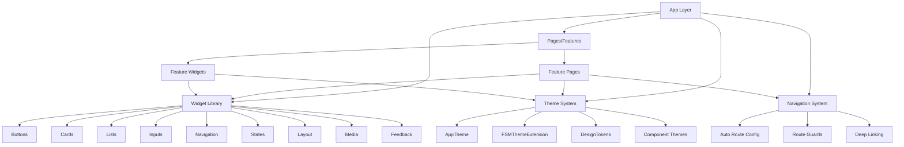

# Design Document

## Overview

This design document outlines the architecture and implementation approach for refactoring the Flutter presentation layer into a reusable design system. The refactor will eliminate hardcoded styling, consolidate duplicate components, enforce strict theming patterns, and establish responsive design tokens while maintaining identical UX behavior.

The design follows Material 3 principles with custom FSM-specific extensions, uses flutter_screenutil for responsive design, and implements a component-based architecture with centralized theming.

## Architecture

### High-Level Architecture



### Directory Structure

```
lib/
├── core/
│   ├── navigation/
│   │   ├── app_router.dart             # Auto Route configuration
│   │   ├── route_guards.dart           # Authentication & authorization guards
│   │   └── navigation.dart             # Barrel export
│   ├── theme/
│   │   ├── app_theme.dart              # Main theme configuration
│   │   ├── design_tokens.dart          # Centralized design tokens (new)
│   │   ├── app_dimensions.dart         # Responsive design tokens (deprecated)
│   │   ├── app_colors.dart             # Color constants (deprecated - migrate to theme)
│   │   ├── extensions/
│   │   │   └── fsm_theme_extension.dart # Custom theme extensions
│   │   └── theme.dart                  # Barrel export
│   └── widgets/
│       ├── buttons/
│       │   ├── fsm_button.dart         # Unified button component
│       │   ├── fsm_action_button.dart  # Action-specific buttons
│       │   └── fsm_quick_action_button.dart
│       ├── cards/
│       │   ├── fsm_card.dart           # Base card component
│       │   ├── fsm_list_card.dart      # List item cards
│       │   └── fsm_stats_card.dart     # Statistics cards
│       ├── inputs/
│       │   ├── fsm_search_bar.dart     # Search input
│       │   └── fsm_filter_chip_group.dart # Filter chips
│       ├── lists/
│       │   ├── fsm_list_item.dart      # List item component
│       │   └── fsm_lazy_loading_list.dart # Lazy loading lists
│       ├── navigation/
│       │   ├── fsm_drawer.dart         # Navigation drawer
│       │   ├── fsm_tab_bar.dart        # Tab navigation
│       │   └── fsm_bottom_sheet.dart   # Bottom sheets
│       ├── states/
│       │   ├── fsm_empty_state.dart    # Empty state component
│       │   ├── fsm_error_state.dart    # Error state component
│       │   ├── fsm_loading_indicator.dart # Loading states
│       │   └── fsm_shimmer_loading.dart # Shimmer loading
│       ├── layout/
│       │   ├── fsm_section_header.dart # Section headers
│       │   ├── fsm_info_row.dart       # Information rows
│       │   └── fsm_metadata_row.dart   # Metadata display
│       ├── feedback/
│       │   ├── fsm_status_badge.dart   # Status indicators
│       │   └── fsm_priority_indicator.dart # Priority indicators
│       ├── media/
│       │   └── fsm_optimized_image.dart # Image components
│       ├── connectivity/
│       │   ├── fsm_offline_banner.dart # Offline indicators
│       │   ├── fsm_connectivity_indicator.dart
│       │   └── fsm_sync_indicator.dart
│       ├── form/
│       │   └── [existing form widgets] # Reactive form components
│       └── widgets.dart                # Barrel export
└── features/
    └── [feature]/
        └── presentation/
            ├── pages/                  # Page implementations (<300 LOC)
            └── widgets/                # Feature-specific widgets
```

## Components and Interfaces

### Theme System Components

#### 1. DesignTokens (Centralized Token System)
```dart
class DesignTokens {
  DesignTokens._();

  // SPACING SCALE (8pt grid)
  static const double space0 = 0;
  static const double space1 = 4;   // 0.5x
  static const double space2 = 8;   // 1x base
  static const double space3 = 12;  // 1.5x
  static const double space4 = 16;  // 2x
  static const double space5 = 20;  // 2.5x
  static const double space6 = 24;  // 3x
  static const double space8 = 32;  // 4x
  static const double space10 = 40; // 5x
  static const double space12 = 48; // 6x
  static const double space16 = 64; // 8x

  // RESPONSIVE HELPERS
  static REdgeInsets get paddingAllSmall => REdgeInsets.all(space2);
  static REdgeInsets get paddingAllMedium => REdgeInsets.all(space4);
  static REdgeInsets get paddingAllLarge => REdgeInsets.all(space6);
  
  // Responsive SizedBox helpers using RSizedBox
  static Widget verticalSpace(double height) => RSizedBox(height: height);
  static Widget horizontalSpace(double width) => RSizedBox(width: width);
  
  static const verticalSpaceSmall = RSizedBox(height: space2);
  static const verticalSpaceMedium = RSizedBox(height: space4);
  static const verticalSpaceLarge = RSizedBox(height: space6);
  
  // Breakpoint helpers
  static bool get isMobile => 1.sw < 600;
  static bool get isTablet => 1.sw >= 600 && 1.sw < 1200;
  static bool get isDesktop => 1.sw >= 1200;
}
```

#### 2. FSMThemeExtension (Strongly-Typed Domain Colors)
```dart
@immutable
class FSMThemeExtension extends ThemeExtension<FSMThemeExtension> {
  // Strongly-typed domain colors for compile-time safety
  final Color workOrderUrgent;
  final Color workOrderHigh;
  final Color workOrderMedium;
  final Color workOrderLow;
  
  final Color statusPending;
  final Color statusInProgress;
  final Color statusCompleted;
  final Color statusCancelled;
  
  // Component-specific colors
  final Color workOrderCardBackground;
  final Color searchBarBackground;
  final Color chipBackground;
  final Color fabBackground;
  
  const FSMThemeExtension({
    required this.workOrderUrgent,
    required this.workOrderHigh,
    required this.workOrderMedium,
    required this.workOrderLow,
    required this.statusPending,
    required this.statusInProgress,
    required this.statusCompleted,
    required this.statusCancelled,
    required this.workOrderCardBackground,
    required this.searchBarBackground,
    required this.chipBackground,
    required this.fabBackground,
  });

  static const FSMThemeExtension light = FSMThemeExtension(
    workOrderUrgent: Color(0xFFD32F2F),
    workOrderHigh: Color(0xFFFF9800),
    workOrderMedium: Color(0xFF2196F3),
    workOrderLow: Color(0xFF4CAF50),
    statusPending: Color(0xFFFFA726),
    statusInProgress: Color(0xFF42A5F5),
    statusCompleted: Color(0xFF66BB6A),
    statusCancelled: Color(0xFFEF5350),
    workOrderCardBackground: Color(0xFFFAFAFA),
    searchBarBackground: Color(0xFFF5F5F5),
    chipBackground: Color(0xFFE0E0E0),
    fabBackground: Color(0xFF2196F3),
  );

  static const FSMThemeExtension dark = FSMThemeExtension(
    workOrderUrgent: Color(0xFFEF5350),
    workOrderHigh: Color(0xFFFFB74D),
    workOrderMedium: Color(0xFF64B5F6),
    workOrderLow: Color(0xFF81C784),
    statusPending: Color(0xFFFFA726),
    statusInProgress: Color(0xFF42A5F5),
    statusCompleted: Color(0xFF66BB6A),
    statusCancelled: Color(0xFFEF5350),
    workOrderCardBackground: Color(0xFF2C2C2C),
    searchBarBackground: Color(0xFF3C3C3C),
    chipBackground: Color(0xFF424242),
    fabBackground: Color(0xFF42A5F5),
  );
}

// Extension method for convenient access
extension FSMThemeExtensionAccessor on BuildContext {
  FSMThemeExtension get fsmTheme {
    final extension = Theme.of(this).extension<FSMThemeExtension>();
    assert(extension != null, 'FSMThemeExtension not found in theme');
    return extension!;
  }
}
```

#### 3. AppTheme (Material 3 Configuration)
```dart
class AppTheme {
  static ThemeData get lightTheme => ThemeData(
    useMaterial3: true,
    colorScheme: _lightColorScheme,
    textTheme: _createTextTheme(),
    extensions: const <ThemeExtension<dynamic>>[
      FSMThemeExtension.light,
    ],
    elevatedButtonTheme: _elevatedButtonTheme,
    outlinedButtonTheme: _outlinedButtonTheme,
    textButtonTheme: _textButtonTheme,
    cardTheme: _cardTheme,
    appBarTheme: _appBarTheme,
  );

  static ThemeData get darkTheme => ThemeData(
    useMaterial3: true,
    colorScheme: _darkColorScheme,
    textTheme: _createTextTheme(),
    extensions: const <ThemeExtension<dynamic>>[
      FSMThemeExtension.dark,
    ],
    elevatedButtonTheme: _elevatedButtonTheme,
    outlinedButtonTheme: _outlinedButtonTheme,
    textButtonTheme: _textButtonTheme,
    cardTheme: _cardTheme,
    appBarTheme: _appBarTheme,
  );

  // Configure typography with responsive sizing
  static TextTheme _createTextTheme() {
    return TextTheme(
      displayLarge: TextStyle(fontSize: 48.sp, fontWeight: FontWeight.w400),
      displayMedium: TextStyle(fontSize: 36.sp, fontWeight: FontWeight.w400),
      displaySmall: TextStyle(fontSize: 32.sp, fontWeight: FontWeight.w400),
      headlineLarge: TextStyle(fontSize: 28.sp, fontWeight: FontWeight.w400),
      headlineMedium: TextStyle(fontSize: 24.sp, fontWeight: FontWeight.w400),
      headlineSmall: TextStyle(fontSize: 20.sp, fontWeight: FontWeight.w400),
      titleLarge: TextStyle(fontSize: 18.sp, fontWeight: FontWeight.w400),
      titleMedium: TextStyle(fontSize: 16.sp, fontWeight: FontWeight.w500),
      titleSmall: TextStyle(fontSize: 14.sp, fontWeight: FontWeight.w500),
      bodyLarge: TextStyle(fontSize: 16.sp, fontWeight: FontWeight.w400),
      bodyMedium: TextStyle(fontSize: 14.sp, fontWeight: FontWeight.w400),
      bodySmall: TextStyle(fontSize: 12.sp, fontWeight: FontWeight.w400),
      labelLarge: TextStyle(fontSize: 14.sp, fontWeight: FontWeight.w500),
      labelMedium: TextStyle(fontSize: 12.sp, fontWeight: FontWeight.w500),
      labelSmall: TextStyle(fontSize: 11.sp, fontWeight: FontWeight.w500),
    );
  }
}
```

### Widget Library Components

#### 1. Unified Button System
```dart
class FsmButton extends StatelessWidget {
  const FsmButton({
    super.key,
    required this.text,
    this.onPressed,
    this.variant = FsmButtonVariant.filled,
    this.size = FsmButtonSize.medium,
    this.icon,
    this.isLoading = false,
  });
  
  final String text;
  final VoidCallback? onPressed;
  final FsmButtonVariant variant;
  final FsmButtonSize size;
  final IconData? icon;
  final bool isLoading;
  
  @override
  Widget build(BuildContext context) {
    final height = switch (size) {
      FsmButtonSize.small => 32.h,
      FsmButtonSize.medium => 48.h,
      FsmButtonSize.large => 56.h,
    };

    return SizedBox(
      height: height,
      child: switch (variant) {
        FsmButtonVariant.filled => FilledButton(
          onPressed: isLoading ? null : onPressed,
          child: _buildButtonChild(),
        ),
        FsmButtonVariant.outlined => OutlinedButton(
          onPressed: isLoading ? null : onPressed,
          child: _buildButtonChild(),
        ),
        FsmButtonVariant.text => TextButton(
          onPressed: isLoading ? null : onPressed,
          child: _buildButtonChild(),
        ),
      },
    );
  }

  Widget _buildButtonChild() {
    if (isLoading) {
      return SizedBox(
        height: 20.h,
        width: 20.w,
        child: CircularProgressIndicator(strokeWidth: 2.w),
      );
    }

    if (icon != null) {
      return Row(
        mainAxisSize: MainAxisSize.min,
        children: [
          Icon(icon, size: 20.sp),
          DesignTokens.horizontalSpace(DesignTokens.space2),
          Text(text),
        ],
      );
    }

    return Text(text);
  }
}

enum FsmButtonVariant { filled, outlined, text }
enum FsmButtonSize { small, medium, large }
```

#### 2. BLoC Optimization Patterns
```dart
// BlocBuildConditions mixin for reusable buildWhen patterns
mixin BlocBuildConditions {
  bool buildWhenLoading<S extends BlocState>(S previous, S current) {
    return previous.isLoading != current.isLoading;
  }

  bool buildWhenData<S extends BlocState>(S previous, S current) {
    return previous.data != current.data;
  }

  bool buildWhenWorkOrders(WorkOrderState previous, WorkOrderState current) {
    return previous.workOrders != current.workOrders ||
           previous.isLoading != current.isLoading ||
           previous.filterStatus != current.filterStatus;
  }

  bool buildWhenDocuments(DocumentState previous, DocumentState current) {
    return previous.documents != current.documents ||
           previous.isLoading != current.isLoading ||
           previous.selectedFolder != current.selectedFolder;
  }
}

// Usage in pages
class WorkOrdersPage extends StatelessWidget with BlocBuildConditions {
  const WorkOrdersPage({super.key});

  @override
  Widget build(BuildContext context) {
    return BlocBuilder<WorkOrderBloc, WorkOrderState>(
      buildWhen: buildWhenWorkOrders,
      builder: (context, state) {
        // Page implementation
      },
    );
  }
}
```

## Data Models

### Performance Optimization Patterns

#### 1. Const Constructors and RepaintBoundary
```dart
// All custom widgets use const constructors with super.key
class FsmWorkOrderCard extends StatelessWidget {
  const FsmWorkOrderCard({
    super.key,
    required this.workOrder,
    this.onTap,
  });
  
  final WorkOrder workOrder;
  final VoidCallback? onTap;
  
  @override
  Widget build(BuildContext context) {
    return RepaintBoundary( // Isolate repaints for performance
      child: Card(
        margin: REdgeInsets.all(DesignTokens.space4),
        child: _buildCardContent(context),
      ),
    );
  }
}
```

#### 2. Method References Pattern
```dart
// Use method references instead of anonymous functions
class MyWidget extends StatelessWidget {
  const MyWidget({super.key});
  
  @override
  Widget build(BuildContext context) {
    return ElevatedButton(
      onPressed: _handlePress, // Method reference
      child: const Text('Click me'),
    );
  }
  
  void _handlePress() {
    // Handle press logic
  }
}
```

## Error Handling

### Theme Error Handling
```dart
class ThemeErrorHandler {
  static Color getColorSafely(BuildContext context, String colorKey) {
    try {
      final fsmTheme = context.fsmTheme;
      return fsmTheme.workOrderUrgent; // Example
    } catch (e) {
      debugPrint('Theme color error for key: $colorKey');
      return Theme.of(context).colorScheme.primary;
    }
  }
}
```

## Testing Strategy

### 1. Golden Tests
- Key page screenshots for visual regression testing
- Theme variant comparisons (light/dark)
- Component library showcase
- Responsive breakpoint testing

### 2. Widget Tests
- BLoC integration patterns with buildWhen/listenWhen optimization
- Accessibility compliance (semantic labels, touch targets)
- Responsive behavior across screen sizes

### 3. Performance Tests
- RepaintBoundary effectiveness
- BLoC rebuild optimization impact
- Memory usage validation

## Migration Strategy

### Phase 1: Foundation Setup
1. Create DesignTokens class with spacing, sizing, and color constants
2. Implement FSMThemeExtension with strongly-typed domain colors
3. Update AppTheme to use Material 3 with component themes
4. Configure ScreenUtilInit with correct design size (390x844)

### Phase 2: Widget Library Consolidation
1. Create unified FsmButton component
2. Implement FsmCard with variants
3. Consolidate empty state, error state, and loading components

### Phase 3: BLoC Optimization
1. Implement BlocBuildConditions mixin
2. Replace runtimeType comparisons with property-based conditions
3. Add fine-grained BlocSelector usage where appropriate

### Phase 4: Page Refactoring
1. Refactor pages to use new design system components
2. Ensure pages stay under 300 lines
3. Extract complex sections to reusable widgets

### Phase 5: Testing and Quality Assurance
1. Implement golden tests for key pages
2. Add accessibility compliance tests
3. Create performance benchmarks
4. Set up CI checks for design system compliance

## Code Generation Best Practices

### ScreenUtil 5.9.3+ Patterns
```dart
// main.dart - Correct initialization
class MyApp extends StatelessWidget {
  const MyApp({super.key});

  @override
  Widget build(BuildContext context) {
    return ScreenUtilInit(
      designSize: const Size(390, 844),
      minTextAdapt: true,
      splitScreenMode: true,
      builder: (context, child) {
        return MaterialApp(
          theme: AppTheme.lightTheme,
          darkTheme: AppTheme.darkTheme,
          home: child,
        );
      },
      child: const SplashPage(),
    );
  }
}
```

### Build Configuration
```yaml
# build.yaml
targets:
  $default:
    builders:
      freezed:
        options:
          map: true        # Enable toMap/fromMap
          copyWith: true   # Generate copyWith methods
      hive_ce_generator:
        options:
          type_adapter_suffix: Adapter
```

This design provides a comprehensive foundation for the Flutter design system refactor, ensuring consistency, maintainability, and performance while meeting all specified requirements and following Flutter best practices.