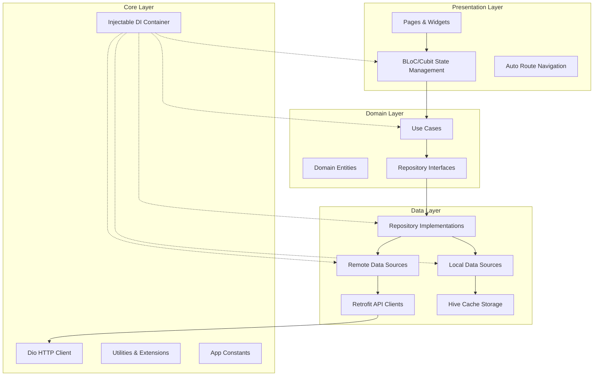
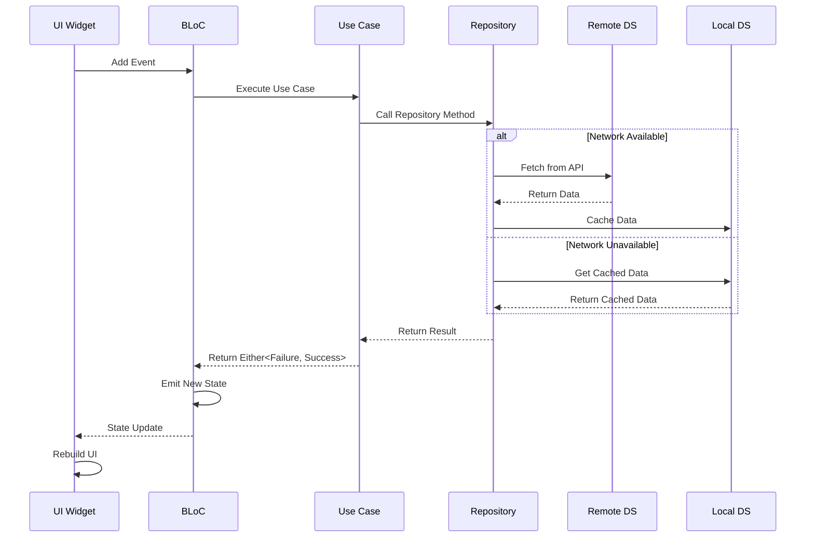
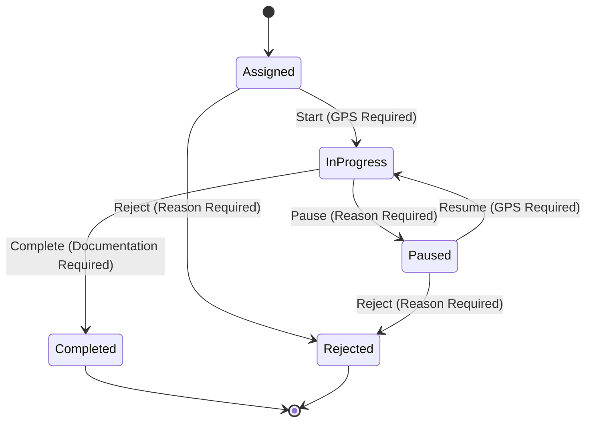
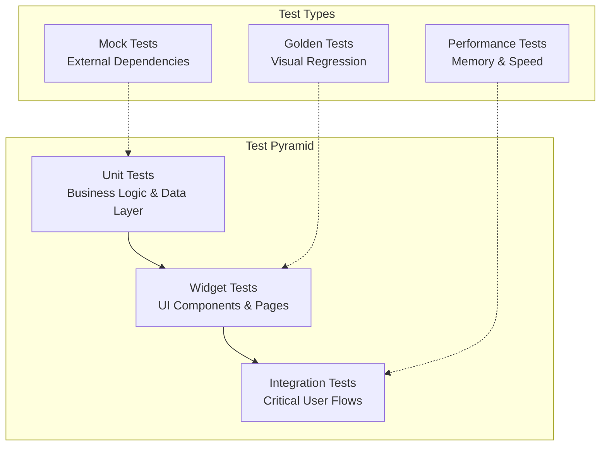

# Design Document

## Overview

The FSM Mobile Application follows Clean Architecture principles with a feature-first modular structure. The application is built using Flutter with extensive code generation for type safety, maintainability, and developer productivity. The design emphasizes offline-first capabilities, responsive UI, and robust state management to ensure field technicians can work effectively in various network conditions.

The architecture leverages modern Flutter patterns including BLoC for state management, Injectable for dependency injection, Auto Route for navigation, and Hive for local storage. All UI components use flutter_screenutil for responsive design across different device sizes.

## Architecture

### Clean Architecture Layers



### Feature-First Module Structure

```
lib/
├── core/                                    # Shared infrastructure
│   ├── di/
│   │   ├── injection.dart                   # @InjectableInit - DI container setup
│   │   └── injection.config.dart            # Generated by Injectable
│   ├── network/
│   │   ├── dio_client.dart                  # @injectable Dio configuration
│   │   ├── auth_interceptor.dart            # JWT token management
│   │   └── network_info.dart                # @injectable connectivity checker
│   ├── storage/
│   │   ├── hive_service.dart                # @injectable Hive service
│   │   ├── cache_manager.dart               # @injectable cache operations
│   │   └── adapters/                        # Hive TypeAdapters (generated)
│   │       ├── work_order_adapter.dart      # @HiveType generated
│   │       └── user_adapter.dart
│   ├── router/
│   │   ├── app_router.dart                  # @AutoRouterConfig - routing config
│   │   └── app_router.gr.dart               # Generated by Auto Route
│   ├── constants/
│   │   ├── app_constants.dart               # API URLs, keys
│   │   └── hive_boxes.dart                  # Hive box names
│   ├── utils/
│   │   ├── extensions.dart                  # Dart extensions
│   │   └── validators.dart
│   └── error/
│       ├── failures.dart                    # @freezed failure types
│       └── exceptions.dart
│
├── features/                                # Feature modules
│   ├── auth/                                # Authentication feature
│   │   ├── data/
│   │   │   ├── datasources/
│   │   │   │   ├── auth_remote_datasource.dart     # @injectable
│   │   │   │   └── auth_local_datasource.dart      # @injectable
│   │   │   ├── models/
│   │   │   │   ├── login_request.dart              # @freezed
│   │   │   │   └── login_response.dart             # @freezed
│   │   │   ├── repositories/
│   │   │   │   └── auth_repository_impl.dart       # @Injectable(as: IAuthRepository)
│   │   │   └── api/
│   │   │       └── auth_api_client.dart            # @RestApi()
│   │   ├── domain/
│   │   │   ├── entities/
│   │   │   │   └── user_entity.dart                # @freezed
│   │   │   ├── repositories/
│   │   │   │   └── i_auth_repository.dart          # Abstract interface
│   │   │   └── usecases/
│   │   │       ├── login_usecase.dart              # @injectable
│   │   │       ├── logout_usecase.dart             # @injectable
│   │   │       └── check_auth_usecase.dart         # @injectable
│   │   └── presentation/
│   │       ├── pages/
│   │       │   ├── login_page.dart                 # @RoutePage()
│   │       │   └── splash_page.dart                # @RoutePage()
│   │       ├── blocs/
│   │       │   └── auth/
│   │       │       ├── auth_bloc.dart              # @injectable
│   │       │       ├── auth_event.dart             # @freezed
│   │       │       └── auth_state.dart             # @freezed
│   │       └── widgets/
│   │           └── login_form.dart
│   │
│   ├── work_orders/                         # Work orders feature
│   │   ├── data/
│   │   │   ├── datasources/
│   │   │   │   ├── work_order_remote_datasource.dart  # @injectable
│   │   │   │   └── work_order_local_datasource.dart   # @injectable (Hive)
│   │   │   ├── models/
│   │   │   │   ├── work_order_dto.dart             # @freezed + @HiveType
│   │   │   │   ├── service_request_dto.dart
│   │   │   │   ├── work_order_start_request.dart
│   │   │   │   └── work_order_complete_request.dart
│   │   │   ├── repositories/
│   │   │   │   └── work_order_repository_impl.dart # @Injectable(as: IWorkOrderRepository)
│   │   │   └── api/
│   │   │       └── work_order_api_client.dart      # @RestApi()
│   │   ├── domain/
│   │   │   ├── entities/
│   │   │   │   ├── work_order_entity.dart          # @freezed
│   │   │   │   └── service_request_entity.dart     # @freezed
│   │   │   ├── repositories/
│   │   │   │   └── i_work_order_repository.dart
│   │   │   └── usecases/
│   │   │       ├── get_work_orders_usecase.dart    # @injectable
│   │   │       ├── start_work_order_usecase.dart   # @injectable
│   │   │       ├── pause_work_order_usecase.dart   # @injectable
│   │   │       ├── resume_work_order_usecase.dart  # @injectable
│   │   │       └── complete_work_order_usecase.dart # @injectable
│   │   └── presentation/
│   │       ├── pages/
│   │       │   ├── dashboard_page.dart             # @RoutePage()
│   │       │   ├── work_order_details_page.dart    # @RoutePage()
│   │       │   └── work_order_action_page.dart     # @RoutePage()
│   │       ├── blocs/
│   │       │   ├── work_orders_list/
│   │       │   │   ├── work_orders_list_bloc.dart  # @injectable
│   │       │   │   ├── work_orders_list_event.dart # @freezed
│   │       │   │   └── work_orders_list_state.dart # @freezed
│   │       │   └── work_order_action/
│   │       │       ├── work_order_action_bloc.dart # @injectable
│   │       │       ├── work_order_action_event.dart
│   │       │       └── work_order_action_state.dart
│   │       └── widgets/
│   │           ├── work_order_card.dart
│   │           ├── work_order_status_chip.dart
│   │           └── work_order_action_sheet.dart
│   │
│   ├── documents/                           # Documents feature
│   │   ├── data/
│   │   │   ├── datasources/
│   │   │   │   ├── document_remote_datasource.dart # @injectable
│   │   │   │   └── document_local_datasource.dart  # @injectable
│   │   │   ├── models/
│   │   │   │   └── document_dto.dart               # @freezed
│   │   │   ├── repositories/
│   │   │   │   └── document_repository_impl.dart   # @Injectable(as: IDocumentRepository)
│   │   │   └── api/
│   │   │       └── document_api_client.dart        # @RestApi()
│   │   ├── domain/
│   │   │   ├── entities/
│   │   │   │   └── document_entity.dart            # @freezed
│   │   │   ├── repositories/
│   │   │   │   └── i_document_repository.dart
│   │   │   └── usecases/
│   │   │       ├── get_documents_usecase.dart      # @injectable
│   │   │       └── search_documents_usecase.dart   # @injectable
│   │   └── presentation/
│   │       ├── pages/
│   │       │   ├── documents_page.dart             # @RoutePage()
│   │       │   └── document_viewer_page.dart       # @RoutePage()
│   │       ├── blocs/
│   │       │   └── documents/
│   │       │       ├── documents_bloc.dart         # @injectable
│   │       │       ├── documents_event.dart
│   │       │       └── documents_state.dart
│   │       └── widgets/
│   │           └── document_list_item.dart
│   │
│   ├── parts/                               # Parts/Inventory feature
│   │   ├── data/
│   │   │   ├── datasources/
│   │   │   │   ├── parts_remote_datasource.dart    # @injectable
│   │   │   │   └── parts_local_datasource.dart     # @injectable
│   │   │   ├── models/
│   │   │   │   ├── part_dto.dart                   # @freezed
│   │   │   │   └── inventory_dto.dart              # @freezed
│   │   │   ├── repositories/
│   │   │   │   └── parts_repository_impl.dart      # @Injectable(as: IPartsRepository)
│   │   │   └── api/
│   │   │       └── parts_api_client.dart           # @RestApi()
│   │   ├── domain/
│   │   │   ├── entities/
│   │   │   │   ├── part_entity.dart                # @freezed
│   │   │   │   └── inventory_entity.dart           # @freezed
│   │   │   ├── repositories/
│   │   │   │   └── i_parts_repository.dart
│   │   │   └── usecases/
│   │   │       ├── get_parts_usecase.dart          # @injectable
│   │   │       ├── search_parts_usecase.dart       # @injectable
│   │   │       └── update_inventory_usecase.dart   # @injectable
│   │   └── presentation/
│   │       ├── pages/
│   │       │   ├── parts_page.dart                 # @RoutePage()
│   │       │   └── part_details_page.dart          # @RoutePage()
│   │       ├── blocs/
│   │       │   └── parts/
│   │       │       ├── parts_bloc.dart             # @injectable
│   │       │       ├── parts_event.dart
│   │       │       └── parts_state.dart
│   │       └── widgets/
│   │           ├── part_card.dart
│   │           └── inventory_indicator.dart
│   │
│   ├── calendar/                            # Calendar feature
│   │   ├── data/
│   │   │   ├── datasources/
│   │   │   │   ├── calendar_remote_datasource.dart # @injectable
│   │   │   │   └── calendar_local_datasource.dart  # @injectable
│   │   │   ├── models/
│   │   │   │   └── calendar_event_dto.dart         # @freezed
│   │   │   ├── repositories/
│   │   │   │   └── calendar_repository_impl.dart   # @Injectable(as: ICalendarRepository)
│   │   │   └── api/
│   │   │       └── calendar_api_client.dart        # @RestApi()
│   │   ├── domain/
│   │   │   ├── entities/
│   │   │   │   └── calendar_event_entity.dart      # @freezed
│   │   │   ├── repositories/
│   │   │   │   └── i_calendar_repository.dart
│   │   │   └── usecases/
│   │   │       ├── get_calendar_events_usecase.dart # @injectable
│   │   │       └── get_daily_schedule_usecase.dart  # @injectable
│   │   └── presentation/
│   │       ├── pages/
│   │       │   └── calendar_page.dart              # @RoutePage()
│   │       ├── blocs/
│   │       │   └── calendar/
│   │       │       ├── calendar_bloc.dart          # @injectable
│   │       │       ├── calendar_event.dart
│   │       │       └── calendar_state.dart
│   │       └── widgets/
│   │           ├── calendar_view.dart
│   │           └── event_card.dart
│   │
│   └── profile/                             # Profile feature
│       ├── data/
│       │   ├── datasources/
│       │   │   ├── profile_remote_datasource.dart  # @injectable
│       │   │   └── profile_local_datasource.dart   # @injectable
│       │   ├── models/
│       │   │   └── profile_dto.dart                # @freezed
│       │   ├── repositories/
│       │   │   └── profile_repository_impl.dart    # @Injectable(as: IProfileRepository)
│       │   └── api/
│       │       └── profile_api_client.dart         # @RestApi()
│       ├── domain/
│       │   ├── entities/
│       │   │   └── profile_entity.dart             # @freezed
│       │   ├── repositories/
│       │   │   └── i_profile_repository.dart
│       │   └── usecases/
│       │       ├── get_profile_usecase.dart        # @injectable
│       │       └── update_profile_usecase.dart     # @injectable
│       └── presentation/
│           ├── pages/
│           │   └── profile_page.dart               # @RoutePage()
│           ├── blocs/
│           │   └── profile/
│           │       ├── profile_bloc.dart           # @injectable
│           │       ├── profile_event.dart
│           │       └── profile_state.dart
│           └── widgets/
│               ├── profile_header.dart
│               └── settings_section.dart
│
├── gen/                                     # Generated by Flutter Gen
│   ├── assets.gen.dart                      # Type-safe asset access
│   ├── colors.gen.dart                      # Generated color constants
│   └── fonts.gen.dart                       # Generated font constants
│
└── main.dart                                # App entry point
```

### Key Structure Principles
1. **Feature-First:** Each feature is self-contained with its own data/domain/presentation layers
2. **Dependency Rule:** Dependencies point inward (presentation → domain ← data)
3. **Code Generation:** Heavy use of generators for DI, routing, serialization, storage
4. **Type Safety:** Generated code provides compile-time safety (Auto Route, Flutter Gen)
5. **Modularity:** Features can be developed/tested independently

### State Management Flow



## Components and Interfaces

### Core Components

#### 1. Dependency Injection Container
```dart
// lib/core/di/injection.dart
@InjectableInit()
Future<void> configureDependencies() async => getIt.init();

// Registration patterns:
@injectable          // Transient instances
@singleton          // Single instance throughout app lifecycle
@lazySingleton      // Single instance created on first access
@Injectable(as: IRepository)  // Interface binding
```

#### 2. Network Layer
```dart
// lib/core/network/dio_client.dart
@singleton
class DioClient {
  late Dio _dio;
  
  @injectable
  DioClient() {
    _dio = Dio(BaseOptions(
      baseUrl: AppConstants.baseUrl,
      connectTimeout: Duration(seconds: 30),
      receiveTimeout: Duration(seconds: 30),
    ));
    
    _dio.interceptors.addAll([
      AuthInterceptor(),
      PrettyDioLogger(),
      DioCacheInterceptor(),
    ]);
  }
}

// lib/core/network/auth_interceptor.dart
@injectable
class AuthInterceptor extends Interceptor {
  // Handles JWT token injection and automatic refresh
  // Intercepts 401 responses and refreshes tokens
}
```

#### 3. Local Storage Service
```dart
// lib/core/storage/hive_service.dart
@singleton
class HiveService {
  static const String workOrdersBox = 'work_orders';
  static const String authBox = 'auth';
  static const String documentsBox = 'documents';
  
  @injectable
  HiveService();
  
  Future<void> init() async {
    await Hive.initFlutter();
    // Register all adapters
    // Open all boxes
  }
}
```

#### 4. Router Configuration
```dart
// lib/core/router/app_router.dart
@AutoRouterConfig()
class AppRouter extends RootStackRouter {
  @override
  List<AutoRoute> get routes => [
    // Splash and Auth routes
    AutoRoute(page: SplashRoute.page, path: '/', initial: true),
    AutoRoute(page: LoginRoute.page, path: '/login'),
    
    // Main app routes with auth guard
    AutoRoute(
      page: MainNavigationWrapperRoute.page,
      path: '/main',
      guards: [AuthGuard],
      children: [
        AutoRoute(page: DashboardRoute.page, path: '/dashboard'),
        AutoRoute(page: WorkOrdersRoute.page, path: '/work-orders'),
        AutoRoute(page: CalendarRoute.page, path: '/calendar'),
        AutoRoute(page: DocumentsRoute.page, path: '/documents'),
        AutoRoute(page: PartsRoute.page, path: '/parts'),
        AutoRoute(page: ProfileRoute.page, path: '/profile'),
      ],
    ),
    
    // Detail routes
    AutoRoute(
      page: WorkOrderDetailsRoute.page,
      path: '/work-order/:workOrderId',
      guards: [AuthGuard],
    ),
    AutoRoute(
      page: DocumentViewerRoute.page,
      path: '/document/:documentId',
      guards: [AuthGuard],
    ),
  ];
}
```

### Feature Components

#### 1. Authentication Module

**Domain Entities:**
```dart
@freezed
class UserEntity with _$UserEntity {
  const factory UserEntity({
    required int id,
    required String email,
    required String firstName,
    required String lastName,
    required String role,
    required List<String> permissions,
  }) = _UserEntity;
}
```

**Use Cases:**
- `LoginUseCase`: Authenticate user with credentials
- `LogoutUseCase`: Clear authentication data
- `CheckAuthUseCase`: Verify stored authentication
- `RefreshTokenUseCase`: Refresh JWT tokens

**State Management:**
```dart
@freezed
class AuthState with _$AuthState {
  const factory AuthState.initial() = _Initial;
  const factory AuthState.loading() = _Loading;
  const factory AuthState.authenticated(UserEntity user) = _Authenticated;
  const factory AuthState.unauthenticated() = _Unauthenticated;
  const factory AuthState.error(String message) = _Error;
}
```

#### 2. Work Orders Module

**Domain Entities:**
```dart
@freezed
class WorkOrderEntity with _$WorkOrderEntity {
  const WorkOrderEntity._();
  
  const factory WorkOrderEntity({
    required int id,
    required String woNumber,
    required String summary,
    required String description,
    required WorkOrderStatus status,
    required WorkOrderPriority priority,
    required DateTime visitDate,
    required CustomerEntity customer,
    required LocationEntity location,
    required List<String> requiredSkills,
    required List<PartEntity> requiredParts,
    @Default([]) List<String> attachments,
    @Default([]) List<WorkLogEntity> workLogs,
    DateTime? startedAt,
    DateTime? completedAt,
    String? completionNotes,
  }) = _WorkOrderEntity;
  
  // Business logic methods
  bool get canBeStarted => status == WorkOrderStatus.assigned;
  bool get canBePaused => status == WorkOrderStatus.inProgress;
  bool get canBeCompleted => status == WorkOrderStatus.inProgress;
  bool get isOverdue => visitDate.isBefore(DateTime.now()) && !isCompleted;
  bool get isCompleted => status == WorkOrderStatus.completed;
}

enum WorkOrderStatus {
  assigned,
  inProgress,
  paused,
  completed,
  cancelled,
  rejected
}

enum WorkOrderPriority {
  low,
  medium,
  high,
  urgent
}
```

**State Machine:**


**Use Cases:**
- `GetWorkOrdersUseCase`: Fetch work orders with filtering
- `GetWorkOrderDetailsUseCase`: Get detailed work order information
- `StartWorkOrderUseCase`: Start work order with GPS capture
- `PauseWorkOrderUseCase`: Pause work order with reason
- `ResumeWorkOrderUseCase`: Resume paused work order
- `CompleteWorkOrderUseCase`: Complete work order with documentation

#### 3. Documents Module

**Domain Entities:**
```dart
@freezed
class DocumentEntity with _$DocumentEntity {
  const factory DocumentEntity({
    required int id,
    required String title,
    required String description,
    required DocumentType type,
    required String fileUrl,
    required String fileName,
    required int fileSize,
    required DateTime createdAt,
    required DateTime updatedAt,
    required List<String> tags,
    required List<String> categories,
    bool? isDownloaded,
    String? localPath,
  }) = _DocumentEntity;
}

enum DocumentType {
  manual,
  procedure,
  schematic,
  specification,
  safety,
  training
}
```

**Use Cases:**
- `GetDocumentsUseCase`: Fetch documents with search/filter
- `SearchDocumentsUseCase`: Search documents by keywords
- `DownloadDocumentUseCase`: Download document for offline access
- `GetDocumentCategoriesUseCase`: Get available categories

#### 4. Parts Module

**Domain Entities:**
```dart
@freezed
class PartEntity with _$PartEntity {
  const factory PartEntity({
    required int id,
    required String partNumber,
    required String name,
    required String description,
    required String category,
    required double price,
    required int stockQuantity,
    required String unit,
    required List<String> compatibleModels,
    String? imageUrl,
    String? specifications,
  }) = _PartEntity;
}

@freezed
class InventoryEntity with _$InventoryEntity {
  const factory InventoryEntity({
    required int partId,
    required int quantity,
    required int minQuantity,
    required int maxQuantity,
    required DateTime lastUpdated,
  }) = _InventoryEntity;
}
```

**Use Cases:**
- `GetPartsUseCase`: Fetch parts catalog
- `SearchPartsUseCase`: Search parts by criteria
- `UpdateInventoryUseCase`: Update part quantities
- `GetLowStockPartsUseCase`: Get parts below minimum quantity

#### 5. Calendar Module

**Domain Entities:**
```dart
@freezed
class CalendarEventEntity with _$CalendarEventEntity {
  const factory CalendarEventEntity({
    required int id,
    required String title,
    required DateTime startTime,
    required DateTime endTime,
    required CalendarEventType type,
    required String description,
    int? workOrderId,
    String? location,
    bool? isAllDay,
  }) = _CalendarEventEntity;
}

enum CalendarEventType {
  workOrder,
  meeting,
  training,
  maintenance,
  break
}
```

**Use Cases:**
- `GetCalendarEventsUseCase`: Fetch events for date range
- `GetDailyScheduleUseCase`: Get events for specific day
- `OptimizeRouteUseCase`: Suggest optimal route for daily work orders

## Data Models

### Data Transfer Objects (DTOs)

All DTOs use Freezed with JSON serialization and include mapping methods to domain entities:

```dart
@freezed
class WorkOrderDto with _$WorkOrderDto {
  const factory WorkOrderDto({
    required int id,
    @JsonKey(name: 'wo_number') required String woNumber,
    required String summary,
    required String description,
    required String status,
    required String priority,
    @JsonKey(name: 'visit_date') required String visitDate,
    required CustomerDto customer,
    required LocationDto location,
    @JsonKey(name: 'required_skills') required List<String> requiredSkills,
    @JsonKey(name: 'required_parts') required List<PartDto> requiredParts,
    @Default([]) List<String> attachments,
    @JsonKey(name: 'work_logs') @Default([]) List<WorkLogDto> workLogs,
    @JsonKey(name: 'started_at') String? startedAt,
    @JsonKey(name: 'completed_at') String? completedAt,
    @JsonKey(name: 'completion_notes') String? completionNotes,
  }) = _WorkOrderDto;

  factory WorkOrderDto.fromJson(Map<String, dynamic> json) =>
      _$WorkOrderDtoFromJson(json);
}

// Extension for mapping to domain entity
extension WorkOrderDtoX on WorkOrderDto {
  WorkOrderEntity toEntity() {
    return WorkOrderEntity(
      id: id,
      woNumber: woNumber,
      summary: summary,
      description: description,
      status: WorkOrderStatus.values.firstWhere(
        (e) => e.name == status.toLowerCase(),
      ),
      priority: WorkOrderPriority.values.firstWhere(
        (e) => e.name == priority.toLowerCase(),
      ),
      visitDate: DateTime.parse(visitDate),
      customer: customer.toEntity(),
      location: location.toEntity(),
      requiredSkills: requiredSkills,
      requiredParts: requiredParts.map((p) => p.toEntity()).toList(),
      attachments: attachments,
      workLogs: workLogs.map((w) => w.toEntity()).toList(),
      startedAt: startedAt != null ? DateTime.parse(startedAt!) : null,
      completedAt: completedAt != null ? DateTime.parse(completedAt!) : null,
      completionNotes: completionNotes,
    );
  }
}
```

### Hive Models for Caching

```dart
@freezed
@HiveType(typeId: 1)
class WorkOrderHiveModel with _$WorkOrderHiveModel {
  const factory WorkOrderHiveModel({
    @HiveField(0) required int id,
    @HiveField(1) required String woNumber,
    @HiveField(2) required String summary,
    @HiveField(3) required String description,
    @HiveField(4) required int status, // Store as int for enum
    @HiveField(5) required int priority,
    @HiveField(6) required DateTime visitDate,
    @HiveField(7) required CustomerHiveModel customer,
    @HiveField(8) required LocationHiveModel location,
    @HiveField(9) required List<String> requiredSkills,
    @HiveField(10) required List<PartHiveModel> requiredParts,
    @HiveField(11) @Default([]) List<String> attachments,
    @HiveField(12) @Default([]) List<WorkLogHiveModel> workLogs,
    @HiveField(13) DateTime? startedAt,
    @HiveField(14) DateTime? completedAt,
    @HiveField(15) String? completionNotes,
    @HiveField(16) required DateTime cachedAt,
  }) = _WorkOrderHiveModel;

  factory WorkOrderHiveModel.fromJson(Map<String, dynamic> json) =>
      _$WorkOrderHiveModelFromJson(json);
}

// Extension for mapping to domain entity
extension WorkOrderHiveModelX on WorkOrderHiveModel {
  WorkOrderEntity toEntity() {
    return WorkOrderEntity(
      id: id,
      woNumber: woNumber,
      summary: summary,
      description: description,
      status: WorkOrderStatus.values[status],
      priority: WorkOrderPriority.values[priority],
      visitDate: visitDate,
      customer: customer.toEntity(),
      location: location.toEntity(),
      requiredSkills: requiredSkills,
      requiredParts: requiredParts.map((p) => p.toEntity()).toList(),
      attachments: attachments,
      workLogs: workLogs.map((w) => w.toEntity()).toList(),
      startedAt: startedAt,
      completedAt: completedAt,
      completionNotes: completionNotes,
    );
  }
}
```

## Error Handling

### Failure Types

```dart
@freezed
class Failure with _$Failure {
  const factory Failure.server({
    required String message,
    int? statusCode,
  }) = ServerFailure;
  
  const factory Failure.network({
    required String message,
  }) = NetworkFailure;
  
  const factory Failure.cache({
    required String message,
  }) = CacheFailure;
  
  const factory Failure.validation({
    required String message,
    Map<String, String>? fieldErrors,
  }) = ValidationFailure;
  
  const factory Failure.permission({
    required String message,
    required String permission,
  }) = PermissionFailure;
  
  const factory Failure.location({
    required String message,
  }) = LocationFailure;
}
```

### Error Handling Strategy

```dart
// Repository implementation with comprehensive error handling
@Injectable(as: IWorkOrderRepository)
class WorkOrderRepositoryImpl implements IWorkOrderRepository {
  @override
  Future<Either<Failure, List<WorkOrderEntity>>> getWorkOrders({
    required int page,
    required int limit,
    WorkOrderStatus? status,
  }) async {
    try {
      if (await _networkInfo.isConnected) {
        // Try remote first
        final workOrderDtos = await _remoteDataSource.getWorkOrders(
          page: page,
          limit: limit,
          status: status,
        );
        
        // Cache successful response
        final hiveModels = workOrderDtos
            .map((dto) => WorkOrderHiveModel.fromDto(dto))
            .toList();
        await _localDataSource.cacheWorkOrders(hiveModels);
        
        // Return domain entities
        final entities = workOrderDtos
            .map((dto) => dto.toEntity())
            .toList();
        return Right(entities);
        
      } else {
        // Fallback to cache when offline
        final cachedModels = await _localDataSource.getCachedWorkOrders(
          status: status,
        );
        
        if (cachedModels.isEmpty) {
          return Left(CacheFailure(
            message: 'No cached work orders available offline',
          ));
        }
        
        final entities = cachedModels
            .map((model) => model.toEntity())
            .toList();
        return Right(entities);
      }
    } on DioException catch (e) {
      return Left(_handleDioException(e));
    } on HiveError catch (e) {
      return Left(CacheFailure(message: e.message));
    } catch (e) {
      return Left(ServerFailure(message: e.toString()));
    }
  }
  
  Failure _handleDioException(DioException e) {
    switch (e.type) {
      case DioExceptionType.connectionTimeout:
      case DioExceptionType.receiveTimeout:
      case DioExceptionType.sendTimeout:
        return NetworkFailure(message: 'Connection timeout');
      case DioExceptionType.connectionError:
        return NetworkFailure(message: 'No internet connection');
      case DioExceptionType.badResponse:
        final statusCode = e.response?.statusCode;
        final message = e.response?.data?['message'] ?? 'Server error';
        return ServerFailure(message: message, statusCode: statusCode);
      default:
        return ServerFailure(message: 'Unknown error occurred');
    }
  }
}
```

## Testing Strategy

### Maximum Test Coverage Approach

The FSM Mobile App implements a comprehensive testing strategy targeting 95%+ code coverage across all layers. Testing follows the Test Pyramid principle with extensive unit tests, focused widget tests, and critical integration tests.

#### Test Coverage Targets:
- **Unit Tests:** 95%+ coverage for business logic (Use Cases, Repositories, BLoCs)
- **Widget Tests:** 90%+ coverage for UI components and pages
- **Integration Tests:** 100% coverage for critical user flows
- **Golden Tests:** All major UI components for visual regression testing
- **Performance Tests:** Memory usage, rendering performance, and network efficiency

### Test Architecture



### Unit Testing (95%+ Coverage)

#### BLoC Testing with Comprehensive Scenarios:
```dart
@GenerateMocks([
  GetWorkOrdersUseCase,
  StartWorkOrderUseCase,
  PauseWorkOrderUseCase,
  CompleteWorkOrderUseCase,
])
void main() {
  late WorkOrdersListBloc bloc;
  late MockGetWorkOrdersUseCase mockGetWorkOrdersUseCase;
  late MockStartWorkOrderUseCase mockStartWorkOrderUseCase;

  setUp(() {
    mockGetWorkOrdersUseCase = MockGetWorkOrdersUseCase();
    mockStartWorkOrderUseCase = MockStartWorkOrderUseCase();
    bloc = WorkOrdersListBloc(
      mockGetWorkOrdersUseCase,
      mockStartWorkOrderUseCase,
    );
  });

  group('WorkOrdersListBloc', () {
    final workOrders = [
      WorkOrderEntity(id: 1, status: WorkOrderStatus.assigned),
      WorkOrderEntity(id: 2, status: WorkOrderStatus.inProgress),
    ];

    blocTest<WorkOrdersListBloc, WorkOrdersListState>(
      'emits [loading, success] when LoadWorkOrders succeeds',
      build: () {
        when(mockGetWorkOrdersUseCase(any))
            .thenAnswer((_) async => Right(workOrders));
        return bloc;
      },
      act: (bloc) => bloc.add(LoadWorkOrders()),
      expect: () => [
        WorkOrdersListState.loading(),
        WorkOrdersListState.success(workOrders),
      ],
      verify: (_) {
        verify(mockGetWorkOrdersUseCase(any)).called(1);
      },
    );

    blocTest<WorkOrdersListBloc, WorkOrdersListState>(
      'emits [loading, error] when LoadWorkOrders fails',
      build: () {
        when(mockGetWorkOrdersUseCase(any))
            .thenAnswer((_) async => Left(ServerFailure(message: 'Server error')));
        return bloc;
      },
      act: (bloc) => bloc.add(LoadWorkOrders()),
      expect: () => [
        WorkOrdersListState.loading(),
        WorkOrdersListState.error('Server error'),
      ],
    );

    blocTest<WorkOrdersListBloc, WorkOrdersListState>(
      'emits [loading, success] with cached data when offline',
      build: () {
        when(mockGetWorkOrdersUseCase(any))
            .thenAnswer((_) async => Right(workOrders));
        return bloc;
      },
      act: (bloc) => bloc.add(LoadWorkOrders(forceRefresh: false)),
      expect: () => [
        WorkOrdersListState.loading(),
        WorkOrdersListState.success(workOrders),
      ],
    );

    blocTest<WorkOrdersListBloc, WorkOrdersListState>(
      'handles pagination correctly',
      build: () {
        when(mockGetWorkOrdersUseCase(any))
            .thenAnswer((_) async => Right([...workOrders, ...workOrders]));
        return bloc;
      },
      seed: () => WorkOrdersListState.success(workOrders),
      act: (bloc) => bloc.add(LoadMoreWorkOrders()),
      expect: () => [
        WorkOrdersListState.loadingMore(workOrders),
        WorkOrdersListState.success([...workOrders, ...workOrders]),
      ],
    );

    blocTest<WorkOrdersListBloc, WorkOrdersListState>(
      'filters work orders by status',
      build: () {
        final filteredOrders = [workOrders.first];
        when(mockGetWorkOrdersUseCase(any))
            .thenAnswer((_) async => Right(filteredOrders));
        return bloc;
      },
      act: (bloc) => bloc.add(FilterWorkOrders(WorkOrderStatus.assigned)),
      expect: () => [
        WorkOrdersListState.loading(),
        WorkOrdersListState.success(filteredOrders),
      ],
    );
  });
}
```

#### Use Case Testing with Edge Cases:
```dart
@GenerateMocks([IWorkOrderRepository, LocationService, NetworkInfo])
void main() {
  late StartWorkOrderUseCase useCase;
  late MockIWorkOrderRepository mockRepository;
  late MockLocationService mockLocationService;
  late MockNetworkInfo mockNetworkInfo;

  setUp(() {
    mockRepository = MockIWorkOrderRepository();
    mockLocationService = MockLocationService();
    mockNetworkInfo = MockNetworkInfo();
    useCase = StartWorkOrderUseCase(
      mockRepository,
      mockLocationService,
      mockNetworkInfo,
    );
  });

  group('StartWorkOrderUseCase', () {
    const workOrderId = 1;
    final position = Position(latitude: 40.7128, longitude: -74.0060);
    final workOrder = WorkOrderEntity(
      id: workOrderId,
      status: WorkOrderStatus.inProgress,
    );

    test('should start work order successfully with GPS', () async {
      // Arrange
      when(mockLocationService.getCurrentPosition())
          .thenAnswer((_) async => position);
      when(mockNetworkInfo.isConnected).thenAnswer((_) async => true);
      when(mockRepository.startWorkOrder(
        workOrderId: workOrderId,
        coordinates: any(named: 'coordinates'),
        files: any(named: 'files'),
      )).thenAnswer((_) async => Right(workOrder));

      // Act
      final result = await useCase(StartWorkOrderParams(
        workOrderId: workOrderId,
        files: [],
      ));

      // Assert
      expect(result, Right(workOrder));
      verify(mockLocationService.getCurrentPosition()).called(1);
      verify(mockRepository.startWorkOrder(
        workOrderId: workOrderId,
        coordinates: jsonEncode([position.latitude, position.longitude]),
        files: [],
      )).called(1);
    });

    test('should fail when GPS permission denied', () async {
      // Arrange
      when(mockLocationService.getCurrentPosition())
          .thenThrow(LocationServiceDisabledException());

      // Act
      final result = await useCase(StartWorkOrderParams(
        workOrderId: workOrderId,
        files: [],
      ));

      // Assert
      expect(result, isA<Left<Failure, WorkOrderEntity>>());
      result.fold(
        (failure) => expect(failure, isA<LocationFailure>()),
        (_) => fail('Should return failure'),
      );
    });

    test('should work offline and sync later', () async {
      // Arrange
      when(mockLocationService.getCurrentPosition())
          .thenAnswer((_) async => position);
      when(mockNetworkInfo.isConnected).thenAnswer((_) async => false);
      when(mockRepository.startWorkOrderOffline(
        workOrderId: workOrderId,
        coordinates: any(named: 'coordinates'),
        files: any(named: 'files'),
      )).thenAnswer((_) async => Right(workOrder));

      // Act
      final result = await useCase(StartWorkOrderParams(
        workOrderId: workOrderId,
        files: [],
      ));

      // Assert
      expect(result, Right(workOrder));
      verify(mockRepository.startWorkOrderOffline(
        workOrderId: workOrderId,
        coordinates: jsonEncode([position.latitude, position.longitude]),
        files: [],
      )).called(1);
    });
  });
}
```

#### Repository Testing with Network Scenarios:
```dart
@GenerateMocks([
  WorkOrderRemoteDataSource,
  WorkOrderLocalDataSource,
  NetworkInfo,
])
void main() {
  late WorkOrderRepositoryImpl repository;
  late MockWorkOrderRemoteDataSource mockRemoteDataSource;
  late MockWorkOrderLocalDataSource mockLocalDataSource;
  late MockNetworkInfo mockNetworkInfo;

  setUp(() {
    mockRemoteDataSource = MockWorkOrderRemoteDataSource();
    mockLocalDataSource = MockWorkOrderLocalDataSource();
    mockNetworkInfo = MockNetworkInfo();
    repository = WorkOrderRepositoryImpl(
      mockRemoteDataSource,
      mockLocalDataSource,
      mockNetworkInfo,
    );
  });

  group('WorkOrderRepositoryImpl', () {
    final workOrderDtos = [
      WorkOrderDto(id: 1, woNumber: 'WO001'),
      WorkOrderDto(id: 2, woNumber: 'WO002'),
    ];
    final workOrderEntities = workOrderDtos.map((dto) => dto.toEntity()).toList();

    test('should return work orders from remote when online', () async {
      // Arrange
      when(mockNetworkInfo.isConnected).thenAnswer((_) async => true);
      when(mockRemoteDataSource.getWorkOrders(
        page: 1,
        limit: 10,
      )).thenAnswer((_) async => workOrderDtos);
      when(mockLocalDataSource.cacheWorkOrders(any))
          .thenAnswer((_) async => {});

      // Act
      final result = await repository.getWorkOrders(page: 1, limit: 10);

      // Assert
      expect(result, Right(workOrderEntities));
      verify(mockRemoteDataSource.getWorkOrders(page: 1, limit: 10)).called(1);
      verify(mockLocalDataSource.cacheWorkOrders(any)).called(1);
    });

    test('should return cached work orders when offline', () async {
      // Arrange
      final cachedModels = workOrderDtos
          .map((dto) => WorkOrderHiveModel.fromDto(dto))
          .toList();
      when(mockNetworkInfo.isConnected).thenAnswer((_) async => false);
      when(mockLocalDataSource.getCachedWorkOrders())
          .thenAnswer((_) async => cachedModels);

      // Act
      final result = await repository.getWorkOrders(page: 1, limit: 10);

      // Assert
      expect(result, Right(workOrderEntities));
      verify(mockLocalDataSource.getCachedWorkOrders()).called(1);
      verifyNever(mockRemoteDataSource.getWorkOrders(
        page: any(named: 'page'),
        limit: any(named: 'limit'),
      ));
    });

    test('should handle server errors gracefully', () async {
      // Arrange
      when(mockNetworkInfo.isConnected).thenAnswer((_) async => true);
      when(mockRemoteDataSource.getWorkOrders(
        page: 1,
        limit: 10,
      )).thenThrow(DioException(
        requestOptions: RequestOptions(path: ''),
        response: Response(
          requestOptions: RequestOptions(path: ''),
          statusCode: 500,
          data: {'message': 'Internal server error'},
        ),
      ));

      // Act
      final result = await repository.getWorkOrders(page: 1, limit: 10);

      // Assert
      expect(result, isA<Left<Failure, List<WorkOrderEntity>>>());
      result.fold(
        (failure) {
          expect(failure, isA<ServerFailure>());
          expect(failure.message, 'Internal server error');
        },
        (_) => fail('Should return failure'),
      );
    });
  });
}
```

### Widget Testing (90%+ Coverage)

#### Page Testing with All States:
```dart
void main() {
  late MockWorkOrdersListBloc mockBloc;
  late MockAuthBloc mockAuthBloc;

  setUp(() {
    mockBloc = MockWorkOrdersListBloc();
    mockAuthBloc = MockAuthBloc();
  });

  group('WorkOrdersPage', () {
    testWidgets('displays loading shimmer when state is loading', (tester) async {
      // Arrange
      when(() => mockBloc.state).thenReturn(WorkOrdersListState.loading());
      when(() => mockBloc.stream).thenAnswer((_) => Stream.empty());
      when(() => mockAuthBloc.state).thenReturn(
        AuthState.authenticated(UserEntity(id: 1, email: 'test@test.com')),
      );

      // Act
      await tester.pumpWidget(
        MaterialApp(
          home: MultiBlocProvider(
            providers: [
              BlocProvider<WorkOrdersListBloc>.value(value: mockBloc),
              BlocProvider<AuthBloc>.value(value: mockAuthBloc),
            ],
            child: WorkOrdersPage(),
          ),
        ),
      );

      // Assert
      expect(find.byType(WorkOrderShimmer), findsWidgets);
      expect(find.byType(WorkOrderCard), findsNothing);
    });

    testWidgets('displays work orders when state is success', (tester) async {
      // Arrange
      final workOrders = [
        WorkOrderEntity(id: 1, woNumber: 'WO001', status: WorkOrderStatus.assigned),
        WorkOrderEntity(id: 2, woNumber: 'WO002', status: WorkOrderStatus.inProgress),
      ];
      when(() => mockBloc.state).thenReturn(
        WorkOrdersListState.success(workOrders),
      );
      when(() => mockBloc.stream).thenAnswer((_) => Stream.empty());

      // Act
      await tester.pumpWidget(
        MaterialApp(
          home: BlocProvider<WorkOrdersListBloc>.value(
            value: mockBloc,
            child: WorkOrdersPage(),
          ),
        ),
      );

      // Assert
      expect(find.byType(WorkOrderCard), findsNWidgets(2));
      expect(find.text('WO001'), findsOneWidget);
      expect(find.text('WO002'), findsOneWidget);
    });

    testWidgets('displays error message when state is error', (tester) async {
      // Arrange
      when(() => mockBloc.state).thenReturn(
        WorkOrdersListState.error('Network error'),
      );
      when(() => mockBloc.stream).thenAnswer((_) => Stream.empty());

      // Act
      await tester.pumpWidget(
        MaterialApp(
          home: BlocProvider<WorkOrdersListBloc>.value(
            value: mockBloc,
            child: WorkOrdersPage(),
          ),
        ),
      );

      // Assert
      expect(find.text('Network error'), findsOneWidget);
      expect(find.byType(ElevatedButton), findsOneWidget); // Retry button
    });

    testWidgets('triggers refresh when pull to refresh', (tester) async {
      // Arrange
      final workOrders = [WorkOrderEntity(id: 1, woNumber: 'WO001')];
      when(() => mockBloc.state).thenReturn(
        WorkOrdersListState.success(workOrders),
      );
      when(() => mockBloc.stream).thenAnswer((_) => Stream.empty());

      // Act
      await tester.pumpWidget(
        MaterialApp(
          home: BlocProvider<WorkOrdersListBloc>.value(
            value: mockBloc,
            child: WorkOrdersPage(),
          ),
        ),
      );

      await tester.fling(
        find.byType(RefreshIndicator),
        Offset(0, 300),
        1000,
      );
      await tester.pump();

      // Assert
      verify(() => mockBloc.add(RefreshWorkOrders())).called(1);
    });

    testWidgets('navigates to work order details when card tapped', (tester) async {
      // Arrange
      final workOrders = [WorkOrderEntity(id: 1, woNumber: 'WO001')];
      when(() => mockBloc.state).thenReturn(
        WorkOrdersListState.success(workOrders),
      );
      when(() => mockBloc.stream).thenAnswer((_) => Stream.empty());

      // Act
      await tester.pumpWidget(
        MaterialApp(
          home: BlocProvider<WorkOrdersListBloc>.value(
            value: mockBloc,
            child: WorkOrdersPage(),
          ),
          onGenerateRoute: (settings) {
            if (settings.name == '/work-order/1') {
              return MaterialPageRoute(
                builder: (_) => Scaffold(body: Text('Work Order Details')),
              );
            }
            return null;
          },
        ),
      );

      await tester.tap(find.byType(WorkOrderCard).first);
      await tester.pumpAndSettle();

      // Assert
      expect(find.text('Work Order Details'), findsOneWidget);
    });

    testWidgets('filters work orders when filter applied', (tester) async {
      // Arrange
      final workOrders = [WorkOrderEntity(id: 1, woNumber: 'WO001')];
      when(() => mockBloc.state).thenReturn(
        WorkOrdersListState.success(workOrders),
      );
      when(() => mockBloc.stream).thenAnswer((_) => Stream.empty());

      // Act
      await tester.pumpWidget(
        MaterialApp(
          home: BlocProvider<WorkOrdersListBloc>.value(
            value: mockBloc,
            child: WorkOrdersPage(),
          ),
        ),
      );

      await tester.tap(find.byIcon(Icons.filter_list));
      await tester.pumpAndSettle();
      await tester.tap(find.text('In Progress'));
      await tester.pumpAndSettle();

      // Assert
      verify(() => mockBloc.add(FilterWorkOrders(WorkOrderStatus.inProgress)))
          .called(1);
    });
  });
}
```

#### Widget Component Testing:
```dart
void main() {
  group('WorkOrderCard', () {
    final workOrder = WorkOrderEntity(
      id: 1,
      woNumber: 'WO001',
      summary: 'Test work order',
      status: WorkOrderStatus.assigned,
      priority: WorkOrderPriority.high,
      visitDate: DateTime(2024, 1, 15),
    );

    testWidgets('displays work order information correctly', (tester) async {
      // Act
      await tester.pumpWidget(
        MaterialApp(
          home: Scaffold(
            body: WorkOrderCard(workOrder: workOrder),
          ),
        ),
      );

      // Assert
      expect(find.text('WO001'), findsOneWidget);
      expect(find.text('Test work order'), findsOneWidget);
      expect(find.text('HIGH'), findsOneWidget);
      expect(find.text('ASSIGNED'), findsOneWidget);
    });

    testWidgets('shows correct status color for different statuses', (tester) async {
      // Test assigned status
      await tester.pumpWidget(
        MaterialApp(
          home: Scaffold(
            body: WorkOrderCard(
              workOrder: workOrder.copyWith(status: WorkOrderStatus.assigned),
            ),
          ),
        ),
      );

      final assignedChip = tester.widget<Chip>(
        find.byWidgetPredicate((widget) => 
          widget is Chip && widget.label is Text && 
          (widget.label as Text).data == 'ASSIGNED'
        ),
      );
      expect(assignedChip.backgroundColor, AppColors.statusAssigned);

      // Test in progress status
      await tester.pumpWidget(
        MaterialApp(
          home: Scaffold(
            body: WorkOrderCard(
              workOrder: workOrder.copyWith(status: WorkOrderStatus.inProgress),
            ),
          ),
        ),
      );

      final inProgressChip = tester.widget<Chip>(
        find.byWidgetPredicate((widget) => 
          widget is Chip && widget.label is Text && 
          (widget.label as Text).data == 'IN PROGRESS'
        ),
      );
      expect(inProgressChip.backgroundColor, AppColors.statusInProgress);
    });

    testWidgets('shows overdue indicator when work order is overdue', (tester) async {
      // Arrange
      final overdueWorkOrder = workOrder.copyWith(
        visitDate: DateTime.now().subtract(Duration(days: 1)),
        status: WorkOrderStatus.assigned,
      );

      // Act
      await tester.pumpWidget(
        MaterialApp(
          home: Scaffold(
            body: WorkOrderCard(workOrder: overdueWorkOrder),
          ),
        ),
      );

      // Assert
      expect(find.byIcon(Icons.warning), findsOneWidget);
      expect(find.text('OVERDUE'), findsOneWidget);
    });

    testWidgets('calls onTap when card is tapped', (tester) async {
      // Arrange
      bool tapped = false;

      // Act
      await tester.pumpWidget(
        MaterialApp(
          home: Scaffold(
            body: WorkOrderCard(
              workOrder: workOrder,
              onTap: () => tapped = true,
            ),
          ),
        ),
      );

      await tester.tap(find.byType(WorkOrderCard));

      // Assert
      expect(tapped, true);
    });
  });
}
```

### Golden Tests for Visual Regression

```dart
void main() {
  group('Golden Tests', () {
    testWidgets('WorkOrderCard golden test - assigned status', (tester) async {
      final workOrder = WorkOrderEntity(
        id: 1,
        woNumber: 'WO001',
        summary: 'Test work order for golden test',
        status: WorkOrderStatus.assigned,
        priority: WorkOrderPriority.high,
        visitDate: DateTime(2024, 1, 15),
      );

      await tester.pumpWidget(
        MaterialApp(
          home: Scaffold(
            body: Container(
              width: 400,
              height: 200,
              child: WorkOrderCard(workOrder: workOrder),
            ),
          ),
        ),
      );

      await expectLater(
        find.byType(WorkOrderCard),
        matchesGoldenFile('work_order_card_assigned.png'),
      );
    });

    testWidgets('WorkOrderCard golden test - in progress status', (tester) async {
      final workOrder = WorkOrderEntity(
        id: 1,
        woNumber: 'WO001',
        summary: 'Test work order for golden test',
        status: WorkOrderStatus.inProgress,
        priority: WorkOrderPriority.medium,
        visitDate: DateTime(2024, 1, 15),
      );

      await tester.pumpWidget(
        MaterialApp(
          home: Scaffold(
            body: Container(
              width: 400,
              height: 200,
              child: WorkOrderCard(workOrder: workOrder),
            ),
          ),
        ),
      );

      await expectLater(
        find.byType(WorkOrderCard),
        matchesGoldenFile('work_order_card_in_progress.png'),
      );
    });

    testWidgets('LoginPage golden test', (tester) async {
      await tester.pumpWidget(
        MaterialApp(
          home: LoginPage(),
        ),
      );

      await expectLater(
        find.byType(LoginPage),
        matchesGoldenFile('login_page.png'),
      );
    });

    testWidgets('DashboardPage golden test', (tester) async {
      await tester.pumpWidget(
        MaterialApp(
          home: BlocProvider(
            create: (_) => MockWorkOrdersListBloc(),
            child: DashboardPage(),
          ),
        ),
      );

      await expectLater(
        find.byType(DashboardPage),
        matchesGoldenFile('dashboard_page.png'),
      );
    });
  });
}
```

### Integration Testing (100% Critical Flows)

```dart
void main() {
  group('Integration Tests', () {
    late GetIt getIt;

    setUp(() async {
      getIt = GetIt.instance;
      await setupTestEnvironment();
    });

    tearDown(() async {
      await getIt.reset();
      await cleanupTestEnvironment();
    });

    testWidgets('complete authentication flow', (tester) async {
      await tester.pumpWidget(MyApp());
      await tester.pumpAndSettle();

      // Should start at splash screen
      expect(find.byType(SplashPage), findsOneWidget);
      await tester.pumpAndSettle(Duration(seconds: 3));

      // Should navigate to login
      expect(find.byType(LoginPage), findsOneWidget);

      // Enter credentials
      await tester.enterText(find.byKey(Key('email_field')), 'test@test.com');
      await tester.enterText(find.byKey(Key('password_field')), 'password123');
      await tester.tap(find.byKey(Key('login_button')));
      await tester.pumpAndSettle();

      // Should navigate to dashboard
      expect(find.byType(DashboardPage), findsOneWidget);
      expect(find.text('Welcome back!'), findsOneWidget);
    });

    testWidgets('complete work order lifecycle', (tester) async {
      // Login first
      await loginUser(tester);

      // Navigate to work orders
      await tester.tap(find.byIcon(Icons.work));
      await tester.pumpAndSettle();
      expect(find.byType(WorkOrdersPage), findsOneWidget);

      // Select a work order
      await tester.tap(find.byType(WorkOrderCard).first);
      await tester.pumpAndSettle();
      expect(find.byType(WorkOrderDetailsPage), findsOneWidget);

      // Start work order
      await tester.tap(find.byKey(Key('start_work_order_button')));
      await tester.pumpAndSettle();
      expect(find.text('In Progress'), findsOneWidget);

      // Add work log
      await tester.tap(find.byKey(Key('add_work_log_button')));
      await tester.pumpAndSettle();
      await tester.enterText(
        find.byKey(Key('work_log_notes')),
        'Started troubleshooting the issue',
      );
      await tester.tap(find.byKey(Key('save_work_log_button')));
      await tester.pumpAndSettle();

      // Complete work order
      await tester.tap(find.byKey(Key('complete_work_order_button')));
      await tester.pumpAndSettle();
      await tester.enterText(
        find.byKey(Key('completion_notes')),
        'Issue resolved successfully',
      );
      await tester.tap(find.byKey(Key('confirm_completion_button')));
      await tester.pumpAndSettle();

      // Verify completion
      expect(find.text('Completed'), findsOneWidget);
    });

    testWidgets('offline functionality test', (tester) async {
      // Login and load data while online
      await loginUser(tester);
      await loadWorkOrders(tester);

      // Simulate going offline
      await simulateOfflineMode();

      // Navigate to work orders
      await tester.tap(find.byIcon(Icons.work));
      await tester.pumpAndSettle();

      // Should still show cached work orders
      expect(find.byType(WorkOrderCard), findsWidgets);
      expect(find.text('Offline Mode'), findsOneWidget);

      // Try to start a work order offline
      await tester.tap(find.byType(WorkOrderCard).first);
      await tester.pumpAndSettle();
      await tester.tap(find.byKey(Key('start_work_order_button')));
      await tester.pumpAndSettle();

      // Should work offline and show sync indicator
      expect(find.text('In Progress'), findsOneWidget);
      expect(find.byIcon(Icons.sync_problem), findsOneWidget);

      // Simulate going back online
      await simulateOnlineMode();
      await tester.pumpAndSettle();

      // Should sync and remove sync indicator
      expect(find.byIcon(Icons.sync_problem), findsNothing);
      expect(find.byIcon(Icons.sync), findsOneWidget);
    });

    testWidgets('document viewing flow', (tester) async {
      await loginUser(tester);

      // Navigate to documents
      await tester.tap(find.byIcon(Icons.description));
      await tester.pumpAndSettle();
      expect(find.byType(DocumentsPage), findsOneWidget);

      // Search for a document
      await tester.enterText(
        find.byKey(Key('document_search')),
        'installation manual',
      );
      await tester.testTextInput.receiveAction(TextInputAction.search);
      await tester.pumpAndSettle();

      // Select a document
      await tester.tap(find.byType(DocumentListItem).first);
      await tester.pumpAndSettle();
      expect(find.byType(DocumentViewerPage), findsOneWidget);

      // Verify PDF viewer is loaded
      expect(find.byType(SfPdfViewer), findsOneWidget);

      // Test zoom functionality
      await tester.pinch(find.byType(SfPdfViewer), 2.0);
      await tester.pumpAndSettle();

      // Download for offline access
      await tester.tap(find.byKey(Key('download_document_button')));
      await tester.pumpAndSettle();
      expect(find.text('Downloaded'), findsOneWidget);
    });

    testWidgets('parts inventory management flow', (tester) async {
      await loginUser(tester);

      // Navigate to parts
      await tester.tap(find.byIcon(Icons.inventory));
      await tester.pumpAndSettle();
      expect(find.byType(PartsPage), findsOneWidget);

      // Search for a part
      await tester.enterText(
        find.byKey(Key('parts_search')),
        'filter',
      );
      await tester.testTextInput.receiveAction(TextInputAction.search);
      await tester.pumpAndSettle();

      // Select a part
      await tester.tap(find.byType(PartCard).first);
      await tester.pumpAndSettle();

      // Update inventory
      await tester.tap(find.byKey(Key('update_inventory_button')));
      await tester.pumpAndSettle();
      await tester.enterText(find.byKey(Key('quantity_field')), '5');
      await tester.tap(find.byKey(Key('confirm_update_button')));
      await tester.pumpAndSettle();

      // Verify inventory updated
      expect(find.text('Inventory updated'), findsOneWidget);
    });
  });
}
```

### Performance Testing

```dart
void main() {
  group('Performance Tests', () {
    testWidgets('app startup performance', (tester) async {
      final stopwatch = Stopwatch()..start();
      
      await tester.pumpWidget(MyApp());
      await tester.pumpAndSettle();
      
      stopwatch.stop();
      
      // App should start within 3 seconds
      expect(stopwatch.elapsedMilliseconds, lessThan(3000));
    });

    testWidgets('work orders list scrolling performance', (tester) async {
      // Create a large list of work orders
      final workOrders = List.generate(
        1000,
        (index) => WorkOrderEntity(id: index, woNumber: 'WO$index'),
      );

      await tester.pumpWidget(
        MaterialApp(
          home: BlocProvider(
            create: (_) => MockWorkOrdersListBloc()
              ..add(LoadWorkOrders()),
            child: WorkOrdersPage(),
          ),
        ),
      );

      // Measure scrolling performance
      final stopwatch = Stopwatch()..start();
      
      await tester.fling(
        find.byType(ListView),
        Offset(0, -5000),
        1000,
      );
      await tester.pumpAndSettle();
      
      stopwatch.stop();
      
      // Scrolling should be smooth (under 100ms)
      expect(stopwatch.elapsedMilliseconds, lessThan(100));
    });

    testWidgets('memory usage test', (tester) async {
      // Monitor memory usage during app lifecycle
      final initialMemory = await getMemoryUsage();
      
      await tester.pumpWidget(MyApp());
      await loginUser(tester);
      await navigateToAllPages(tester);
      
      final finalMemory = await getMemoryUsage();
      final memoryIncrease = finalMemory - initialMemory;
      
      // Memory increase should be reasonable (under 50MB)
      expect(memoryIncrease, lessThan(50 * 1024 * 1024));
    });
  });
}
```

### Test Utilities and Helpers

```dart
// test/helpers/test_helpers.dart
class TestHelpers {
  static Future<void> setupTestEnvironment() async {
    // Setup test database
    await setupTestHive();
    
    // Setup mock services
    await setupMockServices();
    
    // Setup test data
    await seedTestData();
  }

  static Future<void> loginUser(WidgetTester tester) async {
    await tester.enterText(find.byKey(Key('email_field')), 'test@test.com');
    await tester.enterText(find.byKey(Key('password_field')), 'password123');
    await tester.tap(find.byKey(Key('login_button')));
    await tester.pumpAndSettle();
  }

  static Future<void> simulateOfflineMode() async {
    // Mock network connectivity
    when(mockNetworkInfo.isConnected).thenAnswer((_) async => false);
  }

  static Future<void> simulateOnlineMode() async {
    // Mock network connectivity
    when(mockNetworkInfo.isConnected).thenAnswer((_) async => true);
  }

  static Future<int> getMemoryUsage() async {
    // Platform-specific memory usage implementation
    return 0; // Placeholder
  }
}

// test/mocks/mock_services.dart
@GenerateMocks([
  IAuthRepository,
  IWorkOrderRepository,
  IDocumentRepository,
  IPartsRepository,
  LocationService,
  NetworkInfo,
  HiveService,
])
void main() {}
```

### Test Coverage Configuration

```yaml
# test/coverage_config.yaml
coverage:
  exclude:
    - '**/*.g.dart'
    - '**/*.freezed.dart'
    - '**/*.config.dart'
    - '**/*.gr.dart'
    - '**/gen/**'
  include:
    - 'lib/**'
  minimum_coverage: 95
  fail_on_low_coverage: true
```

This comprehensive testing strategy ensures maximum code coverage across all layers of the application, providing confidence in code quality, reliability, and maintainability. The tests cover happy paths, edge cases, error scenarios, and performance requirements.

## UI/UX Design Patterns

### Responsive Design with ScreenUtil

All UI components use flutter_screenutil for consistent responsive behavior:

```dart
// Design system constants
class AppDimensions {
  static double paddingXS = 4.w;
  static double paddingSM = 8.w;
  static double paddingMD = 16.w;
  static double paddingLG = 24.w;
  static double paddingXL = 32.w;

  static double radiusXS = 4.r;
  static double radiusSM = 8.r;
  static double radiusMD = 12.r;
  static double radiusLG = 16.r;

  static double fontXS = 10.sp;
  static double fontSM = 12.sp;
  static double fontMD = 14.sp;
  static double fontLG = 16.sp;
  static double fontXL = 18.sp;
}
```

### Gradient Components

```dart
// Custom gradient components for consistent branding
class GradientAppBar extends StatelessWidget implements PreferredSizeWidget {
  @override
  Widget build(BuildContext context) {
    return AppBar(
      toolbarHeight: 56.h,
      flexibleSpace: Container(
        decoration: BoxDecoration(
          gradient: LinearGradient(
            colors: [AppColors.primaryStart, AppColors.primaryEnd],
          ),
        ),
      ),
    );
  }
  
  @override
  Size get preferredSize => Size.fromHeight(56.h);
}

class GradientButton extends StatelessWidget {
  @override
  Widget build(BuildContext context) {
    return Container(
      height: 48.h,
      decoration: BoxDecoration(
        gradient: LinearGradient(
          colors: [AppColors.primaryStart, AppColors.primaryEnd],
        ),
        borderRadius: BorderRadius.circular(8.r),
      ),
      child: ElevatedButton(
        style: ElevatedButton.styleFrom(
          backgroundColor: Colors.transparent,
          shadowColor: Colors.transparent,
        ),
        onPressed: onPressed,
        child: child,
      ),
    );
  }
}
```

### Loading States and Shimmer Effects

```dart
class WorkOrderShimmer extends StatelessWidget {
  @override
  Widget build(BuildContext context) {
    return Shimmer.fromColors(
      baseColor: Colors.grey[300]!,
      highlightColor: Colors.grey[100]!,
      child: Card(
        margin: EdgeInsets.symmetric(
          horizontal: AppDimensions.paddingMD,
          vertical: AppDimensions.paddingSM,
        ),
        child: Padding(
          padding: EdgeInsets.all(AppDimensions.paddingMD),
          child: Column(
            crossAxisAlignment: CrossAxisAlignment.start,
            children: [
              Container(
                width: 0.6.sw,
                height: 16.h,
                color: Colors.white,
              ),
              SizedBox(height: 8.h),
              Container(
                width: 0.8.sw,
                height: 12.h,
                color: Colors.white,
              ),
            ],
          ),
        ),
      ),
    );
  }
}
```

### Form Validation

```dart
// Reactive forms for complex validation
class WorkOrderForm extends StatelessWidget {
  @override
  Widget build(BuildContext context) {
    return ReactiveFormBuilder(
      form: () => FormGroup({
        'notes': FormControl<String>(
          validators: [Validators.required, Validators.minLength(10)],
        ),
        'parts': FormArray<Map<String, dynamic>>([]),
        'images': FormControl<List<File>>(
          validators: [Validators.required],
        ),
      }),
      builder: (context, form, child) {
        return Column(
          children: [
            ReactiveTextField(
              formControlName: 'notes',
              decoration: InputDecoration(
                labelText: 'Completion Notes',
                labelStyle: TextStyle(fontSize: AppDimensions.fontMD),
                contentPadding: EdgeInsets.symmetric(
                  horizontal: AppDimensions.paddingMD,
                  vertical: AppDimensions.paddingSM,
                ),
                border: OutlineInputBorder(
                  borderRadius: BorderRadius.circular(AppDimensions.radiusSM),
                ),
              ),
              maxLines: 4,
            ),
            SizedBox(height: AppDimensions.paddingMD),
            ReactiveFormConsumer(
              builder: (context, form, child) {
                return GradientButton(
                  onPressed: form.valid ? () => _submitForm(form) : null,
                  child: Text(
                    'Complete Work Order',
                    style: TextStyle(fontSize: AppDimensions.fontLG),
                  ),
                );
              },
            ),
          ],
        );
      },
    );
  }
}
```

This design document provides a comprehensive foundation for implementing the FSM Mobile Application with clean architecture, robust error handling, offline-first capabilities, and responsive UI design. The modular structure ensures maintainability and scalability while the extensive use of code generation provides type safety and developer productivity.