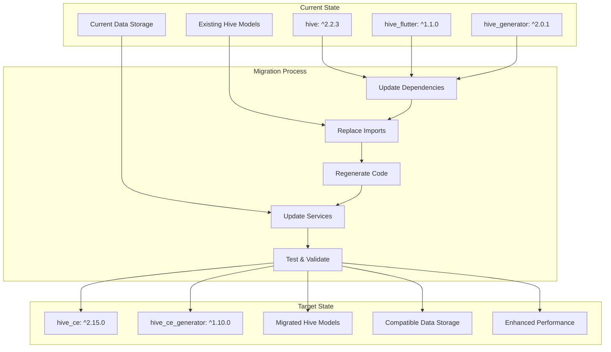

# Design Document

## Overview

The Hive CE Migration design outlines a comprehensive approach to replace the existing `hive` package with `hive_ce: ^2.15.0` and `hive_ce_generator: ^1.10.0` in the FSM Mobile Application. This migration maintains full backward compatibility while leveraging the improved community edition of Hive for better performance, maintenance, and bug fixes.

The design follows a systematic approach: dependency updates, import replacements, code regeneration, testing, and validation. The migration preserves all existing data structures, type IDs, and functionality while transitioning to the Hive CE ecosystem.

## Architecture

### Migration Strategy Overview



### Package Compatibility Matrix

| Current Package | Version | Target Package | Version | Compatibility |
|----------------|---------|----------------|---------|---------------|
| hive | ^2.2.3 | hive_ce | ^2.15.0 | ✅ Full API compatibility |
| hive_flutter | ^1.1.0 | hive_ce | ^2.15.0 | ✅ Included in hive_ce |
| hive_generator | ^2.0.1 | hive_ce_generator | ^1.10.0 | ✅ Same annotations |

### Data Compatibility Strategy

The migration maintains complete data compatibility by:
1. Preserving all existing `typeId` values in `@HiveType` annotations
2. Maintaining identical `@HiveField` indices
3. Using the same serialization format
4. Keeping box names and structure unchanged

## Components and Interfaces

### 1. Dependency Configuration

#### pubspec.yaml Updates
```yaml
dependencies:
  # Remove existing hive packages
  # hive: ^2.2.3
  # hive_flutter: ^1.1.0
  
  # Add hive_ce
  hive_ce: ^2.15.0

dev_dependencies:
  # Remove existing generator
  # hive_generator: ^2.0.1
  
  # Add hive_ce generator
  hive_ce_generator: ^1.10.0
```

#### build.yaml Configuration
```yaml
targets:
  $default:
    builders:
      hive_ce_generator:hive_generator:
        enabled: true
        generate_for:
          - lib/features/*/data/models/*_hive_model.dart
          - lib/core/storage/models/*_hive_model.dart
```

### 2. Import Migration Strategy

#### Automated Import Replacement
```dart
// Before (Current)
import 'package:hive/hive.dart';
import 'package:hive_flutter/hive_flutter.dart';

// After (Hive CE)
import 'package:hive_ce/hive.dart';
```

#### Import Mapping Table
| Current Import | Target Import |
|---------------|---------------|
| `package:hive/hive.dart` | `package:hive_ce/hive.dart` |
| `package:hive_flutter/hive_flutter.dart` | `package:hive_ce/hive.dart` |

### 3. Core Service Migration

#### HiveService Migration
```dart
// lib/core/storage/hive_service.dart
import 'package:hive_ce/hive.dart'; // Updated import
import 'package:injectable/injectable.dart';

@singleton
class HiveService {
  late Box _authBox;
  late Box _settingsBox;

  @factoryMethod
  static Future<HiveService> create() async {
    final service = HiveService._();
    await service._init();
    return service;
  }

  HiveService._();

  Future<void> _init() async {
    // Use Hive CE initialization
    await Hive.initFlutter();

    // Register adapters (same as before)
    _registerAdapters();

    // Open boxes (same API)
    _authBox = await Hive.openBox(HiveBoxes.authBox);
    _settingsBox = await Hive.openBox(HiveBoxes.settingsBox);
    
    await _openFeatureBoxes();
  }

  void _registerAdapters() {
    // Register all Hive CE adapters
    if (!Hive.isAdapterRegistered(HiveBoxes.workOrderEntityTypeId)) {
      Hive.registerAdapter(WorkOrderHiveModelAdapter());
    }
    if (!Hive.isAdapterRegistered(HiveBoxes.partUsedEntityTypeId)) {
      Hive.registerAdapter(PartUsedHiveModelAdapter());
    }
    if (!Hive.isAdapterRegistered(HiveBoxes.customerEntityTypeId)) {
      Hive.registerAdapter(CustomerHiveModelAdapter());
    }
    if (!Hive.isAdapterRegistered(HiveBoxes.locationEntityTypeId)) {
      Hive.registerAdapter(LocationHiveModelAdapter());
    }
    if (!Hive.isAdapterRegistered(HiveBoxes.serviceRequestEntityTypeId)) {
      Hive.registerAdapter(ServiceRequestHiveModelAdapter());
    }
    if (!Hive.isAdapterRegistered(HiveBoxes.workLogEntityTypeId)) {
      Hive.registerAdapter(WorkLogHiveModelAdapter());
    }
    if (!Hive.isAdapterRegistered(HiveBoxes.partEntityTypeId)) {
      Hive.registerAdapter(PartHiveModelAdapter());
    }
    if (!Hive.isAdapterRegistered(HiveBoxes.documentEntityTypeId)) {
      Hive.registerAdapter(DocumentHiveModelAdapter());
    }
    if (!Hive.isAdapterRegistered(HiveBoxes.calendarEventEntityTypeId)) {
      Hive.registerAdapter(CalendarEventHiveModelAdapter());
    }
    if (!Hive.isAdapterRegistered(HiveBoxes.profileEntityTypeId)) {
      Hive.registerAdapter(ProfileHiveModelAdapter());
    }
  }

  // All existing methods remain the same
  // Box operations, token management, etc.
}
```

### 4. Model Migration Strategy

#### Hive Model Updates
All existing Hive models maintain their structure but use Hive CE imports:

```dart
// lib/features/work_orders/data/models/work_order_hive_model.dart
import 'package:hive_ce/hive.dart'; // Updated import
import 'package:freezed_annotation/freezed_annotation.dart';

part 'work_order_hive_model.freezed.dart';
part 'work_order_hive_model.g.dart';

@freezed
@HiveType(typeId: 1) // Same typeId preserved
class WorkOrderHiveModel with _$WorkOrderHiveModel {
  const factory WorkOrderHiveModel({
    @HiveField(0) required int id, // Same field indices
    @HiveField(1) required String woNumber,
    // ... all existing fields with same indices
  }) = _WorkOrderHiveModel;

  factory WorkOrderHiveModel.fromJson(Map<String, dynamic> json) =>
      _$WorkOrderHiveModelFromJson(json);
}
```

#### Type ID Preservation
All existing type IDs in `hive_boxes.dart` remain unchanged:

```dart
// lib/core/constants/hive_boxes.dart
abstract class HiveBoxes {
  // Box names (unchanged)
  static const String authBox = 'auth_box';
  static const String workOrders = 'work_orders_box';
  // ... all existing box names

  // Type IDs (preserved exactly)
  static const int userEntityTypeId = 0;
  static const int workOrderEntityTypeId = 1;
  static const int partUsedEntityTypeId = 2;
  // ... all existing type IDs unchanged
}
```

### 5. Data Source Migration

#### Local Data Source Updates
```dart
// lib/features/work_orders/data/datasources/work_order_local_datasource.dart
import 'package:hive_ce/hive.dart'; // Updated import
import 'package:injectable/injectable.dart';

@injectable
class WorkOrderLocalDataSourceImpl implements WorkOrderLocalDataSource {
  final HiveService _hiveService;

  WorkOrderLocalDataSourceImpl(this._hiveService);

  @override
  Future<List<WorkOrderHiveModel>> getCachedWorkOrders({
    WorkOrderStatus? status,
  }) async {
    final box = await _hiveService.getTypedBox<WorkOrderHiveModel>(
      HiveBoxes.workOrders,
    );
    
    final workOrders = box.values.toList();
    
    if (status != null) {
      return workOrders
          .where((wo) => WorkOrderStatus.values[wo.status] == status)
          .toList();
    }
    
    return workOrders;
  }

  // All other methods remain the same with Hive CE APIs
}
```

### 6. Error Handling Migration

#### Exception Handling Updates
```dart
// lib/core/error/error_handler.dart
import 'package:hive_ce/hive.dart'; // Updated import

class ErrorHandler {
  static Failure handleHiveError(HiveError error) {
    switch (error.message) {
      case 'Box not found':
        return CacheFailure(message: 'Local storage not initialized');
      case 'Adapter not registered':
        return CacheFailure(message: 'Data model not registered');
      default:
        return CacheFailure(message: 'Local storage error: ${error.message}');
    }
  }
}
```

## Data Models

### Migration-Safe Model Structure

#### Work Order Hive Model (Example)
```dart
@freezed
@HiveType(typeId: 1) // PRESERVED - Critical for data compatibility
class WorkOrderHiveModel with _$WorkOrderHiveModel {
  const factory WorkOrderHiveModel({
    @HiveField(0) required int id, // PRESERVED - Field indices unchanged
    @HiveField(1) required String woNumber,
    @HiveField(2) required int srId,
    @HiveField(3) required String summary,
    @HiveField(4) required String problemDescription,
    @HiveField(5) required int priority,
    @HiveField(6) required DateTime visitDate,
    @HiveField(7) required String location,
    @HiveField(8) required int status,
    @HiveField(9) required int durationDays,
    @HiveField(10) required DateTime createdAt,
    @HiveField(11) required DateTime updatedAt,
    @HiveField(12) DateTime? startedAt,
    @HiveField(13) DateTime? resumedAt,
    @HiveField(14) DateTime? completedAt,
    @HiveField(15) String? pauseLogs,
    @HiveField(16) String? workLog,
    @HiveField(17) @Default([]) List<PartUsedHiveModel> partsUsed,
    @HiveField(18) @Default([]) List<String> images,
    @HiveField(19) CustomerHiveModel? customer,
    @HiveField(20) LocationHiveModel? locationDetails,
    @HiveField(21) ServiceRequestHiveModel? serviceRequest,
    @HiveField(22) @Default([]) List<WorkLogHiveModel> workLogs,
    @HiveField(23) @Default([]) List<String> requiredSkills,
    @HiveField(24) @Default([]) List<PartHiveModel> requiredParts,
    @HiveField(25) @Default([]) List<String> attachments,
    @HiveField(26) String? completionNotes,
    @HiveField(27) required DateTime cachedAt,
    @HiveField(28) @Default(false) bool isPendingSync,
    @HiveField(29) String? pendingAction,
  }) = _WorkOrderHiveModel;

  factory WorkOrderHiveModel.fromJson(Map<String, dynamic> json) =>
      _$WorkOrderHiveModelFromJson(json);
}
```

### Additional Models to Migrate

#### Document Hive Model
```dart
@freezed
@HiveType(typeId: 8) // From HiveBoxes.documentEntityTypeId
class DocumentHiveModel with _$DocumentHiveModel {
  const factory DocumentHiveModel({
    @HiveField(0) required int id,
    @HiveField(1) required String title,
    @HiveField(2) required String description,
    @HiveField(3) required int type, // DocumentType as int
    @HiveField(4) required String fileUrl,
    @HiveField(5) required String fileName,
    @HiveField(6) required int fileSize,
    @HiveField(7) required DateTime createdAt,
    @HiveField(8) required DateTime updatedAt,
    @HiveField(9) required List<String> tags,
    @HiveField(10) required List<String> categories,
    @HiveField(11) bool? isDownloaded,
    @HiveField(12) String? localPath,
    @HiveField(13) required DateTime cachedAt,
  }) = _DocumentHiveModel;
}
```

#### Calendar Event Hive Model
```dart
@freezed
@HiveType(typeId: 9) // From HiveBoxes.calendarEventEntityTypeId
class CalendarEventHiveModel with _$CalendarEventHiveModel {
  const factory CalendarEventHiveModel({
    @HiveField(0) required int id,
    @HiveField(1) required String title,
    @HiveField(2) required DateTime startTime,
    @HiveField(3) required DateTime endTime,
    @HiveField(4) required int type, // CalendarEventType as int
    @HiveField(5) required String description,
    @HiveField(6) int? workOrderId,
    @HiveField(7) String? location,
    @HiveField(8) bool? isAllDay,
    @HiveField(9) required DateTime cachedAt,
  }) = _CalendarEventHiveModel;
}
```

#### Profile Hive Model
```dart
@freezed
@HiveType(typeId: 10) // From HiveBoxes.profileEntityTypeId
class ProfileHiveModel with _$ProfileHiveModel {
  const factory ProfileHiveModel({
    @HiveField(0) required int id,
    @HiveField(1) required String email,
    @HiveField(2) required String firstName,
    @HiveField(3) required String lastName,
    @HiveField(4) required String role,
    @HiveField(5) required List<String> permissions,
    @HiveField(6) String? phone,
    @HiveField(7) String? avatar,
    @HiveField(8) required DateTime updatedAt,
    @HiveField(9) required DateTime cachedAt,
  }) = _ProfileHiveModel;
}
```

## Error Handling

### Hive CE Exception Mapping

```dart
// lib/core/error/hive_error_handler.dart
import 'package:hive_ce/hive.dart';
import 'failures.dart';

class HiveCEErrorHandler {
  static Failure handleHiveError(dynamic error) {
    if (error is HiveError) {
      switch (error.message) {
        case 'Box is already open':
          return CacheFailure(message: 'Storage box already initialized');
        case 'Box not found':
          return CacheFailure(message: 'Storage box not found');
        case 'Cannot write, not in transaction':
          return CacheFailure(message: 'Storage transaction error');
        case 'Adapter not registered':
          return CacheFailure(message: 'Data adapter not registered');
        default:
          return CacheFailure(message: 'Storage error: ${error.message}');
      }
    }
    
    return CacheFailure(message: 'Unknown storage error: $error');
  }
}
```

### Migration Error Recovery

```dart
// lib/core/storage/migration_service.dart
import 'package:hive_ce/hive.dart';
import 'package:injectable/injectable.dart';

@injectable
class MigrationService {
  Future<bool> validateDataIntegrity() async {
    try {
      // Check if all boxes can be opened
      final boxes = [
        HiveBoxes.authBox,
        HiveBoxes.workOrders,
        HiveBoxes.documents,
        HiveBoxes.parts,
        HiveBoxes.calendarEvents,
        HiveBoxes.profile,
      ];
      
      for (final boxName in boxes) {
        if (Hive.isBoxOpen(boxName)) {
          final box = Hive.box(boxName);
          // Try to read first item to validate adapter compatibility
          if (box.isNotEmpty) {
            box.getAt(0);
          }
        }
      }
      
      return true;
    } catch (e) {
      return false;
    }
  }
  
  Future<void> repairCorruptedData() async {
    // Implementation for data recovery if needed
    // This would be used if migration causes data issues
  }
}
```

## Testing Strategy

### Migration Testing Approach

#### 1. Pre-Migration Data Backup
```dart
// test/helpers/migration_test_helper.dart
class MigrationTestHelper {
  static Future<Map<String, List<dynamic>>> backupAllData() async {
    final backup = <String, List<dynamic>>{};
    
    final boxes = [
      HiveBoxes.authBox,
      HiveBoxes.workOrders,
      HiveBoxes.documents,
      HiveBoxes.parts,
      HiveBoxes.calendarEvents,
      HiveBoxes.profile,
    ];
    
    for (final boxName in boxes) {
      if (Hive.isBoxOpen(boxName)) {
        final box = Hive.box(boxName);
        backup[boxName] = box.values.toList();
      }
    }
    
    return backup;
  }
  
  static Future<bool> validateDataAfterMigration(
    Map<String, List<dynamic>> originalData,
  ) async {
    for (final entry in originalData.entries) {
      final boxName = entry.key;
      final originalValues = entry.value;
      
      if (Hive.isBoxOpen(boxName)) {
        final box = Hive.box(boxName);
        final currentValues = box.values.toList();
        
        if (originalValues.length != currentValues.length) {
          return false;
        }
        
        // Additional validation logic here
      }
    }
    
    return true;
  }
}
```

#### 2. Adapter Compatibility Tests
```dart
// test/core/storage/hive_ce_compatibility_test.dart
void main() {
  group('Hive CE Compatibility Tests', () {
    test('should read existing work order data with new adapters', () async {
      // Test that Hive CE can read data written by original Hive
    });
    
    test('should write data compatible with original format', () async {
      // Test that data written by Hive CE can be read by original Hive
    });
    
    test('should maintain type ID compatibility', () async {
      // Verify all type IDs are preserved
    });
  });
}
```

#### 3. Performance Comparison Tests
```dart
// test/performance/hive_ce_performance_test.dart
void main() {
  group('Hive CE Performance Tests', () {
    test('should maintain or improve read performance', () async {
      // Benchmark read operations
    });
    
    test('should maintain or improve write performance', () async {
      // Benchmark write operations
    });
    
    test('should use memory efficiently', () async {
      // Memory usage comparison
    });
  });
}
```

## Implementation Phases

### Phase 1: Dependency Migration
1. Update `pubspec.yaml` dependencies
2. Remove old Hive packages
3. Add Hive CE packages
4. Run `flutter pub get`

### Phase 2: Import Updates
1. Replace all Hive imports with Hive CE imports
2. Update import statements in all affected files
3. Verify no compilation errors

### Phase 3: Code Regeneration
1. Clean existing generated files
2. Run `dart run build_runner clean`
3. Regenerate with Hive CE: `dart run build_runner build --delete-conflicting-outputs`
4. Verify all adapters are generated correctly

### Phase 4: Service Updates
1. Update `HiveService` to use Hive CE APIs
2. Register all adapters properly
3. Test box operations
4. Verify error handling

### Phase 5: Testing and Validation
1. Run all existing tests
2. Perform data integrity checks
3. Test offline functionality
4. Validate performance metrics
5. Test across all platforms

### Phase 6: Documentation Updates
1. Update code comments
2. Update README files
3. Update development documentation
4. Add migration notes

## Risk Mitigation

### Data Loss Prevention
- Backup existing data before migration
- Preserve all type IDs and field indices
- Test data compatibility thoroughly
- Implement rollback procedures

### Performance Monitoring
- Benchmark before and after migration
- Monitor memory usage
- Track startup times
- Measure storage operation performance

### Compatibility Assurance
- Test on all target platforms
- Verify with different data sizes
- Test edge cases and error scenarios
- Validate with existing user data

This design ensures a safe, systematic migration from Hive to Hive CE while maintaining full backward compatibility and improving the overall local storage implementation.