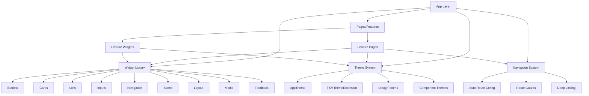

# Design Document

## Overview

This design document outlines the architecture and implementation approach for refactoring the Flutter presentation layer into a reusable design system. The refactor will eliminate hardcoded styling, consolidate duplicate components, enforce strict theming patterns, and establish responsive design tokens while maintaining identical UX behavior.

The design follows Material 3 principles with custom FSM-specific extensions, uses flutter_screenutil for responsive design, and implements a component-based architecture with centralized theming.

## Architecture

### High-Level Architecture



### Directory Structure

```
lib/
├── core/
│   ├── navigation/
│   │   ├── app_router.dart             # Auto Route configuration
│   │   ├── route_guards.dart           # Authentication & authorization guards
│   │   └── navigation.dart             # Barrel export
│   ├── theme/
│   │   ├── app_theme.dart              # Main theme configuration
│   │   ├── design_tokens.dart          # Centralized design tokens (new)
│   │   ├── app_dimensions.dart         # Responsive design tokens (deprecated)
│   │   ├── app_colors.dart             # Color constants (deprecated - migrate to theme)
│   │   ├── extensions/
│   │   │   └── fsm_theme_extension.dart # Custom theme extensions
│   │   └── theme.dart                  # Barrel export
│   └── widgets/
│       ├── buttons/
│       │   ├── fsm_button.dart         # Unified button component
│       │   ├── fsm_action_button.dart  # Action-specific buttons
│       │   └── fsm_quick_action_button.dart
│       ├── cards/
│       │   ├── fsm_card.dart           # Base card component
│       │   ├── fsm_list_card.dart      # List item cards
│       │   └── fsm_stats_card.dart     # Statistics cards
│       ├── inputs/
│       │   ├── fsm_search_bar.dart     # Search input
│       │   └── fsm_filter_chip_group.dart # Filter chips
│       ├── lists/
│       │   ├── fsm_list_item.dart      # List item component
│       │   └── fsm_lazy_loading_list.dart # Lazy loading lists
│       ├── navigation/
│       │   ├── fsm_drawer.dart         # Navigation drawer
│       │   ├── fsm_tab_bar.dart        # Tab navigation
│       │   └── fsm_bottom_sheet.dart   # Bottom sheets
│       ├── states/
│       │   ├── fsm_empty_state.dart    # Empty state component
│       │   ├── fsm_error_state.dart    # Error state component
│       │   ├── fsm_loading_indicator.dart # Loading states
│       │   └── fsm_shimmer_loading.dart # Shimmer loading
│       ├── layout/
│       │   ├── fsm_section_header.dart # Section headers
│       │   ├── fsm_info_row.dart       # Information rows
│       │   └── fsm_metadata_row.dart   # Metadata display
│       ├── feedback/
│       │   ├── fsm_status_badge.dart   # Status indicators
│       │   └── fsm_priority_indicator.dart # Priority indicators
│       ├── media/
│       │   └── fsm_optimized_image.dart # Image components
│       ├── connectivity/
│       │   ├── fsm_offline_banner.dart # Offline indicators
│       │   ├── fsm_connectivity_indicator.dart
│       │   └── fsm_sync_indicator.dart
│       ├── form/
│       │   └── [existing form widgets] # Reactive form components
│       └── widgets.dart                # Barrel export
└── features/
    └── [feature]/
        └── presentation/
            ├── pages/                  # Page implementations (<300 LOC)
            └── widgets/                # Feature-specific widgets
```

## Components and Interfaces

### Theme System Components

#### 1. AppTheme (Enhanced)
```dart
class AppTheme {
  static ThemeData get lightTheme;
  static ThemeData get darkTheme;
  
  // Component theme configurations
  static ElevatedButtonThemeData get _elevatedButtonTheme;
  static OutlinedButtonThemeData get _outlinedButtonTheme;
  static TextButtonThemeData get _textButtonTheme;
  static CardThemeData get _cardTheme;
  static ChipThemeData get _chipTheme;
  static AppBarThemeData get _appBarTheme;
  static InputDecorationTheme get _inputDecorationTheme;
  static SnackBarThemeData get _snackBarTheme;
  static DialogThemeData get _dialogTheme;
  static DividerThemeData get _dividerTheme;
  static ProgressIndicatorThemeData get _progressIndicatorTheme;
}

// Migration note: AppColors will be deprecated
// All color access should go through:
// - Theme.of(context).colorScheme for Material colors
// - context.fsmTheme for domain-specific colors
```

#### 2. DesignTokens (New - Centralized Token System)
```dart
class DesignTokens {
  DesignTokens._();

  // ============================================
  // SPACING SCALE (8pt grid)
  // ============================================
  static const double space0 = 0;
  static const double space1 = 4;   // 0.5x
  static const double space2 = 8;   // 1x base
  static const double space3 = 12;  // 1.5x
  static const double space4 = 16;  // 2x
  static const double space5 = 20;  // 2.5x
  static const double space6 = 24;  // 3x
  static const double space8 = 32;  // 4x
  static const double space10 = 40; // 5x
  static const double space12 = 48; // 6x
  static const double space16 = 64; // 8x

  // ============================================
  // RADIUS SCALE
  // ============================================
  static const double radiusNone = 0;
  static const double radiusXs = 4;
  static const double radiusSm = 8;
  static const double radiusMd = 12;
  static const double radiusLg = 16;
  static const double radiusXl = 24;
  static const double radiusFull = 9999;

  // ============================================
  // ICON SIZES
  // ============================================
  static const double iconXs = 16;
  static const double iconSm = 20;
  static const double iconMd = 24;
  static const double iconLg = 32;
  static const double iconXl = 40;

  // ============================================
  // COMPONENT HEIGHTS
  // ============================================
  static const double buttonHeightSm = 32;
  static const double buttonHeightMd = 48;
  static const double buttonHeightLg = 56;
  static const double inputHeight = 56;
  static const double appBarHeight = 56;
  static const double bottomNavHeight = 80;

  // ============================================
  // TYPOGRAPHY SCALE
  // ============================================
  static const double fontSize10 = 10;
  static const double fontSize11 = 11;
  static const double fontSize12 = 12;
  static const double fontSize14 = 14;
  static const double fontSize16 = 16;
  static const double fontSize18 = 18;
  static const double fontSize20 = 20;
  static const double fontSize24 = 24;
  static const double fontSize28 = 28;
  static const double fontSize32 = 32;
  static const double fontSize36 = 36;
  static const double fontSize48 = 48;

  // ============================================
  // BREAKPOINTS
  // ============================================
  static const double breakpointMobile = 600;
  static const double breakpointTablet = 1200;

  // ============================================
  // ACCESSIBILITY (WCAG 2.1 AA Compliance)
  // ============================================
  static const double minTouchTarget = 48;      // Minimum 44pt (iOS) / 48dp (Android)
  static const double minTextContrast = 4.5;    // WCAG AA text contrast ratio
  static const double minLargeTextContrast = 3; // WCAG AA large text contrast
  static const double focusIndicatorWidth = 2;  // Focus indicator thickness
  static const double semanticSpacing = 8;      // Minimum spacing between interactive elements

  // ============================================
  // Z-INDEX / ELEVATION
  // ============================================
  static const double elevationNone = 0;
  static const double elevationSm = 2;
  static const double elevationMd = 4;
  static const double elevationLg = 8;
  static const double elevationXl = 16;

  // ============================================
  // RESPONSIVE HELPERS
  // ============================================
  // Pre-built responsive EdgeInsets using REdgeInsets
  static REdgeInsets get paddingAllSmall => REdgeInsets.all(space2);
  static REdgeInsets get paddingAllMedium => REdgeInsets.all(space4);
  static REdgeInsets get paddingAllLarge => REdgeInsets.all(space6);
  
  static REdgeInsets paddingSymmetricR({double? horizontal, double? vertical}) {
    return REdgeInsets.symmetric(
      horizontal: horizontal ?? 0,
      vertical: vertical ?? 0,
    );
  }
  
  // Responsive SizedBox helpers using RSizedBox
  static Widget verticalSpace(double height) => RSizedBox(height: height);
  static Widget horizontalSpace(double width) => RSizedBox(width: width);
  
  static const verticalSpaceSmall = RSizedBox(height: space2);
  static const verticalSpaceMedium = RSizedBox(height: space4);
  static const verticalSpaceLarge = RSizedBox(height: space6);
  
  // Breakpoint helpers
  static bool get isMobile => 1.sw < breakpointMobile;
  static bool get isTablet => 1.sw >= breakpointMobile && 1.sw < breakpointTablet;
  static bool get isDesktop => 1.sw >= breakpointTablet;
}
```

#### 3. AppTheme Typography Configuration (Recommended Approach)
```dart
class AppTheme {
  // Configure typography in AppTheme with responsive sizing
  static TextTheme _createTextTheme() {
    return TextTheme(
      displayLarge: TextStyle(fontSize: DesignTokens.fontSize48.sp, fontWeight: FontWeight.w400),
      displayMedium: TextStyle(fontSize: DesignTokens.fontSize36.sp, fontWeight: FontWeight.w400),
      displaySmall: TextStyle(fontSize: DesignTokens.fontSize32.sp, fontWeight: FontWeight.w400),
      headlineLarge: TextStyle(fontSize: DesignTokens.fontSize28.sp, fontWeight: FontWeight.w400),
      headlineMedium: TextStyle(fontSize: DesignTokens.fontSize24.sp, fontWeight: FontWeight.w400),
      headlineSmall: TextStyle(fontSize: DesignTokens.fontSize20.sp, fontWeight: FontWeight.w400),
      titleLarge: TextStyle(fontSize: DesignTokens.fontSize18.sp, fontWeight: FontWeight.w400),
      titleMedium: TextStyle(fontSize: DesignTokens.fontSize16.sp, fontWeight: FontWeight.w500),
      titleSmall: TextStyle(fontSize: DesignTokens.fontSize14.sp, fontWeight: FontWeight.w500),
      bodyLarge: TextStyle(fontSize: DesignTokens.fontSize16.sp, fontWeight: FontWeight.w400),
      bodyMedium: TextStyle(fontSize: DesignTokens.fontSize14.sp, fontWeight: FontWeight.w400),
      bodySmall: TextStyle(fontSize: DesignTokens.fontSize12.sp, fontWeight: FontWeight.w400),
      labelLarge: TextStyle(fontSize: DesignTokens.fontSize14.sp, fontWeight: FontWeight.w500),
      labelMedium: TextStyle(fontSize: DesignTokens.fontSize12.sp, fontWeight: FontWeight.w500),
      labelSmall: TextStyle(fontSize: DesignTokens.fontSize11.sp, fontWeight: FontWeight.w500),
    );
  }

  static ThemeData get lightTheme => ThemeData(
    useMaterial3: true,
    colorScheme: _lightColorScheme,
    textTheme: _createTextTheme(),
    extensions: const <ThemeExtension<dynamic>>[
      FSMThemeExtension.light,
    ],
    // ... component themes
  );
}

// Usage in widgets: Use theme directly instead of wrapper
// Text('Hello', style: Theme.of(context).textTheme.titleLarge)
```

#### 4. FSMThemeExtension (Strongly-Typed)
```dart
@immutable
class FSMThemeExtension extends ThemeExtension<FSMThemeExtension> {
  // Strongly-typed domain colors for compile-time safety
  final Color workOrderUrgent;
  final Color workOrderHigh;
  final Color workOrderMedium;
  final Color workOrderLow;
  
  final Color statusPending;
  final Color statusInProgress;
  final Color statusCompleted;
  final Color statusCancelled;
  
  final Color actionStart;
  final Color actionPause;
  final Color actionComplete;
  final Color actionCancel;
  
  final Color syncOffline;
  final Color syncSyncing;
  final Color syncSynced;
  final Color syncFailed;
  
  // Component-specific colors
  final Color workOrderCardBackground;
  final Color searchBarBackground;
  final Color chipBackground;
  final Color fabBackground;
  
  const FSMThemeExtension({
    required this.workOrderUrgent,
    required this.workOrderHigh,
    required this.workOrderMedium,
    required this.workOrderLow,
    required this.statusPending,
    required this.statusInProgress,
    required this.statusCompleted,
    required this.statusCancelled,
    required this.actionStart,
    required this.actionPause,
    required this.actionComplete,
    required this.actionCancel,
    required this.syncOffline,
    required this.syncSyncing,
    required this.syncSynced,
    required this.syncFailed,
    required this.workOrderCardBackground,
    required this.searchBarBackground,
    required this.chipBackground,
    required this.fabBackground,
  });

  @override
  ThemeExtension<FSMThemeExtension> copyWith({
    Color? workOrderUrgent,
    Color? workOrderHigh,
    // ... all other colors
  }) {
    return FSMThemeExtension(
      workOrderUrgent: workOrderUrgent ?? this.workOrderUrgent,
      workOrderHigh: workOrderHigh ?? this.workOrderHigh,
      // ... all other colors
    );
  }

  @override
  ThemeExtension<FSMThemeExtension> lerp(
    ThemeExtension<FSMThemeExtension>? other,
    double t,
  ) {
    if (other is! FSMThemeExtension) return this;
    return FSMThemeExtension(
      workOrderUrgent: Color.lerp(workOrderUrgent, other.workOrderUrgent, t)!,
      workOrderHigh: Color.lerp(workOrderHigh, other.workOrderHigh, t)!,
      workOrderMedium: Color.lerp(workOrderMedium, other.workOrderMedium, t)!,
      workOrderLow: Color.lerp(workOrderLow, other.workOrderLow, t)!,
      statusPending: Color.lerp(statusPending, other.statusPending, t)!,
      statusInProgress: Color.lerp(statusInProgress, other.statusInProgress, t)!,
      statusCompleted: Color.lerp(statusCompleted, other.statusCompleted, t)!,
      statusCancelled: Color.lerp(statusCancelled, other.statusCancelled, t)!,
      actionStart: Color.lerp(actionStart, other.actionStart, t)!,
      actionPause: Color.lerp(actionPause, other.actionPause, t)!,
      actionComplete: Color.lerp(actionComplete, other.actionComplete, t)!,
      actionCancel: Color.lerp(actionCancel, other.actionCancel, t)!,
      syncOffline: Color.lerp(syncOffline, other.syncOffline, t)!,
      syncSyncing: Color.lerp(syncSyncing, other.syncSyncing, t)!,
      syncSynced: Color.lerp(syncSynced, other.syncSynced, t)!,
      syncFailed: Color.lerp(syncFailed, other.syncFailed, t)!,
      workOrderCardBackground: Color.lerp(workOrderCardBackground, other.workOrderCardBackground, t)!,
      searchBarBackground: Color.lerp(searchBarBackground, other.searchBarBackground, t)!,
      chipBackground: Color.lerp(chipBackground, other.chipBackground, t)!,
      fabBackground: Color.lerp(fabBackground, other.fabBackground, t)!,
    );
  }

  static const FSMThemeExtension light = FSMThemeExtension(
    workOrderUrgent: Color(0xFFD32F2F),
    workOrderHigh: Color(0xFFFF9800),
    workOrderMedium: Color(0xFF2196F3),
    workOrderLow: Color(0xFF4CAF50),
    // ... all other colors
  );

  static const FSMThemeExtension dark = FSMThemeExtension(
    workOrderUrgent: Color(0xFFEF5350),
    workOrderHigh: Color(0xFFFFB74D),
    workOrderMedium: Color(0xFF64B5F6),
    workOrderLow: Color(0xFF81C784),
    statusPending: Color(0xFFFFA726),
    statusInProgress: Color(0xFF42A5F5),
    statusCompleted: Color(0xFF66BB6A),
    statusCancelled: Color(0xFFEF5350),
    actionStart: Color(0xFF66BB6A),
    actionPause: Color(0xFFFFA726),
    actionComplete: Color(0xFF42A5F5),
    actionCancel: Color(0xFFEF5350),
    syncOffline: Color(0xFFEF5350),
    syncSyncing: Color(0xFFFFA726),
    syncSynced: Color(0xFF66BB6A),
    syncFailed: Color(0xFFEF5350),
    workOrderCardBackground: Color(0xFF2C2C2C),
    searchBarBackground: Color(0xFF3C3C3C),
    chipBackground: Color(0xFF424242),
    fabBackground: Color(0xFF42A5F5),
  );
}

// Extension method for convenient access
extension FSMThemeExtensionAccessor on BuildContext {
  FSMThemeExtension get fsmTheme {
    final extension = Theme.of(this).extension<FSMThemeExtension>();
    assert(extension != null, 'FSMThemeExtension not found in theme');
    return extension!;
  }
}
```

### Navigation System Components

#### 1. Auto Route Configuration
```dart
// lib/core/navigation/app_router.dart
import 'package:auto_route/auto_route.dart';
import 'package:flutter/material.dart';

part 'app_router.gr.dart';

@AutoRouterConfig(replaceInRouteName: 'Page|Screen,Route')
class AppRouter extends RootStackRouter {
  @override
  RouteType get defaultRouteType => const RouteType.adaptive();

  @override
  List<AutoRouteGuard> get guards => [
    AuthGuard(),
    OnboardingGuard(),
  ];

  @override
  List<AutoRoute> get routes => [
    // Splash & Auth Flow
    AutoRoute(
      page: SplashRoute.page,
      path: '/splash',
      initial: true,
    ),
    AutoRoute(
      page: LoginRoute.page,
      path: '/login',
    ),
    
    // Main App Flow (Protected)
    AutoRoute(
      page: MainWrapperRoute.page,
      path: '/app',
      guards: [AuthGuard],
      children: [
        // Dashboard
        AutoRoute(
          page: DashboardRoute.page,
          path: '/dashboard',
          initial: true,
        ),
        
        // Work Orders
        AutoRoute(
          page: WorkOrdersRoute.page,
          path: '/work-orders',
        ),
        AutoRoute(
          page: WorkOrderDetailsRoute.page,
          path: '/work-orders/:id',
        ),
        
        // Documents
        AutoRoute(
          page: DocumentsRoute.page,
          path: '/documents',
        ),
        
        // Profile
        AutoRoute(
          page: ProfileRoute.page,
          path: '/profile',
        ),
      ],
    ),
    
    // Fallback route
    AutoRoute(
      path: '*',
      page: NotFoundRoute.page,
    ),
  ];
}

// Extension for convenient navigation
extension AppRouterExtension on BuildContext {
  AppRouter get router => AutoRouter.of(this) as AppRouter;
  
  void pushWorkOrderDetails(String workOrderId) {
    router.push(WorkOrderDetailsRoute(id: workOrderId));
  }
  
  void pushDocuments({String? folderId}) {
    router.push(DocumentsRoute(folderId: folderId));
  }
}
```

#### 2. Route Guards for Authentication & Authorization
```dart
// lib/core/navigation/route_guards.dart
import 'package:auto_route/auto_route.dart';
import 'package:injectable/injectable.dart';

@injectable
class AuthGuard extends AutoRouteGuard {
  final AuthService _authService;
  
  AuthGuard(this._authService);

  @override
  void onNavigation(NavigationResolver resolver, StackRouter router) {
    if (_authService.isAuthenticated) {
      resolver.next();
    } else {
      // Redirect to login and resume navigation after auth
      router.pushAndClearStack(
        LoginRoute(onResult: (success) {
          if (success) {
            resolver.next();
          } else {
            resolver.redirect(LoginRoute());
          }
        }),
      );
    }
  }
}

@injectable
class OnboardingGuard extends AutoRouteGuard {
  final UserPreferencesService _prefsService;
  
  OnboardingGuard(this._prefsService);

  @override
  void onNavigation(NavigationResolver resolver, StackRouter router) {
    if (_prefsService.hasCompletedOnboarding) {
      resolver.next();
    } else {
      resolver.redirect(OnboardingRoute());
    }
  }
}
```

#### 3. Navigation Integration with BLoC
```dart
// Navigation listener for BLoC state changes
class NavigationBlocListener extends StatelessWidget {
  const NavigationBlocListener({super.key, required this.child});
  
  final Widget child;

  @override
  Widget build(BuildContext context) {
    return MultiBlocListener(
      listeners: [
        // Auth state navigation
        BlocListener<AuthBloc, AuthState>(
          listenWhen: (previous, current) => 
            previous.isAuthenticated != current.isAuthenticated,
          listener: (context, state) {
            if (!state.isAuthenticated) {
              context.router.pushAndClearStack(LoginRoute());
            }
          },
        ),
        
        // Work order navigation
        BlocListener<WorkOrderBloc, WorkOrderState>(
          listenWhen: (previous, current) => 
            current.navigationEvent != null,
          listener: (context, state) {
            final event = state.navigationEvent;
            if (event != null) {
              switch (event) {
                case NavigateToWorkOrderDetails(:final workOrderId):
                  context.pushWorkOrderDetails(workOrderId);
                case NavigateToDocuments(:final folderId):
                  context.pushDocuments(folderId: folderId);
              }
              // Clear navigation event after handling
              context.read<WorkOrderBloc>().add(ClearNavigationEvent());
            }
          },
        ),
      ],
      child: child,
    );
  }
}
```

### Widget Library Components

#### 1. Unified Button System
```dart
// Single canonical button implementation using composition pattern
class FsmButton extends StatelessWidget {
  const FsmButton({
    super.key, // Always include key parameter
    required this.text,
    this.onPressed,
    this.variant = FsmButtonVariant.filled,
    this.size = FsmButtonSize.medium,
    this.icon,
    this.isLoading = false,
    this.isEnabled = true,
  });
  
  // All fields must be final for const constructor
  final String text;
  final VoidCallback? onPressed;
  final FsmButtonVariant variant;
  final FsmButtonSize size;
  final IconData? icon;
  final bool isLoading;
  final bool isEnabled;
  
  @override
  Widget build(BuildContext context) {
    final theme = Theme.of(context);
    
    // Determine height based on size
    final height = switch (size) {
      FsmButtonSize.small => DesignTokens.buttonHeightSm.h,
      FsmButtonSize.medium => DesignTokens.buttonHeightMd.h,
      FsmButtonSize.large => DesignTokens.buttonHeightLg.h,
    };

    final Widget buttonChild = isLoading
        ? SizedBox(
            height: DesignTokens.iconSm.h,
            width: DesignTokens.iconSm.w,
            child: CircularProgressIndicator(strokeWidth: 2.w),
          )
        : icon != null
            ? Row(
                mainAxisSize: MainAxisSize.min,
                children: [
                  Icon(icon, size: DesignTokens.iconSm.sp),
                  DesignTokens.horizontalSpace(DesignTokens.space2),
                  Text(text),
                ],
              )
            : Text(text);

    // Wrap Material buttons with custom styling
    return SizedBox(
      height: height,
      child: switch (variant) {
        FsmButtonVariant.filled => FilledButton(
          onPressed: isLoading ? null : onPressed,
          child: buttonChild,
        ),
        FsmButtonVariant.outlined => OutlinedButton(
          onPressed: isLoading ? null : onPressed,
          child: buttonChild,
        ),
        FsmButtonVariant.text => TextButton(
          onPressed: isLoading ? null : onPressed,
          child: buttonChild,
        ),
      },
    );
  }
  
  // Factory constructors for common patterns
  const FsmButton.primary({super.key, ...});
  const FsmButton.secondary({super.key, ...});
  const FsmButton.outline({super.key, ...});
  const FsmButton.text({super.key, ...});
}

enum FsmButtonVariant { filled, outlined, text }
enum FsmButtonSize { small, medium, large }
```

#### 2. Card System
```dart
class FsmCard extends StatelessWidget {
  const FsmCard({
    super.key, // Always include key parameter
    required this.child,
    this.variant = FsmCardVariant.elevated,
    this.padding,
    this.margin,
    this.onTap,
  });
  
  final Widget child;
  final FsmCardVariant variant;
  final EdgeInsetsGeometry? padding;
  final EdgeInsetsGeometry? margin;
  final VoidCallback? onTap;
  
  @override
  Widget build(BuildContext context) {
    return RepaintBoundary( // Isolate repaints for performance
      child: Card(
        // Use theme-based styling
        child: child,
      ),
    );
  }
  
  // Specialized card types
  const FsmCard.workOrder({super.key, ...});
  const FsmCard.stats({super.key, ...});
  const FsmCard.list({super.key, ...});
}

enum FsmCardVariant { elevated, outlined, filled }
```

### Usage Examples

#### Example 1: Building a Work Order Card with Design System
```dart
class WorkOrderCard extends StatelessWidget {
  const WorkOrderCard({super.key, required this.workOrder});

  final WorkOrder workOrder;

  @override
  Widget build(BuildContext context) {
    final theme = Theme.of(context);
    final fsmTheme = context.fsmTheme;

    return RepaintBoundary(
      child: Card(
        margin: REdgeInsets.all(DesignTokens.space4),
        child: Padding(
          padding: REdgeInsets.all(DesignTokens.space4),
          child: Column(
            crossAxisAlignment: CrossAxisAlignment.start,
            children: [
              // Title with Material 3 typography
              Text(
                workOrder.title,
                style: theme.textTheme.titleLarge,
              ),
              DesignTokens.verticalSpaceMedium,

              // Status badge with domain color
              Container(
                padding: REdgeInsets.symmetric(
                  horizontal: DesignTokens.space3,
                  vertical: DesignTokens.space1,
                ),
                decoration: BoxDecoration(
                  color: _getStatusColor(fsmTheme),
                  borderRadius: BorderRadius.circular(DesignTokens.radiusSm.r),
                ),
                child: Text(
                  workOrder.status,
                  style: theme.textTheme.labelSmall?.copyWith(
                    color: theme.colorScheme.onPrimary,
                  ),
                ),
              ),
              DesignTokens.verticalSpaceMedium,

              // Action button
              FsmButton(
                text: 'View Details',
                variant: FsmButtonVariant.outlined,
                size: FsmButtonSize.small,
                icon: Icons.arrow_forward,
                onPressed: _handleViewDetails,
              ),
            ],
          ),
        ),
      ),
    );
  }

  Color _getStatusColor(FSMThemeExtension fsmTheme) {
    return switch (workOrder.status.toLowerCase()) {
      'pending' => fsmTheme.statusPending,
      'in_progress' => fsmTheme.statusInProgress,
      'completed' => fsmTheme.statusCompleted,
      _ => fsmTheme.statusCancelled,
    };
  }

  void _handleViewDetails() {
    // Navigation logic
  }
}
```

#### Example 2: Implementing a Page with BLoC and Design System
```dart
class WorkOrdersPage extends StatelessWidget with BlocBuildConditions {
  const WorkOrdersPage({super.key});

  @override
  Widget build(BuildContext context) {
    final theme = Theme.of(context);

    return Scaffold(
      appBar: AppBar(
        title: Text('Work Orders', style: theme.textTheme.titleLarge),
      ),
      body: SafeArea(
        child: BlocConsumer<WorkOrderBloc, WorkOrderState>(
          // Fine-grained rebuild control
          buildWhen: (previous, current) =>
            previous.workOrders != current.workOrders ||
            previous.isLoading != current.isLoading,

          // Side effects in listener
          listenWhen: (previous, current) =>
            previous.hasError != current.hasError,
          listener: (context, state) {
            if (state.hasError) {
              ScaffoldMessenger.of(context).showSnackBar(
                SnackBar(content: Text(state.errorMessage ?? 'An error occurred')),
              );
            }
          },

          builder: (context, state) {
            if (state.isLoading) {
              return Center(
                child: CircularProgressIndicator(
                  strokeWidth: DesignTokens.space1.w,
                ),
              );
            }

            if (state.workOrders.isEmpty) {
              return FsmEmptyState(
                icon: Icons.work_outline,
                title: 'No Work Orders',
                subtitle: 'Work orders will appear here',
              );
            }

            return ListView.builder(
              padding: REdgeInsets.all(DesignTokens.space4),
              itemCount: state.workOrders.length,
              itemBuilder: (context, index) {
                return WorkOrderCard(workOrder: state.workOrders[index]);
              },
            );
          },
        ),
      ),
      floatingActionButton: FloatingActionButton(
        onPressed: _handleAddWorkOrder,
        child: Icon(Icons.add, size: DesignTokens.iconMd.sp),
      ),
    );
  }

  void _handleAddWorkOrder() {
    // Navigation to add work order
  }
}
```

#### Example 3: Using BlocSelector for Optimized Rebuilds
```dart
class WorkOrderCountWidget extends StatelessWidget {
  const WorkOrderCountWidget({super.key});

  @override
  Widget build(BuildContext context) {
    final theme = Theme.of(context);

    // Only rebuilds when workOrders list length changes
    return BlocSelector<WorkOrderBloc, WorkOrderState, int>(
      selector: (state) => state.workOrders.length,
      builder: (context, count) {
        return Container(
          padding: REdgeInsets.all(DesignTokens.space2),
          decoration: BoxDecoration(
            color: theme.colorScheme.primaryContainer,
            borderRadius: BorderRadius.circular(DesignTokens.radiusSm.r),
          ),
          child: Text(
            '$count Work Orders',
            style: theme.textTheme.labelMedium?.copyWith(
              color: theme.colorScheme.onPrimaryContainer,
            ),
          ),
        );
      },
    );
  }
}
```

#### Example 4: Creating a Form with Responsive Layout
```dart
class WorkOrderForm extends StatelessWidget {
  const WorkOrderForm({super.key});

  @override
  Widget build(BuildContext context) {
    final theme = Theme.of(context);

    return Padding(
      padding: REdgeInsets.all(DesignTokens.space4),
      child: Column(
        crossAxisAlignment: CrossAxisAlignment.stretch,
        children: [
          // Title field
          TextFormField(
            decoration: InputDecoration(
              labelText: 'Title',
              hintText: 'Enter work order title',
              contentPadding: REdgeInsets.symmetric(
                horizontal: DesignTokens.space4,
                vertical: DesignTokens.space3,
              ),
            ),
            style: theme.textTheme.bodyLarge,
          ),
          DesignTokens.verticalSpaceMedium,

          // Description field
          TextFormField(
            decoration: InputDecoration(
              labelText: 'Description',
              hintText: 'Enter description',
              contentPadding: REdgeInsets.symmetric(
                horizontal: DesignTokens.space4,
                vertical: DesignTokens.space3,
              ),
            ),
            style: theme.textTheme.bodyLarge,
            maxLines: 5,
          ),
          DesignTokens.verticalSpaceLarge,

          // Submit button
          FsmButton(
            text: 'Create Work Order',
            variant: FsmButtonVariant.filled,
            size: FsmButtonSize.large,
            onPressed: _handleSubmit,
          ),
        ],
      ),
    );
  }

  void _handleSubmit() {
    // Form submission logic
  }
}
```

#### Example 5: Responsive Layout with Breakpoints
```dart
class ResponsiveDashboard extends StatelessWidget {
  const ResponsiveDashboard({super.key});

  @override
  Widget build(BuildContext context) {
    return LayoutBuilder(
      builder: (context, constraints) {
        if (DesignTokens.isMobile) {
          return _buildMobileLayout();
        } else if (DesignTokens.isTablet) {
          return _buildTabletLayout();
        } else {
          return _buildDesktopLayout();
        }
      },
    );
  }

  Widget _buildMobileLayout() {
    return Column(
      children: [
        _buildStatsSection(),
        DesignTokens.verticalSpaceMedium,
        _buildWorkOrdersList(),
      ],
    );
  }

  Widget _buildTabletLayout() {
    return Row(
      children: [
        Expanded(flex: 1, child: _buildStatsSection()),
        DesignTokens.horizontalSpace(DesignTokens.space4),
        Expanded(flex: 2, child: _buildWorkOrdersList()),
      ],
    );
  }

  Widget _buildDesktopLayout() {
    return Row(
      children: [
        Expanded(flex: 1, child: _buildStatsSection()),
        DesignTokens.horizontalSpace(DesignTokens.space6),
        Expanded(flex: 3, child: _buildWorkOrdersList()),
        DesignTokens.horizontalSpace(DesignTokens.space6),
        Expanded(flex: 1, child: _buildActivityFeed()),
      ],
    );
  }

  Widget _buildStatsSection() => const SizedBox(); // Implementation
  Widget _buildWorkOrdersList() => const SizedBox(); // Implementation
  Widget _buildActivityFeed() => const SizedBox(); // Implementation
}
```

#### 3. BLoC Helper Patterns
```dart
// Use mixin for common buildWhen patterns instead of wrapper widgets
mixin BlocBuildConditions {
  bool buildWhenLoading<S extends BlocState>(S previous, S current) {
    return previous.isLoading != current.isLoading;
  }

  bool buildWhenData<S extends BlocState>(S previous, S current) {
    return previous.data != current.data;
  }

  bool buildWhenError<S extends BlocState>(S previous, S current) {
    return previous.hasError != current.hasError;
  }

  bool buildWhenStatus<S extends BlocState>(S previous, S current) {
    return previous.status != current.status;
  }
}

// Usage in pages - use direct BlocBuilder with mixin helpers
class MyPage extends StatelessWidget with BlocBuildConditions {
  const MyPage({super.key});

  @override
  Widget build(BuildContext context) {
    return BlocBuilder<MyBloc, MyState>(
      buildWhen: buildWhenData, // Use mixin method
      builder: (context, state) {
        // Widget implementation
      },
    );
  }

  // Method references instead of anonymous functions
  void _handleButtonPress() {
    // Handle press logic
  }
}

// Common listener patterns as static methods
class BlocListenerHelpers {
  static void showSnackBarOnError<S extends BlocState>(
    BuildContext context,
    S state,
  ) {
    if (state.hasError) {
      ScaffoldMessenger.of(context).showSnackBar(
        SnackBar(content: Text(state.errorMessage ?? 'An error occurred')),
      );
    }
  }

  static void navigateOnSuccess<S extends BlocState>(
    BuildContext context,
    S state,
    String route,
  ) {
    if (state.isSuccess) {
      Navigator.of(context).pushNamed(route);
    }
  }
}
```

## BLoC Best Practices (flutter_bloc 9.1.1+)

### Property-Based buildWhen Conditions (Recommended)

**Always compare specific state properties** instead of using `runtimeType` for more precise rebuild control:

```dart
// ✅ CORRECT - Property-based comparison
BlocBuilder<CounterBloc, CounterState>(
  buildWhen: (previous, current) {
    // Only rebuild when count actually changes
    return previous.count != current.count;
  },
  builder: (context, state) {
    return Text('Count: ${state.count}');
  },
)

// ✅ CORRECT - Multiple property comparison
BlocBuilder<WorkOrderBloc, WorkOrderState>(
  buildWhen: (previous, current) {
    return previous.workOrders != current.workOrders ||
           previous.isLoading != current.isLoading ||
           previous.filterStatus != current.filterStatus;
  },
  builder: (context, state) {
    if (state.isLoading) return CircularProgressIndicator();
    return WorkOrderList(workOrders: state.workOrders);
  },
)

// ❌ WRONG - Runtime type comparison (less precise)
BlocBuilder<TimerBloc, TimerState>(
  buildWhen: (previous, current) {
    // This rebuilds on ANY state change of different types
    // Can cause unnecessary rebuilds if state properties don't change
    return previous.runtimeType != current.runtimeType;
  },
  builder: (context, state) {
    return Text('State: $state');
  },
)
```

### Enhanced BLoC Optimization Patterns

#### BlocBuildConditions Mixin (Requirement 5.5)
```dart
// lib/core/bloc/bloc_build_conditions.dart
mixin BlocBuildConditions {
  // Common build conditions for reuse across pages
  bool buildWhenLoading<S extends BlocState>(S previous, S current) {
    return previous.isLoading != current.isLoading;
  }

  bool buildWhenData<S extends BlocState>(S previous, S current) {
    return previous.data != current.data;
  }

  bool buildWhenError<S extends BlocState>(S previous, S current) {
    return previous.hasError != current.hasError;
  }

  bool buildWhenStatus<S extends BlocState>(S previous, S current) {
    return previous.status != current.status;
  }

  // Specific conditions for work orders
  bool buildWhenWorkOrders(WorkOrderState previous, WorkOrderState current) {
    return previous.workOrders != current.workOrders ||
           previous.isLoading != current.isLoading ||
           previous.filterStatus != current.filterStatus;
  }

  // Specific conditions for documents
  bool buildWhenDocuments(DocumentState previous, DocumentState current) {
    return previous.documents != current.documents ||
           previous.isLoading != current.isLoading ||
           previous.selectedFolder != current.selectedFolder;
  }

  // Combined conditions
  bool buildWhenDataOrLoading<S extends BlocState>(S previous, S current) {
    return buildWhenData(previous, current) || buildWhenLoading(previous, current);
  }
}

// Usage in pages
class WorkOrdersPage extends StatelessWidget with BlocBuildConditions {
  const WorkOrdersPage({super.key});

  @override
  Widget build(BuildContext context) {
    return BlocBuilder<WorkOrderBloc, WorkOrderState>(
      buildWhen: buildWhenWorkOrders, // Use mixin method
      builder: (context, state) {
        // Page implementation
      },
    );
  }
}
```

### BlocSelector for Ultra-Fine-Grained Rebuilds

Use `BlocSelector` when you only care about a specific derived value from state:

```dart
// Only rebuilds when workOrders.length changes, not on any workOrders mutation
BlocSelector<WorkOrderBloc, WorkOrderState, int>(
  selector: (state) => state.workOrders.length,
  builder: (context, count) {
    return Badge(
      label: Text('$count'),
      child: Icon(Icons.work),
    );
  },
)

// Complex selection with multiple properties
BlocSelector<WorkOrderBloc, WorkOrderState, ({int total, int urgent})>(
  selector: (state) => (
    total: state.workOrders.length,
    urgent: state.workOrders.where((w) => w.priority == 'urgent').length,
  ),
  builder: (context, counts) {
    return Text('${counts.urgent} urgent of ${counts.total} total');
  },
)
```

### BlocConsumer for Combined Builder + Listener

Use `BlocConsumer` when you need both UI updates and side effects:

```dart
BlocConsumer<WorkOrderBloc, WorkOrderState>(
  // Control when listener fires
  listenWhen: (previous, current) {
    return previous.hasError != current.hasError ||
           previous.successMessage != current.successMessage;
  },
  listener: (context, state) {
    if (state.hasError) {
      ScaffoldMessenger.of(context).showSnackBar(
        SnackBar(
          content: Text(state.errorMessage ?? 'An error occurred'),
          backgroundColor: Theme.of(context).colorScheme.error,
        ),
      );
    }

    if (state.successMessage != null) {
      ScaffoldMessenger.of(context).showSnackBar(
        SnackBar(content: Text(state.successMessage!)),
      );
    }
  },
  // Control when builder fires
  buildWhen: (previous, current) {
    return previous.workOrders != current.workOrders ||
           previous.isLoading != current.isLoading;
  },
  builder: (context, state) {
    if (state.isLoading) {
      return Center(child: CircularProgressIndicator());
    }

    return WorkOrderList(workOrders: state.workOrders);
  },
)
```

### BlocListener for Pure Side Effects

Use `BlocListener` when you don't need to rebuild UI, only trigger side effects:

```dart
// Navigation based on authentication state
BlocListener<AuthBloc, AuthState>(
  listenWhen: (previous, current) => previous.isAuthenticated != current.isAuthenticated,
  listener: (context, state) {
    if (!state.isAuthenticated) {
      context.router.replaceAll([LoginRoute()]);
    }
  },
  child: DashboardPage(),
)

// Show dialogs on specific state changes
BlocListener<WorkOrderBloc, WorkOrderState>(
  listenWhen: (previous, current) => current.showDeleteConfirmation,
  listener: (context, state) {
    showDialog(
      context: context,
      builder: (_) => AlertDialog(
        title: Text('Delete Work Order?'),
        actions: [
          TextButton(
            onPressed: () => Navigator.pop(context),
            child: Text('Cancel'),
          ),
          FilledButton(
            onPressed: () {
              context.read<WorkOrderBloc>().add(ConfirmDelete(state.selectedId));
              Navigator.pop(context);
            },
            child: Text('Delete'),
          ),
        ],
      ),
    );
  },
  child: WorkOrdersList(),
)
```

### MultiBlocListener for Multiple Side Effects

```dart
MultiBlocListener(
  listeners: [
    BlocListener<AuthBloc, AuthState>(
      listenWhen: (previous, current) => previous.isAuthenticated != current.isAuthenticated,
      listener: (context, state) {
        if (!state.isAuthenticated) {
          context.router.replaceAll([LoginRoute()]);
        }
      },
    ),
    BlocListener<ConnectivityBloc, ConnectivityState>(
      listenWhen: (previous, current) => previous.isOnline != current.isOnline,
      listener: (context, state) {
        ScaffoldMessenger.of(context).showSnackBar(
          SnackBar(
            content: Text(state.isOnline ? 'Back online' : 'Offline mode'),
            duration: Duration(seconds: 2),
          ),
        );
      },
    ),
    BlocListener<SyncBloc, SyncState>(
      listenWhen: (previous, current) => previous.syncStatus != current.syncStatus,
      listener: (context, state) {
        if (state.syncStatus == SyncStatus.completed) {
          context.read<WorkOrderBloc>().add(RefreshWorkOrders());
        }
      },
    ),
  ],
  child: DashboardContent(),
)
```

### Context Extensions for Cleaner Code

```dart
// Use context.read for one-time access (events)
ElevatedButton(
  onPressed: () {
    context.read<CounterBloc>().add(Increment());
  },
  child: Text('Increment'),
)

// Use context.watch for continuous state access (rebuilds on change)
@override
Widget build(BuildContext context) {
  final count = context.watch<CounterBloc>().state.count;
  return Text('Count: $count');
}

// Use context.select for selective watching
@override
Widget build(BuildContext context) {
  // Only rebuilds when count changes, not on other state properties
  final count = context.select((CounterBloc bloc) => bloc.state.count);
  return Text('Count: $count');
}
```

### Common BLoC Anti-Patterns to Avoid

```dart
// ❌ WRONG - Using context.read in build method (won't rebuild)
@override
Widget build(BuildContext context) {
  final state = context.read<MyBloc>().state; // BAD - doesn't listen
  return Text('${state.value}');
}

// ✅ CORRECT - Use context.watch or BlocBuilder
@override
Widget build(BuildContext context) {
  final state = context.watch<MyBloc>().state; // GOOD - rebuilds on change
  return Text('${state.value}');
}

// ❌ WRONG - Anonymous functions in build (creates new instance each build)
@override
Widget build(BuildContext context) {
  return ElevatedButton(
    onPressed: () => context.read<MyBloc>().add(MyEvent()), // BAD
    child: Text('Click'),
  );
}

// ✅ CORRECT - Method reference
@override
Widget build(BuildContext context) {
  return ElevatedButton(
    onPressed: _handlePress, // GOOD
    child: Text('Click'),
  );
}

void _handlePress() {
  context.read<MyBloc>().add(MyEvent());
}

// ❌ WRONG - Omitting buildWhen/listenWhen (rebuilds/listens on every state)
BlocBuilder<MyBloc, MyState>(
  builder: (context, state) => Text('$state'), // Rebuilds on ANY state change
)

// ✅ CORRECT - Explicit conditions for optimization
BlocBuilder<MyBloc, MyState>(
  buildWhen: (previous, current) => previous.value != current.value,
  builder: (context, state) => Text('${state.value}'),
)
```

## Data Models

### Design Token Models

#### 1. Spacing Token
```dart
class SpacingToken {
  final double xSmall;
  final double small;
  final double medium;
  final double large;
  final double xLarge;
  
  const SpacingToken({
    required this.xSmall,
    required this.small,
    required this.medium,
    required this.large,
    required this.xLarge,
  });
}
```

#### 2. Typography Token
```dart
class TypographyToken {
  final double fontSize;
  final FontWeight fontWeight;
  final double lineHeight;
  final double letterSpacing;
  
  const TypographyToken({
    required this.fontSize,
    required this.fontWeight,
    required this.lineHeight,
    this.letterSpacing = 0,
  });
}
```

#### 3. Component Variant Models
```dart
abstract class ComponentVariant {
  String get name;
  Map<String, dynamic> get properties;
}

class ButtonVariant extends ComponentVariant {
  final Color backgroundColor;
  final Color foregroundColor;
  final BorderSide? border;
  final double elevation;
  
  const ButtonVariant({
    required this.backgroundColor,
    required this.foregroundColor,
    this.border,
    this.elevation = 0,
  });
}
```

## Error Handling

### Theme Error Handling
```dart
class ThemeErrorHandler {
  static Color getColorSafely(BuildContext context, String colorKey) {
    try {
      final fsmTheme = context.fsmTheme;
      return fsmTheme.getStatusColor(colorKey);
    } catch (e) {
      // Log error and return fallback
      debugPrint('Theme color error for key: $colorKey');
      return Theme.of(context).colorScheme.primary;
    }
  }
  
  static TextStyle getTextStyleSafely(BuildContext context, String styleKey) {
    try {
      return AppTypography.bodyMedium(context);
    } catch (e) {
      // Log error and return fallback
      debugPrint('Typography error for key: $styleKey');
      return const TextStyle();
    }
  }
}
```

### Widget Error Boundaries
```dart
class FsmErrorBoundary extends StatelessWidget {
  const FsmErrorBoundary({
    super.key,
    required this.child,
    this.fallback,
    this.onError,
  });

  final Widget child;
  final Widget Function(FlutterErrorDetails)? fallback;
  final void Function(FlutterErrorDetails)? onError;

  @override
  Widget build(BuildContext context) {
    return child; // Just return child normally
  }
  
  // Error handling should be set up in main.dart:
  // FlutterError.onError = (details) { ... };
}

// Better approach: Use existing ErrorBoundaryService from codebase
// or implement proper error handling at the app level
```

## Accessibility Guidelines (WCAG 2.1 AA Compliance)

### 1. Color and Contrast Requirements
```dart
// All colors must meet WCAG AA contrast ratios
class AccessibilityColors {
  // Text contrast ratios
  static const double normalTextMinContrast = 4.5;  // 14pt+ text
  static const double largeTextMinContrast = 3.0;   // 18pt+ or 14pt+ bold
  
  // Verify contrast in theme extension
  static bool verifyContrast(Color foreground, Color background, {bool isLargeText = false}) {
    final ratio = _calculateContrastRatio(foreground, background);
    final minRatio = isLargeText ? largeTextMinContrast : normalTextMinContrast;
    return ratio >= minRatio;
  }
}

// FSMThemeExtension with accessibility validation
class FSMThemeExtension extends ThemeExtension<FSMThemeExtension> {
  // ... existing code ...
  
  // Accessibility validation
  bool get isAccessibilityCompliant {
    // Validate all color combinations meet contrast requirements
    return AccessibilityColors.verifyContrast(
      statusPending, 
      workOrderCardBackground,
    ) && /* other validations */;
  }
}
```

### 2. Touch Target Requirements
```dart
// All interactive elements must meet minimum touch targets
class AccessibleWidget extends StatelessWidget {
  const AccessibleWidget({
    super.key,
    required this.child,
    this.onTap,
    this.semanticLabel,
    this.tooltip,
  });

  final Widget child;
  final VoidCallback? onTap;
  final String? semanticLabel;
  final String? tooltip;

  @override
  Widget build(BuildContext context) {
    Widget result = child;

    // Ensure minimum touch target
    result = ConstrainedBox(
      constraints: BoxConstraints(
        minWidth: DesignTokens.minTouchTarget.w,
        minHeight: DesignTokens.minTouchTarget.h,
      ),
      child: result,
    );

    // Add semantic information
    if (semanticLabel != null) {
      result = Semantics(
        label: semanticLabel,
        button: onTap != null,
        child: result,
      );
    }

    // Add tooltip for additional context
    if (tooltip != null) {
      result = Tooltip(
        message: tooltip!,
        child: result,
      );
    }

    return result;
  }
}
```

### 3. Screen Reader Support
```dart
// Enhanced semantic information for complex widgets
class FsmWorkOrderCard extends StatelessWidget {
  const FsmWorkOrderCard({super.key, required this.workOrder});

  final WorkOrder workOrder;

  @override
  Widget build(BuildContext context) {
    return Semantics(
      label: 'Work order ${workOrder.title}',
      value: 'Status: ${workOrder.status}, Priority: ${workOrder.priority}',
      button: true,
      onTap: () => _navigateToDetails(context),
      child: RepaintBoundary(
        child: Card(
          child: _buildCardContent(context),
        ),
      ),
    );
  }

  Widget _buildCardContent(BuildContext context) {
    return Column(
      children: [
        // Exclude decorative elements from screen reader
        ExcludeSemantics(
          child: Icon(Icons.work, color: context.fsmTheme.statusPending),
        ),
        
        // Provide meaningful semantic labels
        Semantics(
          header: true,
          child: Text(workOrder.title, style: Theme.of(context).textTheme.titleLarge),
        ),
        
        // Group related information
        Semantics(
          container: true,
          label: 'Work order details',
          child: Column(
            children: [
              Text('Status: ${workOrder.status}'),
              Text('Priority: ${workOrder.priority}'),
            ],
          ),
        ),
      ],
    );
  }
}
```

## Testing Strategy

### 1. Golden Tests (Requirement 8.1)
- Key page screenshots for visual regression testing
- Theme variant comparisons (light/dark)
- Component library showcase
- Responsive breakpoint testing
- Accessibility color contrast validation

### 2. Unit Tests
- Theme extension functionality
- Design token calculations
- Component variant behavior
- Error handling scenarios
- Accessibility compliance validation

### 3. Widget Tests (Requirement 8.3)
- BLoC integration patterns with buildWhen/listenWhen optimization
- Accessibility compliance (semantic labels, touch targets)
- Responsive behavior across screen sizes
- Navigation integration with Auto Route

### 4. Integration Tests
- End-to-end user flows
- Theme switching
- Performance benchmarks
- Memory usage validation
- Deep linking scenarios

### 5. Accessibility Tests
```dart
// Accessibility testing utilities
class AccessibilityTestHelpers {
  static Future<void> verifyAccessibility(WidgetTester tester) async {
    // Check semantic labels
    final semanticsHandle = tester.ensureSemantics();
    
    // Verify all interactive elements have semantic labels
    final buttons = find.byType(ElevatedButton);
    for (int i = 0; i < buttons.evaluate().length; i++) {
      final button = buttons.at(i);
      final semantics = tester.getSemantics(button);
      expect(semantics.label, isNotNull, reason: 'Button at index $i missing semantic label');
    }
    
    // Verify touch target sizes
    final touchTargets = find.byType(GestureDetector);
    for (int i = 0; i < touchTargets.evaluate().length; i++) {
      final target = touchTargets.at(i);
      final size = tester.getSize(target);
      expect(size.width, greaterThanOrEqualTo(DesignTokens.minTouchTarget));
      expect(size.height, greaterThanOrEqualTo(DesignTokens.minTouchTarget));
    }
    
    semanticsHandle.dispose();
  }
  
  static Future<void> verifyColorContrast(WidgetTester tester) async {
    // Test color contrast ratios
    await tester.pumpWidget(
      MaterialApp(
        theme: AppTheme.lightTheme,
        home: Builder(
          builder: (context) {
            final fsmTheme = context.fsmTheme;
            final colorScheme = Theme.of(context).colorScheme;
            
            // Verify primary text contrast
            expect(
              AccessibilityColors.verifyContrast(
                colorScheme.onSurface,
                colorScheme.surface,
              ),
              isTrue,
              reason: 'Primary text contrast insufficient',
            );
            
            return const SizedBox();
          },
        ),
      ),
    );
  }
}

### Test Structure
```dart
// Golden test example
testWidgets('Dashboard page golden test', (tester) async {
  await tester.pumpWidget(
    MaterialApp(
      theme: AppTheme.lightTheme,
      home: DashboardPage(),
    ),
  );
  
  await expectLater(
    find.byType(DashboardPage),
    matchesGoldenFile('dashboard_light.png'),
  );
});

// BLoC optimization test
testWidgets('BLoC buildWhen optimization', (tester) async {
  int buildCount = 0;
  
  await tester.pumpWidget(
    BlocProvider(
      create: (_) => TestBloc(),
      child: FsmBlocBuilder<TestBloc, TestState>(
        buildWhen: (previous, current) => previous.data != current.data,
        builder: (context, state) {
          buildCount++;
          return Text(state.data);
        },
      ),
    ),
  );
  
  // Verify minimal rebuilds
  expect(buildCount, equals(1));
});
```

### CI/CD Integration
```yaml
# .github/workflows/design_system_checks.yml
name: Design System Checks

on: [push, pull_request]

jobs:
  lint_checks:
    runs-on: ubuntu-latest
    steps:
      - uses: actions/checkout@v3
      - uses: subosito/flutter-action@v2
      
      - name: Check for hardcoded styling
        run: |
          # Check for hardcoded Colors (allow only Colors.transparent)
          if grep -rn "Colors\.\(red\|blue\|green\|white\|black\|grey\|amber\|purple\|orange\|pink\|teal\|cyan\|indigo\|lime\|brown\)" \
             lib/features/*/presentation/ lib/core/widgets/ \
             --include="*.dart" --exclude-dir=test; then
            echo "❌ Found hardcoded Colors usage"
            exit 1
          fi
          
          # Check for raw EdgeInsets (allow EdgeInsets.zero and EdgeInsets.all(0))
          if grep -rn "EdgeInsets\.\(symmetric\|only\|fromLTRB\)\|EdgeInsets\.all([1-9]" \
             lib/features/*/presentation/ lib/core/widgets/ \
             --include="*.dart" --exclude-dir=test; then
            echo "❌ Found raw EdgeInsets usage without responsive tokens"
            exit 1
          fi
          
          # Check for hardcoded SizedBox dimensions
          if grep -rn "SizedBox(height: [0-9]\+\|SizedBox(width: [0-9]\+" \
             lib/features/*/presentation/ lib/core/widgets/ \
             --include="*.dart" --exclude-dir=test; then
            echo "❌ Found SizedBox with hardcoded dimensions"
            exit 1
          fi
          
          # Check for direct .w/.h/.sp usage instead of tokens
          if grep -rn "\.[0-9]\+\.[wh]\>\|\.[0-9]\+\.sp\>" \
             lib/features/*/presentation/ lib/core/widgets/ \
             --include="*.dart" --exclude-dir=test; then
            echo "❌ Found direct .w/.h/.sp usage instead of design tokens"
            exit 1
          fi
          
          # Check for import hygiene (Requirement 8.4)
          if grep -rn "import.*lib/core/theme/app_colors.dart\|import.*lib/core/theme/app_dimensions.dart" \
             lib/features/*/presentation/ \
             --include="*.dart" --exclude-dir=test; then
            echo "❌ Found deprecated theme imports - use widgets.dart barrel"
            exit 1
          fi
          
          # Check for proper widget imports (should use barrel)
          if ! grep -rn "import.*lib/core/widgets/widgets.dart" \
             lib/features/*/presentation/ \
             --include="*.dart" --exclude-dir=test | head -1; then
            echo "⚠️  Pages should import widgets via barrel file"
          fi
          
      - name: Run golden tests
        run: flutter test --update-goldens
        
      - name: Check page line counts
        run: |
          find lib/features/*/presentation/pages/ -name "*.dart" -exec wc -l {} + | awk '$1 > 300 {print "❌ " $2 " exceeds 300 lines (" $1 ")"; exit 1}'
          
      - name: Check const constructors and performance patterns
        run: |
          # Check that custom widgets use const constructors
          find lib/core/widgets/ -name "*.dart" -exec grep -l "class.*extends StatelessWidget" {} \; | \
          while read file; do
            if ! grep -q "const.*({" "$file"; then
              echo "❌ Missing const constructor in $file"
              exit 1
            fi
          done
          
          # Check for anonymous functions in build methods (performance anti-pattern)
          if grep -rn "onPressed: () =>" lib/core/widgets/ lib/features/*/presentation/ \
             --include="*.dart" --exclude-dir=test; then
            echo "❌ Found anonymous functions in build methods - use method references"
            exit 1
          fi
```

## Performance Optimization Patterns

### 1. Widget Composition Helpers
```dart
// Composition helper for common patterns
class FsmScaffold extends StatelessWidget {
  const FsmScaffold({
    super.key,
    this.appBar,
    required this.body,
    this.floatingActionButton,
    this.bottomNavigationBar,
    this.drawer,
  });

  final PreferredSizeWidget? appBar;
  final Widget body;
  final Widget? floatingActionButton;
  final Widget? bottomNavigationBar;
  final Widget? drawer;

  @override
  Widget build(BuildContext context) {
    return Scaffold(
      appBar: appBar,
      body: SafeArea(child: body), // Always use SafeArea
      floatingActionButton: floatingActionButton,
      bottomNavigationBar: bottomNavigationBar,
      drawer: drawer,
    );
  }
}
```

### 2. Performance Best Practices (Requirement 9)

#### Const Constructors and Super.key (Requirement 9.1)
```dart
// ✅ CORRECT - All custom widgets use const constructors with super.key
class FsmWorkOrderCard extends StatelessWidget {
  const FsmWorkOrderCard({
    super.key,  // Always include super.key parameter
    required this.workOrder,
    this.onTap,
  });
  
  final WorkOrder workOrder;
  final VoidCallback? onTap;
  
  @override
  Widget build(BuildContext context) {
    return RepaintBoundary( // Requirement 9.3 - Isolate repaints
      child: Card(
        child: _buildCardContent(context),
      ),
    );
  }
  
  Widget _buildCardContent(BuildContext context) {
    // Card content implementation
  }
}
```

#### Composition Over Inheritance (Requirement 9.2)
```dart
// ✅ CORRECT - Wrap Material widgets instead of extending
class FsmButton extends StatelessWidget {
  const FsmButton({
    super.key,
    required this.text,
    this.onPressed,
    this.variant = FsmButtonVariant.filled,
  });
  
  final String text;
  final VoidCallback? onPressed;
  final FsmButtonVariant variant;
  
  @override
  Widget build(BuildContext context) {
    // Wrap Material button with custom styling
    return switch (variant) {
      FsmButtonVariant.filled => FilledButton(
        onPressed: onPressed,
        child: Text(text),
      ),
      FsmButtonVariant.outlined => OutlinedButton(
        onPressed: onPressed,
        child: Text(text),
      ),
      // ... other variants
    };
  }
}

// ❌ WRONG - Don't extend ButtonStyleButton
class FsmButton extends ButtonStyleButton {
  // This approach is discouraged
}
```

#### Method References (Requirement 9.4)
```dart
// ✅ CORRECT - Method references instead of anonymous functions
class MyWidget extends StatelessWidget {
  const MyWidget({super.key});
  
  @override
  Widget build(BuildContext context) {
    return Column(
      children: [
        ElevatedButton(
          onPressed: _handlePress, // Method reference
          child: const Text('Click me'),
        ),
        ElevatedButton(
          onPressed: _handleSecondAction, // Method reference
          child: const Text('Second Action'),
        ),
      ],
    );
  }
  
  void _handlePress() {
    // Handle press logic
  }
  
  void _handleSecondAction() {
    // Handle second action
  }
}

// ❌ WRONG - Anonymous functions create new instances each build
class MyWidget extends StatelessWidget {
  @override
  Widget build(BuildContext context) {
    return ElevatedButton(
      onPressed: () => print('clicked'), // Creates new function each build
      child: Text('Click me'),
    );
  }
}
```

#### ListView.builder for Dynamic Lists (Requirement 9.5)
```dart
// ✅ CORRECT - ListView.builder for lazy loading
class FsmWorkOrderList extends StatelessWidget {
  const FsmWorkOrderList({super.key, required this.workOrders});
  
  final List<WorkOrder> workOrders;
  
  @override
  Widget build(BuildContext context) {
    return ListView.builder( // Lazy loading for performance
      itemCount: workOrders.length,
      itemBuilder: (context, index) {
        return FsmWorkOrderCard(workOrder: workOrders[index]);
      },
    );
  }
}

// ❌ WRONG - Column with children creates all widgets at once
class FsmWorkOrderList extends StatelessWidget {
  @override
  Widget build(BuildContext context) {
    return Column(
      children: workOrders.map((wo) => FsmWorkOrderCard(workOrder: wo)).toList(),
    );
  }
}
```

#### RepaintBoundary for Complex Widgets (Requirement 9.3)
```dart
// ✅ CORRECT - RepaintBoundary isolates repaints
class FsmComplexCard extends StatelessWidget {
  const FsmComplexCard({super.key, required this.data});
  
  final ComplexData data;
  
  @override
  Widget build(BuildContext context) {
    return RepaintBoundary( // Isolate this widget's repaints
      child: Card(
        child: Column(
          children: [
            // Complex content that might repaint frequently
            CustomChart(data: data.chartData),
            AnimatedProgressBar(progress: data.progress),
            InteractiveMap(locations: data.locations),
          ],
        ),
      ),
    );
  }
}
```

### 3. ScreenUtil Initialization (Correct Pattern)
```dart
// main.dart
void main() => runApp(const MyApp());

class MyApp extends StatelessWidget {
  const MyApp({super.key});

  @override
  Widget build(BuildContext context) {
    return ScreenUtilInit(
      designSize: const Size(390, 844), // Your design specs
      minTextAdapt: true,
      splitScreenMode: true,
      builder: (context, child) {
        return MaterialApp(
          debugShowCheckedModeBanner: false,
          title: 'FSM App',
          theme: AppTheme.lightTheme,
          darkTheme: AppTheme.darkTheme,
          home: child,
        );
      },
      child: const SplashPage(),
    );
  }
}
```

### 4. Test Utilities
```dart
// test/helpers/widget_test_helpers.dart
MaterialApp testableWidget(Widget child, {ThemeData? theme}) {
  return ScreenUtilInit(
    designSize: const Size(390, 844),
    builder: (context, _) => MaterialApp(
      theme: theme ?? AppTheme.lightTheme,
      home: Scaffold(body: child),
    ),
  );
}

// Theme tests
void main() {
  group('AppTheme Tests', () {
    testWidgets('Light theme has correct color scheme', (tester) async {
      await tester.pumpWidget(
        MaterialApp(
          theme: AppTheme.lightTheme,
          home: Builder(
            builder: (context) {
              final colorScheme = Theme.of(context).colorScheme;
              expect(colorScheme.brightness, Brightness.light);
              expect(colorScheme.primary, isNotNull);
              return const SizedBox();
            },
          ),
        ),
      );
    });

    testWidgets('FSMThemeExtension is properly registered', (tester) async {
      await tester.pumpWidget(
        MaterialApp(
          theme: AppTheme.lightTheme,
          home: Builder(
            builder: (context) {
              final fsmTheme = Theme.of(context).extension<FSMThemeExtension>();
              expect(fsmTheme, isNotNull);
              expect(fsmTheme!.workOrderUrgent, isNotNull);
              return const SizedBox();
            },
          ),
        ),
      );
    });
  });

  group('DesignTokens Tests', () {
    test('Spacing follows 8pt grid', () {
      expect(DesignTokens.space2, 8);
      expect(DesignTokens.space4, 16);
      expect(DesignTokens.space6, 24);
    });

    test('Touch targets meet accessibility minimum', () {
      expect(DesignTokens.minTouchTarget, greaterThanOrEqualTo(48));
      expect(DesignTokens.buttonHeightMd, greaterThanOrEqualTo(48));
    });
  });

  group('Responsive Design Tests', () {
    testWidgets('Components scale correctly on different screen sizes', (tester) async {
      // Test with small screen (mobile)
      tester.view.physicalSize = const Size(375, 667);
      tester.view.devicePixelRatio = 2.0;

      await tester.pumpWidget(
        ScreenUtilInit(
          designSize: const Size(390, 844),
          builder: (context, child) => MaterialApp(
            home: Scaffold(
              body: FsmButton(
                text: 'Test',
                onPressed: () {},
              ),
            ),
          ),
        ),
      );

      await tester.pumpAndSettle(); // Required for ScreenUtil v5.9.0+

      // Verify button renders correctly
      expect(find.text('Test'), findsOneWidget);

      // Reset for next test
      addTearDown(tester.view.reset);
    });
  });
}
```

## Structured Migration Strategy

### Phase 1: Foundation Setup (Week 1-2)
1. **Theme System Migration**
   - Create `DesignTokens` class with all spacing, sizing, and color constants
   - Implement `FSMThemeExtension` with strongly-typed domain colors
   - Update `AppTheme` to use Material 3 with component themes
   - Configure `ScreenUtilInit` with correct design size (390x844)

2. **Navigation System Setup**
   - Implement Auto Route configuration with proper guards
   - Set up route structure for main app flows
   - Integrate navigation with existing BLoC patterns

3. **Build System Configuration**
   - Update `build.yaml` with proper freezed and hive_ce settings
   - Document code generation workflow
   - Set up CI checks for hardcoded styling violations

### Phase 2: Core Widget Library (Week 3-4)
1. **Button System Consolidation**
   - Create unified `FsmButton` component
   - Deprecate existing custom button implementations
   - Migrate all button usage to new component

2. **Card and List Components**
   - Implement `FsmCard` with variants
   - Create `FsmListItem` for consistent list styling
   - Add `RepaintBoundary` for performance optimization

3. **State and Feedback Components**
   - Consolidate empty state, error state, and loading components
   - Implement consistent status indicators and badges
   - Add accessibility semantic labels

### Phase 3: BLoC Optimization (Week 5)
1. **Implement BlocBuildConditions Mixin**
   - Create reusable buildWhen patterns
   - Replace runtimeType comparisons with property-based conditions
   - Add fine-grained BlocSelector usage where appropriate

2. **Navigation Integration**
   - Integrate Auto Route with BLoC state changes
   - Implement navigation listeners for side effects
   - Add deep linking support for work orders and documents

### Phase 4: Page Refactoring (Week 6-8)
1. **Dashboard and Work Orders Pages**
   - Refactor to use new design system components
   - Ensure pages stay under 300 lines
   - Extract complex sections to reusable widgets

2. **Documents and Profile Pages**
   - Apply consistent theming and responsive design
   - Implement proper accessibility labels
   - Optimize BLoC integration patterns

### Phase 5: Testing and Quality Assurance (Week 9-10)
1. **Comprehensive Testing**
   - Implement golden tests for key pages
   - Add accessibility compliance tests
   - Create performance benchmarks

2. **Documentation and Training**
   - Create migration guide with before/after examples
   - Document new component usage patterns
   - Set up lint rules and CI enforcement

## Migration Examples

### Before and After Comparisons

#### Migration 1: Hardcoded Colors to Theme-Based
```dart
// ❌ BEFORE - Hardcoded colors
Container(
  color: Colors.blue,
  child: Text(
    'Status: Active',
    style: TextStyle(color: Colors.white, fontSize: 16),
  ),
)

// ✅ AFTER - Theme-based colors
Container(
  color: Theme.of(context).colorScheme.primary,
  child: Text(
    'Status: Active',
    style: Theme.of(context).textTheme.bodyLarge?.copyWith(
      color: Theme.of(context).colorScheme.onPrimary,
    ),
  ),
)
```

#### Migration 2: Raw EdgeInsets to REdgeInsets
```dart
// ❌ BEFORE - Hardcoded padding
Padding(
  padding: EdgeInsets.all(16),
  child: Column(
    children: [
      Text('Title'),
      SizedBox(height: 8),
      Text('Subtitle'),
    ],
  ),
)

// ✅ AFTER - Token-based responsive padding
Padding(
  padding: REdgeInsets.all(DesignTokens.space4),
  child: Column(
    children: [
      Text('Title'),
      DesignTokens.verticalSpaceMedium,
      Text('Subtitle'),
    ],
  ),
)
```

#### Migration 3: Direct .w/.h Usage to DesignTokens
```dart
// ❌ BEFORE - Ad-hoc responsive values
Container(
  width: 200.w,
  height: 48.h,
  padding: EdgeInsets.symmetric(horizontal: 16.w, vertical: 12.h),
  decoration: BoxDecoration(
    borderRadius: BorderRadius.circular(8.r),
  ),
  child: Text('Button', style: TextStyle(fontSize: 14.sp)),
)

// ✅ AFTER - Design token based
Container(
  width: DesignTokens.space16.w,  // Or a specific component width token
  height: DesignTokens.buttonHeightMd.h,
  padding: REdgeInsets.symmetric(
    horizontal: DesignTokens.space4,
    vertical: DesignTokens.space3,
  ),
  decoration: BoxDecoration(
    borderRadius: BorderRadius.circular(DesignTokens.radiusMd.r),
  ),
  child: Text('Button', style: Theme.of(context).textTheme.labelLarge),
)
```

#### Migration 4: Anonymous Functions to Method References
```dart
// ❌ BEFORE - Anonymous functions
class MyWidget extends StatelessWidget {
  @override
  Widget build(BuildContext context) {
    return Column(
      children: [
        ElevatedButton(
          onPressed: () {
            context.read<MyBloc>().add(IncrementEvent());
          },
          child: Text('Increment'),
        ),
        ElevatedButton(
          onPressed: () => _showDialog(context),
          child: Text('Show Dialog'),
        ),
      ],
    );
  }

  void _showDialog(BuildContext context) { /* ... */ }
}

// ✅ AFTER - Method references
class MyWidget extends StatelessWidget {
  const MyWidget({super.key});

  @override
  Widget build(BuildContext context) {
    return Column(
      children: [
        ElevatedButton(
          onPressed: _handleIncrement,  // Method reference
          child: const Text('Increment'),
        ),
        ElevatedButton(
          onPressed: _handleShowDialog,  // Method reference
          child: const Text('Show Dialog'),
        ),
      ],
    );
  }

  void _handleIncrement() {
    // Access context properly if needed
  }

  void _handleShowDialog() {
    // Implementation
  }
}
```

#### Migration 5: BLoC runtimeType to Property-Based buildWhen
```dart
// ❌ BEFORE - Runtime type comparison
BlocBuilder<WorkOrderBloc, WorkOrderState>(
  buildWhen: (previous, current) {
    return previous.runtimeType != current.runtimeType;
  },
  builder: (context, state) {
    if (state is WorkOrderLoading) {
      return CircularProgressIndicator();
    }
    if (state is WorkOrderLoaded) {
      return WorkOrderList(workOrders: state.workOrders);
    }
    return SizedBox();
  },
)

// ✅ AFTER - Property-based comparison
BlocBuilder<WorkOrderBloc, WorkOrderState>(
  buildWhen: (previous, current) {
    return previous.workOrders != current.workOrders ||
           previous.isLoading != current.isLoading;
  },
  builder: (context, state) {
    if (state.isLoading) {
      return const CircularProgressIndicator();
    }
    if (state.workOrders.isNotEmpty) {
      return WorkOrderList(workOrders: state.workOrders);
    }
    return const SizedBox();
  },
)
```

#### Migration 6: Custom Button to FsmButton
```dart
// ❌ BEFORE - Custom button widget
class CustomButton extends StatelessWidget {
  final String text;
  final VoidCallback? onPressed;

  CustomButton({required this.text, this.onPressed});

  @override
  Widget build(BuildContext context) {
    return Container(
      height: 48,
      decoration: BoxDecoration(
        color: Colors.blue,
        borderRadius: BorderRadius.circular(8),
      ),
      child: Material(
        color: Colors.transparent,
        child: InkWell(
          onTap: onPressed,
          child: Center(
            child: Text(
              text,
              style: TextStyle(color: Colors.white, fontSize: 16),
            ),
          ),
        ),
      ),
    );
  }
}

// ✅ AFTER - Use FsmButton from design system
FsmButton(
  text: 'Submit',
  variant: FsmButtonVariant.filled,
  size: FsmButtonSize.medium,
  onPressed: _handleSubmit,
)
```

### Deprecation Path

#### Phase 1: Immediate Deprecations
```dart
// Deprecate these immediately with @Deprecated annotation
@Deprecated('Use DesignTokens instead. Will be removed in v2.1.0')
class AppDimensions { /* ... */ }

@Deprecated('Use Theme.of(context).textTheme directly. Will be removed in v2.1.0')
class AppTypography { /* ... */ }

@Deprecated('Use Theme.of(context).colorScheme for Material colors and context.fsmTheme for domain colors. Will be removed in v2.1.0')
class AppColors { /* ... */ }
```

#### Phase 2: Widget Consolidation
```dart
// Mark duplicate widgets as deprecated
@Deprecated('Use FsmButton instead. Will be removed in v2.1.0')
class CustomButton extends StatelessWidget { /* ... */ }

@Deprecated('Use FsmCard instead. Will be removed in v2.1.0')
class WorkOrderCard extends StatelessWidget { /* ... */ }

@Deprecated('Use FsmEmptyState instead. Will be removed in v2.1.0')
class EmptyStateWidget extends StatelessWidget { /* ... */ }
```

### Common Pitfalls to Avoid

1. **Don't use static getters with responsive extensions before ScreenUtil init**
   ```dart
   // ❌ WRONG - Will crash if called before ScreenUtil init
   class AppDimensions {
     static double get padding => 16.w;  // Bad!
   }

   // ✅ CORRECT - Use const base values + extensions at call site
   class DesignTokens {
     static const double space4 = 16;  // Good!
   }
   // Usage: DesignTokens.space4.w
   ```

2. **Don't mix const and non-const in responsive widgets**
   ```dart
   // ❌ WRONG - Can't be const because of .w
   const Padding(
     padding: EdgeInsets.all(16.w),  // Error!
     child: Text('Hello'),
   )

   // ✅ CORRECT - Use REdgeInsets for const support
   const Padding(
     padding: REdgeInsets.all(16),  // Works with const!
     child: Text('Hello'),
   )
   ```

3. **Don't access theme outside build context**
   ```dart
   // ❌ WRONG - Theme access in static method
   static Color getColor(BuildContext context) {
     return context.fsmTheme.statusPending;  // Might fail
   }

   // ✅ CORRECT - Pass theme explicitly or access in build
   Widget build(BuildContext context) {
     final fsmTheme = context.fsmTheme;
     return Container(color: fsmTheme.statusPending);
   }
   ```

This design provides a comprehensive foundation for the Flutter design system refactor, ensuring consistency, maintainability, and performance while meeting all the specified requirements and following Flutter best practices.

## Code Generation Best Practices

### Build Configuration

The project uses `build_runner` for code generation with the following configuration in `build.yaml`:

```yaml
targets:
  $default:
    builders:
      freezed:
        options:
          union_key: type
          union_value_case: pascal
          map: true        # Enable toMap/fromMap for debugging
          copyWith: true   # Generate copyWith methods

      hive_ce_generator:
        enabled: true
        generate_for:
          - lib/features/*/data/models/*_hive_model.dart
          - lib/core/storage/models/*_hive_model.dart
        options:
          type_adapter_suffix: Adapter  # Consistent naming
```

### Code Generation Workflow

**Order of execution** (important for dependency resolution):
1. Freezed generates immutable classes first
2. JSON serialization generators run on freezed classes
3. Hive generators create adapters for storage models

**Mandatory commands after changes**:
```bash
# Watch mode during development (auto-regenerates on file save)
dart run build_runner watch --delete-conflicting-outputs

# One-time build (for CI/CD or after pull)
dart run build_runner build --delete-conflicting-outputs

# Clean stale files (if build fails)
dart run build_runner clean
dart run build_runner build --delete-conflicting-outputs
```

### Flutter ScreenUtil 5.9.3+ Specific Patterns

#### Initialization Pattern (Updated for 5.9.3+)

```dart
// main.dart - Correct initialization
void main() async {
  WidgetsFlutterBinding.ensureInitialized();
  await configureInjection(); // DI setup
  runApp(const MyApp());
}

class MyApp extends StatelessWidget {
  const MyApp({super.key});

  @override
  Widget build(BuildContext context) {
    return ScreenUtilInit(
      designSize: const Size(390, 844),  // Updated from 375x812
      minTextAdapt: true,                // Enable text scaling
      splitScreenMode: true,             // Support split screen
      builder: (context, child) {
        return MaterialApp.router(
          routerConfig: getIt<AppRouter>().config(),
          theme: AppTheme.lightTheme,
          darkTheme: AppTheme.darkTheme,
          builder: (context, widget) {
            // Ensure MediaQuery for ScreenUtil
            return MediaQuery(
              data: MediaQuery.of(context).copyWith(textScaler: TextScaler.linear(1.0)),
              child: widget!,
            );
          },
        );
      },
      child: const SizedBox.shrink(), // Placeholder
    );
  }
}
```

#### REdgeInsets and RSizedBox for Const Support

Flutter ScreenUtil 5.9.3+ provides `REdgeInsets` and `RSizedBox` that can be used in const contexts:

```dart
// ✅ CORRECT - Const constructor with responsive padding
class MyWidget extends StatelessWidget {
  const MyWidget({super.key});

  @override
  Widget build(BuildContext context) {
    return Container(
      padding: const REdgeInsets.all(16),  // Supports const!
      child: const RSizedBox(height: 48, child: Text('Hello')),
    );
  }
}

// ❌ WRONG - Cannot use .w/.h in const context
class MyWidget extends StatelessWidget {
  const MyWidget({super.key});

  @override
  Widget build(BuildContext context) {
    return Container(
      padding: EdgeInsets.all(16.w),  // ERROR: Not constant!
      child: SizedBox(height: 48.h, child: Text('Hello')),
    );
  }
}
```

#### Testing with ScreenUtil 5.9.3+

**Critical**: Version 5.9.3+ requires `await tester.pumpAndSettle()` after widget pump:

```dart
testWidgets('Widget test with ScreenUtil', (tester) async {
  await tester.pumpWidget(
    ScreenUtilInit(
      designSize: const Size(390, 844),
      builder: (context, child) => MaterialApp(
        theme: AppTheme.lightTheme,
        home: const MyWidget(),
      ),
    ),
  );

  // REQUIRED for ScreenUtil 5.9.3+
  await tester.pumpAndSettle();

  // Now assertions work correctly
  expect(find.text('Hello'), findsOneWidget);

  // Reset after test
  addTearDown(tester.view.reset);
});
```

### Freezed Model Patterns

#### Domain Entity (Immutable)

```dart
import 'package:freezed_annotation/freezed_annotation.dart';

part 'work_order.freezed.dart';

@freezed
class WorkOrder with _$WorkOrder {
  const factory WorkOrder({
    required String id,
    required String title,
    required WorkOrderStatus status,
    required WorkOrderPriority priority,
    DateTime? scheduledDate,
    String? assignedTechnician,
  }) = _WorkOrder;

  const WorkOrder._();  // Private constructor for methods

  // Custom methods
  bool get isOverdue => scheduledDate != null &&
    scheduledDate!.isBefore(DateTime.now()) &&
    status != WorkOrderStatus.completed;
}

@freezed
class WorkOrderStatus with _$WorkOrderStatus {
  const factory WorkOrderStatus.pending() = _Pending;
  const factory WorkOrderStatus.inProgress() = _InProgress;
  const factory WorkOrderStatus.completed() = _Completed;
  const factory WorkOrderStatus.cancelled() = _Cancelled;
}
```

#### DTO Model (JSON Serialization)

```dart
import 'package:freezed_annotation/freezed_annotation.dart';

part 'work_order_dto.freezed.dart';
part 'work_order_dto.g.dart';

@freezed
class WorkOrderDto with _$WorkOrderDto {
  const factory WorkOrderDto({
    required String id,
    required String title,
    required String status,
    @JsonKey(name: 'priority_level') required String priority,
    @JsonKey(name: 'scheduled_date') DateTime? scheduledDate,
    @JsonKey(name: 'assigned_to') String? assignedTechnician,
  }) = _WorkOrderDto;

  factory WorkOrderDto.fromJson(Map<String, dynamic> json) =>
      _$WorkOrderDtoFromJson(json);
}
```

#### Hive Model (Local Storage)

```dart
import 'package:hive_ce/hive.dart';
import 'package:freezed_annotation/freezed_annotation.dart';

part 'work_order_hive_model.freezed.dart';
part 'work_order_hive_model.g.dart';

@freezed
@HiveType(typeId: 0)  // Unique ID from hive_boxes.dart
class WorkOrderHiveModel with _$WorkOrderHiveModel {
  const factory WorkOrderHiveModel({
    @HiveField(0) required String id,
    @HiveField(1) required String title,
    @HiveField(2) required String status,
    @HiveField(3) required String priority,
    @HiveField(4) DateTime? scheduledDate,
    @HiveField(5) String? assignedTechnician,
  }) = _WorkOrderHiveModel;

  factory WorkOrderHiveModel.fromJson(Map<String, dynamic> json) =>
      _$WorkOrderHiveModelFromJson(json);
}
```

### Common Code Generation Pitfalls

1. **Forgetting to run build_runner after model changes**
   - Symptom: "Missing part" or "Undefined class" errors
   - Solution: Always run `dart run build_runner build --delete-conflicting-outputs`

2. **Hive Type ID conflicts**
   - Symptom: Runtime error "Type already registered"
   - Solution: Check `lib/core/constants/hive_boxes.dart` for unique IDs

3. **Stale .g.dart files causing conflicts**
   - Symptom: Build runner hangs or produces incorrect code
   - Solution: Run `dart run build_runner clean` first

4. **Wrong freezed imports**
   - Symptom: "Could not find part" errors
   - Solution: Ensure `part 'filename.freezed.dart';` matches actual filename

5. **ScreenUtil timing issues in tests**
   - Symptom: Tests fail with dimension errors
   - Solution: Add `await tester.pumpAndSettle()` after pump (required in 5.9.3+)

### Automated CI Checks for Code Generation

```yaml
# .github/workflows/code_generation_check.yml
name: Code Generation Check

on: [push, pull_request]

jobs:
  check_generation:
    runs-on: ubuntu-latest
    steps:
      - uses: actions/checkout@v3
      - uses: subosito/flutter-action@v2
        with:
          flutter-version: '3.35.6'

      - name: Install dependencies
        run: flutter pub get

      - name: Run code generation
        run: dart run build_runner build --delete-conflicting-outputs

      - name: Check for uncommitted changes
        run: |
          if [[ -n $(git status --porcelain) ]]; then
            echo "❌ Generated files are out of sync!"
            echo "Run: dart run build_runner build --delete-conflicting-outputs"
            git diff
            exit 1
          fi
          echo "✅ Generated files are up to date"
```

This ensures all spec requirements are met with proper tooling configuration and development workflows.