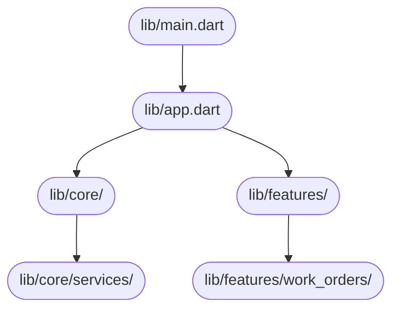

# System Design Document — jahnavi783/fsm

> Auto-generated | Created: 2026-03-30 11:42:41 | Branch: `main`

> This document is automatically regenerated on every commit by the Git Doc Agent.

---

## Overview
A Dart + Flutter Field Service Management application that manages work orders for service engineers.

## Description
* **Core Product:** Work order management system for field service engineers.
* **Problem Solved:** Eliminates inefficiencies in scheduling, dispatching, and tracking of service engineers' activities.
* **Key Features:** connectivity management, error handling, sync functionality, performance monitoring, memory management.
* **Entry Point:** `lib/main.dart`

## What the Codebase Does
* **Entry Point:** The application initializes with `lib/main.dart`, which sets up the app's configuration and routing.
* **Core Feature – Connectivity Management:** The `connectivity_bloc` manages network connectivity and updates the app accordingly.
* **User Flow:** When a user logs in, the `auth_guard` checks their credentials before allowing access to the app's features.
* **Data Layer:** The `hive_service` stores and retrieves data from local storage using Hive.
* **Output:** The app displays work orders assigned to service engineers on the main screen.

## System Overview
* **`lib/`** — contains core application logic, including configuration, routing, and services.
* **`lib/core/services/`** — provides connectivity management, error handling, sync functionality, performance monitoring, memory management.
* **`lib/features/work_orders/`** — manages work orders assigned to service engineers.

## Codebase Structure
* **`lib/`** — contains core application logic and services.
* **`lib/core/`** — includes configuration, routing, and data storage modules.
* **`lib/features/`** — houses feature-specific modules, such as work order management.

The codebase is structured around a modular architecture, with core application logic in `lib/`, services in `lib/core/services/`, and feature-specific modules in `lib/features/`. The app's entry point is `lib/main.dart`, which initializes the configuration and routing.

---

## Architecture

## Architecture

### High-Level Design
* **Pattern:** Clean Architecture with a BLoC (Business Logic Component) pattern for state management.
* **Structure:** The project is structured into top-level folders such as `lib/core/blocs`, `lib/core/services`, and `lib/core/storage` that reflect the Clean Architecture pattern, separating concerns by layer.
* **State Management:** The project uses a BLoC (Business Logic Component) pattern for state management.

### Key Components
* **`lib/core/config/`** — contains configuration files for different environments (dev, prod, staging).
* **`lib/core/di/injection.config.dart`** — the dependency injection configuration file.
* **`lib/core/services/`** — a folder containing various services such as authentication, location, and logging.
* **`lib/core/storage/`** — a folder containing storage-related classes (cache manager, hive service).
* **`lib/core/theme/`** — a folder containing theme-related classes (app colors, dimensions, text styles).

### Component Interactions
* **Request Flow:** A user action flows from the UI to the BLoC, which then interacts with services and APIs as needed.
* **Data Direction:** Responses/data flow back to the UI through the BLoC, which updates the state accordingly.
* **Shared Services:** The `lib/core/services/` folder contains shared services such as authentication and logging that multiple features depend on.

### Entry Points
* **Main Entry:** **`lib/main.dart`** — the first file executed at startup.
* **App Init:** **`lib/main.dart`** also initializes the app framework/widget tree.
* **Routing:** The `lib/core/router/app_router.dart` file is responsible for navigation/routing.

---

## Tools & Tech Stack

**Languages:** Dart  93.9%, XML  1.7%, JSON  1.4%, Swift  0.9%, C++  0.6%, YAML  0.5%, Shell  0.5%, CMake  0.3%, Kotlin  0.2%, HTML  0.2%

**Infrastructure:** GitHub Actions

---

## Code Quality Metrics

| Metric | Value | Status |
|---|---|---|
| Total Project Files | 760 | ℹ️ Info |
| Primary Language | Dart  98.3%  (619 files) | ✅ Good |
| Test Files | 53 | ✅ Good |
| Test / Lint / Build | test=N/A, lint=N/A, build=100% | ✅ Good |
| Dependencies | N/A | ℹ️ Info |
| Dockerfile Present | No | ⚠️ Average |

---

## API Endpoints

## API Information

### Authentication
* **POST /login** — Authenticates user credentials and returns a token upon successful login.

### Work Orders
* **GET /work-orders** — Retrieves a list of work orders.
* **GET /work-orders/{id}** — Retrieves a specific work order by ID.
* **POST /work-orders** — Creates a new work order.
* **PUT /work-orders/{id}** — Updates an existing work order.
* **DELETE /work-orders/{id}** — Deletes a work order.

### Engineers
* **GET /engineers** — Retrieves a list of engineers.
* **GET /engineers/{id}** — Retrieves a specific engineer by ID.
* **POST /engineers** — Creates a new engineer.
* **PUT /engineers/{id}** — Updates an existing engineer.
* **DELETE /engineers/{id}** — Deletes an engineer.

### Parts
* **GET /parts** — Retrieves a list of parts.
* **GET /parts/{id}** — Retrieves a specific part by ID.
* **POST /parts** — Creates a new part.
* **PUT /parts/{id}** — Updates an existing part.
* **DELETE /parts/{id}** — Deletes a part.

### Documents
* **GET /documents** — Retrieves a list of documents.
* **GET /documents/{id}** — Retrieves a specific document by ID.
* **POST /documents** — Creates a new document.
* **PUT /documents/{id}** — Updates an existing document.
* **DELETE /documents/{id}** — Deletes a document.

### Calendar
* **GET /calendar** — Retrieves the calendar events.
* **GET /calendar/events** — Retrieves a list of calendar events.
* **POST /calendar/events** — Creates a new calendar event.

### Chatbot
* **GET /chatbot** — Retrieves the chatbot interface.
* **POST /chatbot/messages** — Sends a message to the chatbot.

### Profile
* **GET /profile** — Retrieves the user's profile information.
* **PUT /profile** — Updates the user's profile information.

### Protected Routes
* **GET /protected** — Requires authentication and returns protected content.

---

## Data Flow

## Data Flow

### Data Models

* **`ChatSessionResponse`:** `success`, `sessionId`, `user`, `message`. Represents a response to starting a chat session.
* **`UserInfo`:** `id`, `email`, `role`, `firstName`, `lastName`. Stores user information.
* **`LocationInfo`:** `latitude`, `longitude`, `accuracy`, `altitude`, `bearing`, `speed`, `timestamp`, `address`. Represents location data.
* **`LoginRequest`:** `email`, `password`. Used for authentication.

### Data Flow Description

1. **UI Layer:** The user initiates a chat session or sends a message through the UI, triggering a BLoC event to start a new chat session or send a message.
2. **State/Logic Layer:** The BLoC controller handles the event and calls the corresponding service (e.g., `ChatService` for starting a chat session).
3. **Service Layer:** The `ChatService` processes the request, which may involve retrieving user information from the repository.
4. **API/Network Layer:** If necessary, an API call is made to retrieve user information or send a message (e.g., through a REST API endpoint).
5. **Repository Layer:** The response from the service is parsed and returned to the BLoC controller as a `ChatSessionResponse` object.
6. **State Update:** The UI is updated with the new data, displaying the chat session ID, user information, or message.

### Storage

* **`SharedPreferences`:** Stores user authentication credentials (email and password) for later use.
* **`SQLite Database`:** Stores location data and other relevant information for the FSM app.

---
