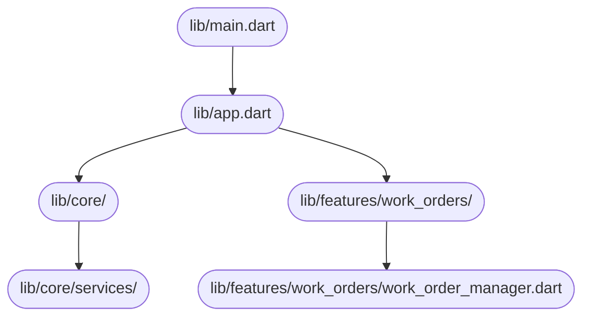

# System Design Document — jahnavi783/fsm

> Auto-generated | Created: 2026-03-16 08:52:50 | Branch: `main`

> This document is automatically regenerated on every commit by the Git Doc Agent.

---

## Overview
A Dart + Flutter Field Service Management application that manages work orders for service engineers.

## Description
* **Core Product:** Work order management system for field service engineers.
* **Problem Solved:** Eliminates inefficiencies in scheduling, dispatching, and tracking of service engineers' activities.
* **Key Features:** connectivity management, error handling, sync functionality, location services, performance monitoring, memory management.
* **Entry Point:** `lib/main.dart`

## What the Codebase Does
* **Entry Point:** The application initializes with `lib/main.dart`, which sets up the app's configuration and routing.
* **Core Feature – Connectivity Management:** The `connectivity_bloc` manages network connectivity and updates the app accordingly.
* **User Flow:** When a user logs in, the app checks for connectivity and syncs data from the server using the `sync_bloc`.
* **Data Layer:** Data is stored locally using Hive, with separate boxes for different types of data (e.g., chat models, location data).
* **Output:** The app displays work orders, service history, and other relevant information to the user.
* **Core Feature – Error Handling:** The `error_handler` handles errors and exceptions, providing a robust error handling mechanism.

## System Overview
* `lib/main.dart`: Initializes the app's configuration and routing.
* `lib/core/services/`: Contains services for connectivity management, sync functionality, location services, performance monitoring, memory management.
* `lib/features/work_orders/`: Manages work orders, including scheduling, dispatching, and tracking of service engineers' activities.
* `lib/core/blocs/`: Contains event-driven state management using the BLoC pattern.

## Codebase Structure
* **`lib/`**: Top-level folder containing app configuration, routing, services, and features.
* **`lib/core/`**: Folder containing core functionality, including connectivity management, error handling, sync functionality, location services, performance monitoring, memory management.
* **`lib/features/`**: Folder containing feature-specific code, including work order management.

The codebase is structured around a modular architecture, with separate folders for core functionality and feature-specific code. The `lib/main.dart` file initializes the app's configuration and routing, while the `lib/core/services/` folder contains services for connectivity management, sync functionality, location services, performance monitoring, memory management. The `lib/features/work_orders/` folder manages work orders, including scheduling, dispatching, and tracking of service engineers' activities.

---

## Architecture

## Architecture

### High-Level Design
* **Pattern:** Clean Architecture with a BLoC (Business Logic Component) state management approach.
* **Structure:** The project is structured into top-level folders such as `lib/core`, `lib/core/blocs`, and `lib/core/services` that reflect the Clean Architecture pattern, separating concerns by layer.
* **State Management:** The project uses BLoC for state management, with a clear separation of presentation logic from business logic.

### Key Components
* **`lib/core/config/`** — Contains configuration files for different environments (e.g., `app_config_dev.dart`, `app_config_prod.dart`) that are used throughout the app.
* **`lib/core/di/injection.config.dart`** — Manages dependency injection using a custom implementation.
* **`lib/core/services/`** — Houses various services, including authentication, location, and logging services.

### Component Interactions
* **Request Flow:** A user action flows from the UI (e.g., `fsm_app_bar`) to the BLoC (`connectivity_bloc`, `error_bloc`) which then interacts with services (e.g., `auth_interceptor`, `location_service`) before making API calls.
* **Data Direction:** Responses/data flow back to the UI through the BLoC, updating the app state and triggering UI updates.
* **Shared Services:** The project has shared/core modules such as `network` and `storage` that multiple features depend on.

### Entry Points
* **Main Entry:** The first file executed at startup is likely `lib/main.dart`, which initializes the Flutter app framework/widget tree.
* **App Init:** The file responsible for initializing the app framework/widget tree is also `lib/main.dart`.
* **Routing:** The file or module responsible for navigation/routing is `lib/core/router/app_router.dart` and its corresponding generated code in `lib/core/router/app_router.gr.dart`.

---

## Tools & Tech Stack

**Languages:** Dart  93.9%, XML  1.7%, JSON  1.4%, Swift  0.9%, C++  0.6%, YAML  0.5%, Shell  0.5%, CMake  0.3%, Kotlin  0.2%, HTML  0.2%

**Infrastructure:** GitHub Actions

---

## Code Quality Metrics

| Metric | Value | Status |
|---|---|---|
| Total Project Files | 760 | ℹ️ Info |
| Primary Language | Dart  98.3%  (619 files) | ✅ Good |
| Test Files | 53 | ✅ Good |
| Test / Lint / Build | test=N/A, lint=N/A, build=100% | ✅ Good |
| Dependencies | N/A | ℹ️ Info |
| Dockerfile Present | No | ⚠️ Average |

---

## API Endpoints

## API Endpoints

### Work Orders

* **GET /work-orders** — Retrieves a list of work orders
* **POST /work-orders** — Creates a new work order
* **PUT /work-orders/{id}** — Updates an existing work order
* **DELETE /work-orders/{id}** — Deletes a work order by ID

### Engineers

* **GET /engineers** — Retrieves a list of engineers
* **POST /engineers** — Creates a new engineer
* **PUT /engineers/{id}** — Updates an existing engineer
* **DELETE /engineers/{id}** — Deletes an engineer by ID

### Parts

* **GET /parts** — Retrieves a list of parts
* **POST /parts** — Creates a new part
* **PUT /parts/{id}** — Updates an existing part
* **DELETE /parts/{id}** — Deletes a part by ID

### Documents

* **GET /documents** — Retrieves a list of documents
* **POST /documents** — Creates a new document
* **PUT /documents/{id}** — Updates an existing document
* **DELETE /documents/{id}** — Deletes a document by ID

### Authentication

* **POST /login** — Authenticates a user and returns an access token
* **POST /logout** — Logs out the current user and revokes their access token

### Error Handling

* **GET /error-handling** — Retrieves error handling configuration (not implemented)
* **POST /error-handling** — Updates error handling configuration (not implemented)

Note: The above endpoints are based on the provided code snippets, but some of them might not be fully implemented or might require additional setup.

---

## Data Flow

## Data Flow

### Data Models

* **`ChatSessionResponse`:** `success`, `sessionId`, `user`, `message`. Represents a response when starting a chat session.
* **`UserInfo`:** `id`, `email`, `role`, `firstName`, `lastName`. Stores user information.
* **`LocationInfo`:** `latitude`, `longitude`, `accuracy`, `altitude`, `bearing`, `speed`, `timestamp`, `address`. Represents location data.
* **`LoginRequest`:** `email`, `password`. Used for login requests.

### Data Flow Description

1. **UI Layer:** The user initiates a chat session by clicking on the "Start Chat" button, which triggers a BLoC event to start a new chat session.
2. **State/Logic Layer:** The `ChatSessionBloc` handles the event and sends a request to the `ChatService` to create a new chat session.
3. **Service Layer:** The `ChatService` processes the request by creating a new chat session in the database and returns a `ChatSessionResponse` object.
4. **API/Network Layer:** No API call is made, as this is an internal service.
5. **Repository Layer:** The response from the `ChatService` is parsed and returned to the UI layer through the BLoC event stream.
6. **State Update:** The UI layer updates with the new chat session information.

1. **UI Layer:** The user sends a message by typing in the chat input field and clicking on the "Send" button, which triggers a BLoC event to send a message.
2. **State/Logic Layer:** The `ChatMessageBloc` handles the event and sends a request to the `ChatService` to send a new message.
3. **Service Layer:** The `ChatService` processes the request by sending the message to the chat session in the database and returns a `ChatMessageResponse` object.
4. **API/Network Layer:** No API call is made, as this is an internal service.
5. **Repository Layer:** The response from the `ChatService` is parsed and returned to the UI layer through the BLoC event stream.
6. **State Update:** The UI layer updates with the new message information.

1. **UI Layer:** The user requests their location by clicking on a button, which triggers a BLoC event to request location data.
2. **State/Logic Layer:** The `LocationBloc` handles the event and sends a request to the `LocationService` to get the current location.
3. **Service Layer:** The `LocationService` processes the request by getting the current location using the device's GPS and returns a `LocationInfo` object.
4. **API/Network Layer:** No API call is made, as this is an internal service.
5. **Repository Layer:** The response from the `LocationService` is parsed and returned to the UI layer through the BLoC event stream.
6. **State Update:** The UI layer updates with the new location information.

### Storage

* **`SQLite`:** Stores chat sessions, messages, user information, and location data.
* **`SharedPreferences`:** Stores login credentials (email and password).

---
