# Documentation — fsm

> Auto-generated | Last updated: 2026-03-13 08:39:40 | Commit: `c13246c` on `main` by git-doc-agent[bot]

---

## Overview
A Dart/Flutter Field Service Management application that manages work orders for service engineers.

## Description
* **Core Product:** The FSM app is designed to manage work orders, track service history, and provide real-time updates for field service management.
* **Problem Solved:** It solves the problem of inefficient work order management, enabling service engineers to focus on customer satisfaction while providing accurate tracking and reporting.
* **Key Features:**
	+ Real-time work order management
	+ Service history tracking
	+ Location-based services for efficient route planning
	+ Performance monitoring and analytics
* **Extensibility:** The app is designed with extensibility in mind, allowing for easy integration of new features and modules as the business grows.

## What the Codebase Does
* **Entry Point:** The entry point of the application is `lib/app.dart`, which initializes the Flutter engine and sets up the main application widget.
* **Core Feature [name]:** The core feature of the app is work order management, implemented in `lib/core/blocs/work_order_bloc.dart`.
* **User Flow:** The user flow starts with authentication, followed by work order assignment, service execution, and finally, reporting and analytics. This flow is managed through various routes defined in `lib/core/router/app_router.gr.dart`.
* **Data:** Data storage is handled using Hive, a lightweight NoSQL database, implemented in `lib/core/storage/hive_service.dart`. The app also uses Dio for network requests.
* **Output:** The output of the application includes work order reports, service history logs, and performance metrics.

## System Overview
* **`android/`** — Android-specific implementation using Kotlin and Gradle build scripts.
* **`ios/`** — iOS-specific implementation using Swift and Xcode project files.
* **`lib/`** — Core application logic implemented in Dart, including business logic, data storage, and networking.
* **`assets/`** — Application assets, including fonts, icons, and images.

```mermaid
flowchart TD
    subgraph android/
        direction TB
        app/build.gradle.kts[Android build script]
        app/src/main/kotlin/com/csg/fsm/fsm/MainActivity.kt[Main activity]
        app/src/main/res/drawable-v21/launch_background.xml[Launch background]
    end

    subgraph ios/
        direction TB
        Runner.xcodeproj/project.pbxproj[iOS project file]
        Runner/AppDelegate.swift[App delegate]
        Runner/Assets.xcassets/AppIcon.appiconset/Contents.json[App icon asset]
    end

    lib/[Core application logic]
        direction TB
        lib/app.dart[Entry point]
        lib/core/blocs/work_order_bloc.dart[Work order management]
        lib/core/router/app_router.gr.dart[Routing configuration]

    assets/[Application assets]
        direction TB
        assets/fonts/Inter/Inter.ttf[Font asset]
        assets/icons/sort-down.png[Icon asset]
```

The codebase structure is modular, with separate folders for Android and iOS implementation. The core application logic is implemented in the `lib` folder, using Dart and Flutter. The app uses Hive for data storage and Dio for networking requests.

---

## Tools & Tech Stack

**Languages:** Dart  93.9%, XML  1.7%, JSON  1.4%, Swift  0.9%, C++  0.6%, YAML  0.5%, Shell  0.5%, CMake  0.3%, Kotlin  0.2%, HTML  0.2%

**Infrastructure:** GitHub Actions

**Repository Type:** `FLUTTER`

---

## Code Quality Metrics

| Metric | Value | Status |
|---|---|---|
| Total Project Files | 760 | ℹ️ Info |
| Primary Language | Dart  98.3%  (619 files) | ✅ Good |
| Test Files | 53 | ✅ Good |
| Test / Lint / Build | test=N/A, lint=N/A, build=100% | ✅ Good |
| Dependencies | N/A | ℹ️ Info |
| Dockerfile Present | No | ⚠️ Average |

---

## Impact Analysis

| Area Impacted | Type of Impact | Severity | Description | Action Required |
| --- | --- | --- | --- | --- |
| Documentation | Functional | Low | Updated documentation to reflect changes in work order management and user flow. | Review updated documentation for accuracy. |
| Documentation | UI | Medium | Changes made to improve readability and clarity of documentation. | None |

Note: The table only includes the changed file, which is `DOCUMENTATION.md`.

---

## Commit Change Details

| File Changed | Change Type | Description | Lines Added | Lines Removed | Risk Level |
| DOCUMENTATION.md | Modified | Corrected formatting and content of documentation sections | 6 | 62 | Low  |
| lib/features/chat/presentation/pages/chatbot_page.dart | Modified | Corrected login error message in ChatbotPageState | 0 | 1 | Low  |
| lib/features/work_orders/presentation/pages/dashboard_page.dart | Modified | Removed _handleRefresh method from DashboardPageState | 0 | 11 | Low 

---
