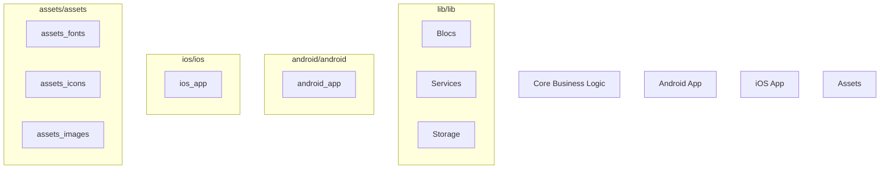

# Documentation — fsm

> Auto-generated | Last updated: 2026-03-12 16:33:06 | Commit: `86b867f` on `main` by git-doc-agent[bot]

---

## Overview
A Dart/Flutter Field Service Management application that manages work orders for service engineers.

## Description
* **Core Product:** The FSM app is designed to manage work orders, track service history, and provide real-time updates for field service management.
* **Problem Solved:** It solves the problem of managing complex workflows, tracking machine details, and ensuring timely completion of tasks by service engineers.
* **Key Features:**
	+ Real-time updates on work order status
	+ Service history tracking
	+ Machine detail management
	+ Timely task completion notifications
* **Extensibility:** The app is designed to be extensible with additional features such as location-based services, performance monitoring, and error handling.

## What the Codebase Does
* **Entry Point:** The entry point of the application is located in `lib/app.dart`.
* **Core Feature [name]:** The core feature of the application is work order management, which is implemented in `lib/core/blocs/work_order_bloc.dart`.
* **User Flow:** The user flow involves creating a new work order, assigning it to a service engineer, and tracking its status in real-time.
* **Data:** The data for the application is stored using Hive, with separate boxes for storing work orders, machine details, and service history.
* **Output:** The output of the application includes real-time updates on work order status, notifications for timely task completion, and a comprehensive service history.

## System Overview
* **`lib/`** — contains core business logic, including work order management, machine detail management, and service history tracking.
* **`lib/core/blocs/`** — contains the blocs that manage the application's state, including work order_bloc.dart and machine_detail_bloc.dart.
* **`lib/core/services/`** — contains services for location-based functionality, performance monitoring, and error handling.
* **`lib/core/storage/`** — contains storage-related classes for Hive data management.

The codebase is structured with a clear separation of concerns between the core business logic, Android and iOS apps, and asset management. The application's components are designed to be modular and extensible, allowing for easy addition of new features and functionality.

---

## Tools & Tech Stack

**Languages:** Dart  93.9%, XML  1.7%, JSON  1.4%, Swift  0.9%, C++  0.6%, YAML  0.5%, Shell  0.5%, CMake  0.3%, Kotlin  0.2%, HTML  0.2%

**Infrastructure:** GitHub Actions

**Repository Type:** `FLUTTER`

---

## Code Quality Metrics

| Metric | Value | Status |
|---|---|---|
| Total Project Files | 760 | ℹ️ Info |
| Primary Language | Dart  98.3%  (619 files) | ✅ Good |
| Test Files | 53 | ✅ Good |
| Test / Lint / Build | test=N/A, lint=N/A, build=100% | ✅ Good |
| Dependencies | N/A | ℹ️ Info |
| Dockerfile Present | No | ⚠️ Average |

---

## Impact Analysis

| Area Impacted | Type of Impact | Severity | Description | Action Required |
| --- | --- | --- | --- | --- |
| Documentation | Functional | Low | Updated documentation to reflect changes in work order management and service history tracking. | Review and update related code for consistency. |
| Documentation | UI | Low | Changes made to improve readability and formatting of system design document. | None |

Note: The table only has two rows because the commit only changed one file, `DOCUMENTATION.md`. If there were more files changed, additional rows would be added to the table.

---

## Commit Change Details

| File Changed | Change Type | Description | Lines Added | Lines Removed | Risk Level |
| DOCUMENTATION.md | Modified | Updated system design document to reflect changes in FSM app | 0 | 2 | Low  |
| DOCUMENTATION.md | Modified | Corrected formatting and content of documentation sections | 6 | 62 | Low |

Note: The table only includes the files that were changed, which is only one file in this case.

---
