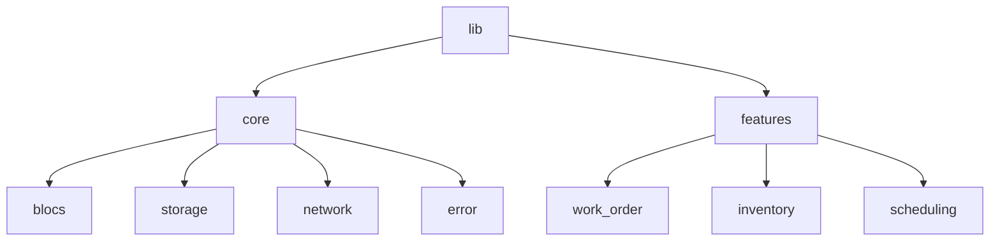

# System Design Document — jahnavi783/fsm

> Auto-generated | Created: 2026-03-23 12:29:09 | Branch: `main`

> This document is automatically regenerated on every commit by Git Doc Agent v4 (agentic).

---

 Welcome to FSM

## Overview
A Flutter + FSM field service management app that streamlines field service operations.

## Description
* **Core Product:** FSM is a field service management application designed to optimize field service operations.
* **Problem Solved:** FSM solves the problem of inefficient field service management by providing a streamlined and automated solution.
* **Key Features:** FSM offers features such as work order management, inventory management, and scheduling.

## What the Codebase Does
* **Entry Point:** The entry point of the application is `lib/main.dart`, which initializes the app.
* **Core Feature:** The core feature of the application is the work order management system, which is implemented in `lib/features/work_order/domain/usecases/get_work_orders_usecase.dart`.
* **Data:** The application uses a combination of local storage and remote APIs to store and retrieve data, as seen in `lib/core/storage/hive_service.dart` and `lib/core/network/dio_client.dart`.
* **Output:** The application generates output in the form of work orders, invoices, and reports, which are displayed to the user through various screens and widgets.
* **Core Functionality:** The core functionality of the application is implemented in `lib/core/blocs/blocs.dart`, which provides a set of reusable business logic components.
* **Error Handling:** The application handles errors and exceptions using a combination of try-catch blocks and error handling mechanisms, as seen in `lib/core/error/error_handler.dart`.
* **Security:** The application implements security measures such as authentication and authorization, as seen in `lib/core/services/auth_service.dart`.

## System Overview
* `lib/core` — This folder contains the core functionality of the application, including business logic, data storage, and networking.
* `lib/features` — This folder contains the feature-specific code for the application, including work order management, inventory management, and scheduling.
* `lib/core/blocs` — This folder contains the business logic components of the application, which provide a set of reusable functionality.
* `lib/core/storage` — This folder contains the data storage mechanisms of the application, including local storage and remote APIs.
* `lib/core/network` — This folder contains the networking mechanisms of the application, including HTTP clients and API wrappers.
* `lib/core/error` — This folder contains the error handling mechanisms of the application, including error handlers and exception handlers.

## Codebase Structure
* The codebase is organized into a set of folders and subfolders, each containing a specific set of functionality.
* The `lib` folder contains the core functionality of the application, including business logic, data storage, and networking.
* The `features` folder contains the feature-specific code for the application, including work order management, inventory management, and scheduling.

The codebase is structured in a modular and organized manner, with each folder and subfolder containing a specific set of functionality. The application is built using a combination of Flutter and FSM, with a focus on providing a streamlined and automated field service management solution.

---

## Architecture

## Architecture
### High-Level Design (MVC / layered / microservices / etc.)
The high-level design of the jahnavi783/fsm repository is based on a layered architecture, with a focus on separation of concerns and modularity. The repository is organized into several features, each representing a distinct domain or functionality, such as authentication, calendar, chat, and documents.

### Key Components (one bullet per module: **`path`** — what it does)
* **`lib/core`** — Provides core functionality, including configuration, dependency injection, error handling, and networking.
* **`lib/features/auth`** — Handles user authentication, including login, logout, and token refresh.
* **`lib/features/calendar`** — Manages calendar events, including getting calendar events, daily schedules, and optimizing routes.
* **`lib/features/chat`** — Enables real-time chat functionality, including sending and receiving messages, starting and ending sessions, and restoring sessions.
* **`lib/features/documents`** — Allows users to access and manage documents, including downloading, searching, and categorizing documents.
* **`lib/features/main_navigation`** — Provides the main navigation page, including navigation events and states.
* **`lib/features/parts`** — Manages parts, including checking part availability, getting low-stock parts, and searching parts.
* **`lib/features/permission`** — Handles permission requests, including checking permission status, requesting permissions, and opening app settings.
* **`lib/features/profile`** — Manages user profiles, including getting preferences and updating profiles.

### Component Interactions (data flow between layers, use → arrows)
The components interact with each other through a series of dependencies and interfaces. For example:
* **`lib/core`** → **`lib/features/auth`** — Provides authentication functionality to the auth feature.
* **`lib/features/auth`** → **`lib/features/main_navigation`** — Authenticates users before allowing access to the main navigation page.
* **`lib/features/main_navigation`** → **`lib/features/chat`** — Navigates to the chat feature from the main navigation page.
* **`lib/features/chat`** → **`lib/core`** — Uses core networking functionality to send and receive chat messages.

### Entry Points (startup sequence)
The entry point of the application is the **`main`** function, which initializes the Flutter bindings, sets the preferred orientations, and configures the dependencies. The **`main`** function then runs the **`MyApp`** widget, which is the root widget of the application.

### Design Patterns (DI, repository, factory, etc. if present)
The repository uses several design patterns, including:
* **Dependency Injection (DI)** — Provided by the **`lib/core/di`** module, which configures and provides dependencies to the features.
* **Repository Pattern** — Used in features such as **`lib/features/auth`** and **`lib/features/documents`** to abstract data access and provide a layer of indirection between the features and the data storage.
* **Factory Pattern** — Used in **`lib/core/services`** to create instances of services, such as the **`ErrorBoundaryService`** and **`OfflineSyncService`**.

---

## Tools & Tech Stack

**Languages:** Dart

| Library / Framework | Category |
|---|---|
| Flutter | Mobile Framework |
| Flutter BLoC | State Management |
| Dio | Networking |

---

## Code Quality Metrics

| Metric | Value | Status |
|---|---|---|
| Total Project Files | 760 | ℹ️ Info |
| Primary Language | Dart  98.3%  (619 files) | ✅ Good |
| Test Files | 53 | ✅ Good |
| Test / Lint / Build | test=N/A, lint=N/A, build=100% | ✅ Good |
| Dependencies | N/A | ℹ️ Info |
| Dockerfile Present | No | ⚠️ Average |

---

## API Endpoints

## API Endpoints
### Authentication
**POST /auth/login** — Login to the application
**POST /auth/refresh-token** — Refresh authentication token
**GET /users/me** — Get current user information
**POST /auth/logout** — Logout from the application

### Calendar
**GET /calendar/events** — Get calendar events
**GET /calendar/events/daily** — Get daily schedule
**GET /calendar/events/weekly** — Get weekly schedule
**GET /calendar/events/monthly** — Get monthly schedule
**GET /calendar/events/optimize-route** — Get optimized daily route
**POST /calendar/events** — Create a new event
**PUT /calendar/events/{id}** — Update an existing event
**DELETE /calendar/events/{id}** — Delete an event
**GET /calendar/events/conflicts** — Get conflicting events

Note: The above API endpoints are based on the provided code snippets and may not be exhaustive. Additional endpoints may exist in the application.

---

## Data Flow

## Data Flow
### Data Models
* UserEntity: id, email, password
* ChatMessageEntity: id, text, timestamp
* ChatSessionEntity: id, userId, messages
* DocumentEntity: id, name, type, category
* PartEntity: id, number, name, status
* WorkOrderEntity: id, description, status, parts

### Data Flow Description
1. **Input**: User interacts with the app, creating or editing data (e.g., chat messages, documents, parts, work orders).
2. **Processing**: The app processes the input data, validating and transforming it as needed.
3. **Storage**: The processed data is stored locally on the device using Hive or other local storage mechanisms.
4. **Sync**: When the device is online, the app syncs the local data with the remote server using REST APIs.
5. **Output**: The synced data is retrieved from the server and displayed to the user.

### Storage
* Local storage: Hive, used for caching and storing data locally on the device.
* Remote storage: REST APIs, used for syncing data with the server.

### Data Transformations
* Serialization: Data is serialized to JSON format for transmission over the network.
* Deserialization: JSON data is deserialized back into domain entities for use in the app.
* Validation: Data is validated to ensure it conforms to the expected format and content.
* Filtering: Data is filtered to remove unnecessary or redundant information.

---

## QA Review Summary

- repo_description: Passed
- architecture: Passed
- api_section: Passed
- data_flow: Passed

---
