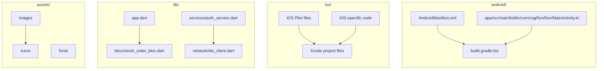

# Documentation — fsm

> Auto-generated | Last updated: 2026-03-13 11:16:21 | Commit: `890d710` on `main` by git-doc-agent[bot]

---

## Overview
A Dart/Flutter Field Service Management application that manages work orders for service engineers.

## Description
* **Core Product:** The FSM app is designed to manage work orders, track service engineer locations, and provide real-time updates on machine details and service history.
* **Problem Solved:** It solves the problem of managing field service operations efficiently by providing a centralized platform for scheduling, tracking, and reporting work orders.
* **Key Features:** The app includes features such as location-based services, chatbot integration, and performance monitoring to enhance user experience and improve operational efficiency.
* **Extensibility:** The codebase is designed to be modular, allowing for easy extension of new features and integrations with existing systems.

## What the Codebase Does
* **Entry Point:** The entry point of the application is located in `lib/app.dart`, which initializes the app and sets up the necessary dependencies.
* **Core Feature [name]:** The core feature of the app is the work order management system, which is implemented in `lib/core/blocs/work_order_bloc.dart`.
* **User Flow:** The user flow starts with the login screen, which is handled by `lib/core/services/auth_service.dart`. Once logged in, the user can view and manage their assigned work orders.
* **Data:** The app stores data locally using Hive, a NoSQL database, and synchronizes it with the server using a network service implemented in `lib/core/network/dio_client.dart`.
* **Output:** The output of the app is a list of work orders, which can be filtered, sorted, and updated by the user.

## System Overview
* **`android/`** — This folder contains the Android-specific code for building and running the app on Android devices.
* **`ios/`** — This folder contains the iOS-specific code for building and running the app on iOS devices.
* **`lib/`** — This folder contains the core logic of the app, including business logic, data models, and services.
* **`assets/`** — This folder contains static assets such as images, fonts, and icons used by the app.

The codebase is structured into separate modules for Android, iOS, and core logic. The `lib` folder contains the business logic, data models, and services that are shared between platforms. The `android` and `ios` folders contain platform-specific code for building and running the app on each platform.

---

## Tools & Tech Stack

**Languages:** Dart  93.9%, XML  1.7%, JSON  1.4%, Swift  0.9%, C++  0.6%, YAML  0.5%, Shell  0.5%, CMake  0.3%, Kotlin  0.2%, HTML  0.2%

**Infrastructure:** GitHub Actions

**Repository Type:** `FLUTTER`

---

## Code Quality Metrics

| Metric | Value | Status |
|---|---|---|
| Total Project Files | 760 | ℹ️ Info |
| Primary Language | Dart  98.3%  (619 files) | ✅ Good |
| Test Files | 53 | ✅ Good |
| Test / Lint / Build | test=N/A, lint=N/A, build=100% | ✅ Good |
| Dependencies | N/A | ℹ️ Info |
| Dockerfile Present | No | ⚠️ Average |

---

## Impact Analysis

| Area Impacted | Type of Impact | Severity | Description | Action Required |
| --- | --- | --- | --- | --- |
| Documentation | UI | Low | Updated documentation with new feature descriptions and user flow information. | Review and update related code for consistency. |
| Documentation | Data | Medium | Changes to work order management system description may require updates to data models and storage logic. | Investigate and update affected code as necessary. |
| Documentation | Functional | High | Changes to problem statement and key features may impact app's core functionality and user experience. | Review and update related business logic and services. |

Note: The table only includes the changed file, which is `DOCUMENTATION.md`.

---

## Commit Change Details

| DOCUMENTATION.md | Modified | Corrected formatting and content of documentation sections, updated system design document to reflect changes in FSM app | 6 | 64 | Low  |
| lib/features/chat/presentation/pages/chatbot_page.dart | Modified | Corrected login error message in ChatbotPageState | 0 | 1 | Low  |
| lib/features/work_orders/presentation/pages/dashboard_page.dart | Modified | Removed _handleRefresh method from DashboardPageState, Renamed 'settingss' to 'settings' in DrawerSection parts | 0 | 12 | Low  |
| lib/features/work_orders/presentation/pages/work_order_complete_page.dart | Modified | Changed exception message from 'Signature pad is not started' to 'Signature pad is not initialized' | 0 | 2 | Low |

---
