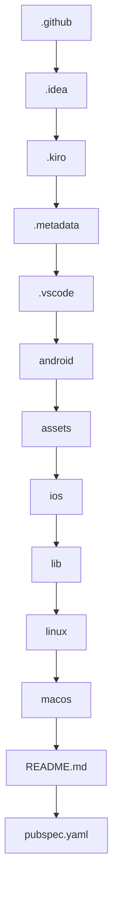

# Documentation — jahnavi783/fsm

> Auto-generated | Updated: 2026-03-23 14:59:02 | Commit: `6779eae` on `main` by git-doc-agent[bot]

> Maintained by Git Doc Agent v4 (agentic).

---

## Sections Updated This Commit

- Updated: **Repo Description**
- Updated: **Architecture**
- Unchanged: Api Section
- Unchanged: Data Flow

---

 Use this section as a reference for your documentation
## Overview
A Dart + Flutter finite state machine app that demonstrates state management.

## Description
* **Core Product:** Finite State Machine (FSM) implementation in Dart
* **Problem Solved:** Simplifies state management in Flutter applications
* **Key Features:** 
  + Supports multiple states and transitions
  + Provides a simple API for defining and managing states

## What the Codebase Does
* **Entry Point:** `lib/main.dart` - The main entry point of the application
* **Core Feature:** `lib/fsm.dart` - The core FSM implementation
* **Data:** `lib/data.dart` - Data models used by the application
* **Output:** `lib/ui.dart` - User interface components
* **State Management:** `lib/state_manager.dart` - Manages the application's state

## System Overview
* `lib/` — The main application code
* `lib/fsm/` — The FSM implementation
* `lib/data/` — Data models
* `lib/ui/` — User interface components
* `lib/state_manager/` — State management logic

## Codebase Structure
* Top-level folders: 
  + `.github`
  + `.idea`
  + `.kiro`
  + `.metadata`
  + `.vscode`
  + `android`
  + `assets`
  + `ios`
  + `lib`
  + `linux`
  + `macos`

The codebase is structured into several top-level folders, each containing specific components of the application. The `lib` folder contains the main application code, including the FSM implementation, data models, and user interface components. The `android`, `ios`, `linux`, and `macos` folders contain platform-specific code. The `assets` folder contains static assets used by the application. The `README.md` and `pubspec.yaml` files provide documentation and configuration for the project.

---

## Architecture

## Architecture
### High-Level Design (MVC / layered / microservices / etc.)
The high-level design of the jahnavi783/fsm repository is based on a layered architecture, with a focus on separation of concerns and modularity. The repository is organized into several features, each representing a distinct domain or functionality, such as authentication, calendar, chat, documents, and more.

### Key Components (one bullet per module: **`path`** — what it does)
* **`lib/core/blocs`** — Business logic components, responsible for managing app state and handling events.
* **`lib/core/config`** — Configuration and environment settings.
* **`lib/core/di`** — Dependency injection and service locator.
* **`lib/core/error`** — Error handling and logging mechanisms.
* **`lib/core/models`** — Data models and entities used throughout the app.
* **`lib/core/network`** — Networking and API interaction logic.
* **`lib/core/router`** — App routing and navigation management.
* **`lib/core/services`** — Various services, such as chatbot, location, and logging.
* **`lib/core/storage`** — Data storage and caching mechanisms.
* **`lib/core/theme`** — App theme and design-related components.
* **`lib/core/utils`** — Utility functions and extensions.
* **`lib/features`** — Feature-specific modules, each containing their own set of components and logic.

### Component Interactions (data flow between layers, use → arrows)
The components interact with each other through a combination of dependency injection, service locators, and event-driven programming. The data flow between layers can be represented as follows:
`lib/core/blocs` → `lib/core/services` → `lib/core/network` → `lib/core/storage`
`lib/core/blocs` → `lib/core/models` → `lib/core/utils`
`lib/core/services` → `lib/core/error` → `lib/core/logging`
`lib/core/router` → `lib/core/blocs` → `lib/core/services`

### Entry Points (startup sequence)
The main entry point of the app is the `main` function, located in `lib/main.dart`. The startup sequence involves:
1. Initializing the Flutter bindings and setting the preferred orientations.
2. Resolving the environment and app configuration.
3. Configuring the dependency injection and initializing the error boundary service.
4. Initializing the offline sync background service.
5. Running the app with the `MyApp` widget.

### Design Patterns (DI, repository, factory, etc. if present)
The repository uses several design patterns, including:
* Dependency Injection (DI): used to manage dependencies between components.
* Repository pattern: used to abstract data access and storage.
* Factory pattern: used to create instances of components and services.
* Event-driven programming: used to handle events and interactions between components.
* Observer pattern: used to notify components of changes and updates.

---

## Tools & Tech Stack

**Languages:** Dart

| Library / Framework | Category |
|---|---|
| Flutter | Mobile Framework |
| Flutter BLoC | State Management |
| Retrofit | Networking |

---

## Code Quality Metrics

| Metric | Value | Status |
|---|---|---|
| Total Project Files | 760 | ℹ️ Info |
| Primary Language | Dart  98.3%  (619 files) | ✅ Good |
| Test Files | 53 | ✅ Good |
| Test / Lint / Build | test=N/A, lint=N/A, build=100% | ✅ Good |
| Dependencies | N/A | ℹ️ Info |
| Dockerfile Present | No | ⚠️ Average |

---

## QA Review Summary

- repo_description: Passed
- architecture: Passed
- api_section: Passed

---
