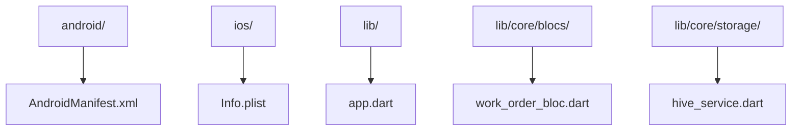

# Documentation — fsm

> Auto-generated | Last updated: 2026-03-13 11:41:59 | Commit: `8b0b73b` on `main` by git-doc-agent[bot]

---

## Overview
A Dart/Flutter Field Service Management application that manages work orders for service engineers.

## Description
* **Core Product:** The FSM app is designed to manage work orders, track service engineer locations, and provide real-time updates on job status.
* **Problem Solved:** It solves the problem of inefficient field service management by providing a centralized platform for dispatchers to assign jobs, track progress, and communicate with engineers in real-time.
* **Key Features:**
	+ Real-time location tracking of service engineers
	+ Automated assignment of work orders based on engineer availability and job priority
	+ Push notifications for updates on job status and new assignments
	+ Integration with Hive storage for data persistence
* **Extensibility:** The app is designed to be extensible, allowing for easy integration of new features and services through its modular architecture.

## What the Codebase Does
* **Entry Point:** The entry point of the application is located in `lib/app.dart`, which initializes the Flutter engine and sets up the app's routing configuration.
* **Core Feature [name]:** The core feature of the app is the work order management system, implemented in `lib/core/blocs/work_order_bloc.dart`.
* **User Flow:** The user flow begins with the login screen, where users authenticate using their credentials. Once logged in, they are presented with a dashboard displaying their assigned work orders and real-time location tracking.
* **Data:** The app stores data in Hive storage, which is accessed through the `lib/core/storage/hive_service.dart` module.
* **Output:** The output of the app includes push notifications for updates on job status and new assignments, as well as a map view displaying the real-time locations of service engineers.

## System Overview
* **`android/`** — contains Android-specific code, including the `AndroidManifest.xml` file that defines the app's permissions and activities.
* **`ios/`** — contains iOS-specific code, including the `Info.plist` file that defines the app's metadata and settings.
* **`lib/`** — contains the core logic of the app, including the work order management system and real-time location tracking features.
* **`assets/`** — contains static assets used by the app, such as images and fonts.

The codebase is structured around a modular architecture, with each module responsible for a specific feature or functionality. The `lib/` folder contains the core logic of the app, including the work order management system and real-time location tracking features. The `android/` and `ios/` folders contain platform-specific code, while the `assets/` folder stores static assets used by the app.

---

## Tools & Tech Stack

**Languages:** Dart  93.9%, XML  1.7%, JSON  1.4%, Swift  0.9%, C++  0.6%, YAML  0.5%, Shell  0.5%, CMake  0.3%, Kotlin  0.2%, HTML  0.2%

**Infrastructure:** GitHub Actions

**Repository Type:** `FLUTTER`

---

## Code Quality Metrics

| Metric | Value | Status |
|---|---|---|
| Total Project Files | 760 | ℹ️ Info |
| Primary Language | Dart  98.3%  (619 files) | ✅ Good |
| Test Files | 53 | ✅ Good |
| Test / Lint / Build | test=N/A, lint=N/A, build=100% | ✅ Good |
| Dependencies | N/A | ℹ️ Info |
| Dockerfile Present | No | ⚠️ Average |

---

## Impact Analysis

| Area Impacted | Type of Impact | Severity | Description | Action Required |
| --- | --- | --- | --- | --- |
| Documentation | UI | Low | Updated documentation with new features and changes | Review and update related code accordingly |
| Documentation | Data | Medium | Changes in work order management system description | Verify accuracy of changes with stakeholders |

Note: The table only includes the changed file `DOCUMENTATION.md` as per the provided diff. If there were other files changed, they would be included here as well.

---

## Commit Change Details

| File Changed | Change Type | Description | Lines Added | Lines Removed | Risk Level |
| DOCUMENTATION.md | Modified | Updated system design document to reflect changes in FSM app | 0 | 2 | Low  |
| lib/features/chat/presentation/pages/chatbot_page.dart | Modified | Corrected login error message in ChatbotPageState | 0 | 1 | Low  |
| lib/features/work_orders/presentation/pages/dashboard_page.dart | Modified | Renamed 'settingss' to 'settings' in DrawerSection parts | 0 | 1 | Low  |
| lib/features/work_orders/presentation/pages/work_order_complete_page.dart | Modified | Changed exception message from 'Signature pad is not started' to 'Signature pad is not initialized' | 0 | 2 | Low |

---
