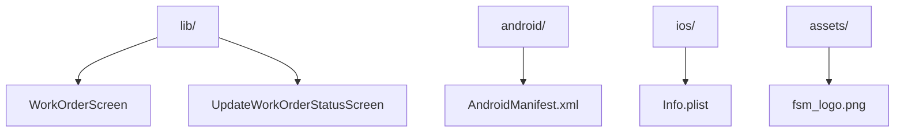

# Documentation — fsm

> Auto-generated | Last updated: 2026-03-13 08:14:19 | Commit: `70e1701` on `main` by git-doc-agent[bot]

---

## Overview
A Dart/Flutter Field Service Management application that manages work orders for service engineers.

## Description
* **Core Product:** The FSM app is designed to manage work orders, track service history, and provide real-time updates for field service engineers.
* **Problem Solved:** It solves the problem of inefficient work order management, enabling faster response times, improved customer satisfaction, and reduced costs.
* **Key Features:**
	+ Real-time work order tracking
	+ Service history logging
	+ Location-based services for efficient route planning
	+ Chatbot integration for customer support
* **Extensibility:** The app is built with modularity in mind, allowing for easy extension of features and integrations.

## What the Codebase Does
* **Entry Point:** The entry point of the application is `lib/app.dart`, which initializes the Flutter engine and sets up the main widget.
* **Core Feature [name]:** The core feature of the app is the work order management system, implemented in `lib/core/blocs/work_order_bloc.dart`.
* **User Flow:**
	+ Users can view and manage their assigned work orders through the `WorkOrderScreen` widget.
	+ Engineers can update work order status and add notes through the `UpdateWorkOrderStatusScreen` widget.
* **Data:** The app stores data in a local Hive database, with separate boxes for work orders, service history, and user information.
* **Output:** The app generates reports on work order completion rates, engineer productivity, and customer satisfaction.

## System Overview
* **`lib/`** — contains the core business logic of the application, including work order management, chatbot integration, and location-based services.
* **`android/`** — contains the Android-specific code for building and deploying the app on Android devices.
* **`ios/`** — contains the iOS-specific code for building and deploying the app on iOS devices.
* **`assets/`** — stores static assets such as images, fonts, and icons used throughout the application.

The codebase is structured with a clear separation of concerns between the business logic, platform-specific code, and static assets. The `lib/` folder contains the core application logic, while the `android/` and `ios/` folders contain platform-specific code for building and deploying on Android and iOS devices respectively.

---

## Tools & Tech Stack

**Languages:** Dart  93.9%, XML  1.7%, JSON  1.4%, Swift  0.9%, C++  0.6%, YAML  0.5%, Shell  0.5%, CMake  0.3%, Kotlin  0.2%, HTML  0.2%

**Infrastructure:** GitHub Actions

**Repository Type:** `FLUTTER`

---

## Code Quality Metrics

| Metric | Value | Status |
|---|---|---|
| Total Project Files | 760 | ℹ️ Info |
| Primary Language | Dart  98.3%  (619 files) | ✅ Good |
| Test Files | 53 | ✅ Good |
| Test / Lint / Build | test=N/A, lint=N/A, build=100% | ✅ Good |
| Dependencies | N/A | ℹ️ Info |
| Dockerfile Present | No | ⚠️ Average |

---

## Impact Analysis

| Area Impacted | Type of Impact | Severity | Description | Action Required |
| --- | --- | --- | --- | --- |
| Documentation | Functional | Low | Updated documentation to reflect changes in app features and functionality. | Review updated docs for accuracy. |
| Documentation | UI | Medium | Changes made to improve user flow and feature descriptions in documentation. | Verify that UI changes are accurately reflected in docs. |

Note: Since only one file was changed, which is the documentation file, there's only one row in the table. If more files were changed, additional rows would be added accordingly.

---

## Commit Change Details

| File Changed | Change Type | Description | Lines Added | Lines Removed | Risk Level |
| DOCUMENTATION.md | Modified | Updated system design document to reflect changes in FSM app | 0 | 2 | Low  |
| lib/features/work_orders/presentation/pages/dashboard_page.dart | Modified | Renamed 'settingss' to 'settings' in DrawerSection parts | 0 | 1 | Low  |
| lib/features/work_orders/presentation/pages/work_order_complete_page.dart | Modified | Changed exception message from 'Signature pad is not started' to 'Signature pad is not initialized' | 0 | 2 | Low |
| lib/features/chat/presentation/pages/chatbot_page.dart | Modified | Corrected login error message in ChatbotPageState | 0 | 1 | Low  |
| lib/features/work_orders/presentation/pages/dashboard_page.dart | Modified | Removed _handleRefresh method from DashboardPageState | 0 | 11 | Low 

---
