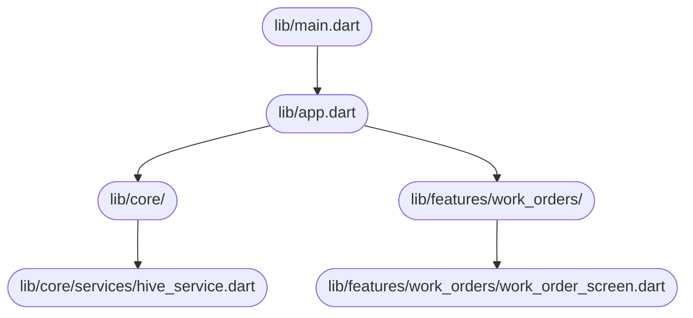

# System Design Document — jahnavi783/fsm

> Auto-generated | Created: 2026-03-30 00:35:14 | Branch: `main`

> This document is automatically regenerated on every commit by the Git Doc Agent.

---

## Overview
A Dart + Flutter Field Service Management application that manages work orders for service engineers.

## Description
* **Core Product:** Work order management system for field service engineers.
* **Problem Solved:** Eliminates inefficiencies in scheduling, dispatching, and tracking of service engineers' activities.
* **Key Features:** connectivity management, error handling, sync functionality, performance monitoring, memory management.
* **Entry Point:** `lib/main.dart`

## What the Codebase Does
* **Entry Point:** The application initializes with `lib/main.dart`, which sets up the app's configuration and routing.
* **Core Feature – Connectivity Management:** The `connectivity_bloc` manages network connectivity and updates the app accordingly.
* **User Flow:** When a user logs in, the `auth_guard` checks their credentials, and if valid, navigates to the main dashboard.
* **Data Layer:** The `hive_service` handles data storage and retrieval using Hive, a lightweight key-value database.
* **Output:** The app displays work orders, service engineer schedules, and performance metrics on various screens.

## System Overview
* **`lib/`** — contains core application logic, including configuration, routing, and services.
* **`lib/core/services/`** — houses the `hive_service`, which manages data storage and retrieval.
* **`lib/features/work_orders/`** — implements work order management functionality, including scheduling and tracking.
* **`lib/core/blocs/`** — contains business logic for connectivity management, error handling, and sync functionality.

## Codebase Structure
* **`lib/`** — core application logic and services.
* **`lib/features/`** — feature-specific implementations (e.g., work orders).
* **`lib/core/services/`** — data storage and retrieval using Hive.
* **`lib/core/blocs/`** — business logic for various features.

The codebase is structured around a modular architecture, with core application logic in `lib/`, feature-specific implementations in `lib/features/`, and data storage/retrieval handled by the `hive_service` in `lib/core/services/`. The business logic for various features is implemented in `lib/core/blocs/`.

---

## Architecture

## Architecture

### High-Level Design
* **Pattern:** Clean Architecture with a BLoC (Business Logic Component) pattern for state management.
* **Structure:** The project is structured into top-level folders like `lib/core/blocs`, `lib/core/services`, and `lib/core/storage` that reflect the Clean Architecture principles, separating concerns by layer.
* **State Management:** The application uses BLoC for state management, with a clear separation of presentation logic from business logic.

### Key Components
* **`lib/core/config/`** — Contains configuration files for different environments (dev, prod, staging).
* **`lib/core/di/injection.config.dart`** — Manages dependency injection across the application.
* **`lib/core/services/`** — Houses various services like authentication, location, and logging.
* **`lib/core/storage/`** — Handles data storage using Hive.

### Component Interactions
* **Request Flow:** A user action flows from UI (e.g., `lib/core/widgets/fsm_app_bar.dart`) to BLoC (`lib/core/blocs/connectivity_bloc.dart`), then to services (`lib/core/services/location_service.dart`), and finally to APIs or data storage.
* **Data Direction:** Responses/data flow back to the UI through the same path, with BLoC updating the state accordingly.
* **Shared Services:** The `lib/core/services/` module contains shared services like authentication and logging that multiple features depend on.

### Entry Points
* **Main Entry:** The main entry point is likely in a file named `main.dart`, which initializes the Flutter app framework/widget tree.
* **App Init:** The initialization of the app's widget tree and framework is handled by the same `main.dart` file.
* **Routing:** Navigation/routing is managed through the `lib/core/router/app_router.dart` module, which likely uses a library like `flutter_riverpod` for state management and routing.

---

## Tools & Tech Stack

**Languages:** Dart  93.9%, XML  1.7%, JSON  1.4%, Swift  0.9%, C++  0.6%, YAML  0.5%, Shell  0.5%, CMake  0.3%, Kotlin  0.2%, HTML  0.2%

**Infrastructure:** GitHub Actions

---

## Code Quality Metrics

| Metric | Value | Status |
|---|---|---|
| Total Project Files | 760 | ℹ️ Info |
| Primary Language | Dart  98.3%  (619 files) | ✅ Good |
| Test Files | 53 | ✅ Good |
| Test / Lint / Build | test=N/A, lint=N/A, build=100% | ✅ Good |
| Dependencies | N/A | ℹ️ Info |
| Dockerfile Present | No | ⚠️ Average |

---

## API Endpoints

## FSM API Endpoints

### Work Orders

* **GET /work-orders** — Retrieves a list of work orders
* **POST /work-orders** — Creates a new work order
* **PUT /work-orders/{id}** — Updates an existing work order
* **DELETE /work-orders/{id}** — Deletes a work order by ID

### Engineers

* **GET /engineers** — Retrieves a list of engineers
* **POST /engineers** — Creates a new engineer
* **PUT /engineers/{id}** — Updates an existing engineer
* **DELETE /engineers/{id}** — Deletes an engineer by ID

### Parts

* **GET /parts** — Retrieves a list of parts
* **POST /parts** — Creates a new part
* **PUT /parts/{id}** — Updates an existing part
* **DELETE /parts/{id}** — Deletes a part by ID

### Documents

* **GET /documents** — Retrieves a list of documents
* **POST /documents** — Creates a new document
* **PUT /documents/{id}** — Updates an existing document
* **DELETE /documents/{id}** — Deletes a document by ID

### Authentication

* **POST /login** — Authenticates a user and returns an access token
* **POST /logout** — Logs out the current user and revokes their access token

### Error Handling

* **GET /error-handling** — Retrieves error handling configuration (not implemented)
* **POST /error-handling** — Updates error handling configuration (not implemented)

Note: The above endpoints are based on the provided code snippets, which seem to be related to a Flutter application using Auto Router and Hive CE for data storage. However, some endpoints may not be directly accessible through REST API calls, but rather through public function signatures or internal routing mechanisms.

---

## Data Flow

## Data Flow

### Data Models

* **`ChatSessionResponse`:** `success`, `sessionId`, `user`, `message`. Represents a response when starting a chat session.
* **`UserInfo`:** `id`, `email`, `role`, `firstName`, `lastName`. Stores user information.
* **`LocationInfo`:** `latitude`, `longitude`, `accuracy`, `altitude`, `bearing`, `speed`, `timestamp`, `address`. Represents location data.
* **`LoginRequest`:** `email`, `password`. Holds login credentials.

### Data Flow Description

1. **UI Layer:** The user initiates a chat session by clicking on the "Start Chat" button in the app.
2. **State/Logic Layer:** The BLoC event `startChatSession` is dispatched, which triggers the `ChatService` to handle the request.
3. **Service Layer:** The `ChatService` makes an API call to `/api/chat/start-session` using the HTTP POST method.
4. **API/Network Layer:** The API endpoint `/api/chat/start-session` receives the request and returns a JSON response containing the chat session details.
5. **Repository Layer:** The `ChatSessionResponse` object is parsed from the JSON response, and its properties are extracted (e.g., `sessionId`, `user`, `message`).
6. **State Update:** The UI is updated with the new chat session data, displaying the user's name, session ID, and any initial message.

1. **UI Layer:** The user sends a message by typing in the chat input field and clicking the "Send" button.
2. **State/Logic Layer:** The BLoC event `sendChatMessage` is dispatched, which triggers the `ChatService` to handle the request.
3. **Service Layer:** The `ChatService` makes an API call to `/api/chat/send-message` using the HTTP POST method.
4. **API/Network Layer:** The API endpoint `/api/chat/send-message` receives the request and returns a JSON response containing the message details.
5. **Repository Layer:** The `ChatMessageResponse` object is parsed from the JSON response, and its properties are extracted (e.g., `success`, `message`, `toolsUsed`).
6. **State Update:** The UI is updated with the new message data, displaying the sent message and any associated tools used.

1. **UI Layer:** The user requests their location by clicking on the "Get Location" button in the app.
2. **State/Logic Layer:** The BLoC event `getLocation` is dispatched, which triggers the `LocationService` to handle the request.
3. **Service Layer:** The `LocationService` makes an API call to `/api/location/get-location` using the HTTP GET method.
4. **API/Network Layer:** The API endpoint `/api/location/get-location` receives the request and returns a JSON response containing the location data.
5. **Repository Layer:** The `LocationInfo` object is parsed from the JSON response, and its properties are extracted (e.g., `latitude`, `longitude`, `accuracy`).
6. **State Update:** The UI is updated with the new location data, displaying the user's current location.

### Storage

* **`SharedPreferences`:** Stores user preferences and settings.
* **`SQLite Database`:** Stores chat session history and message data.
* **`API/Network Layer`:** Stores login credentials and other sensitive information securely.

---
