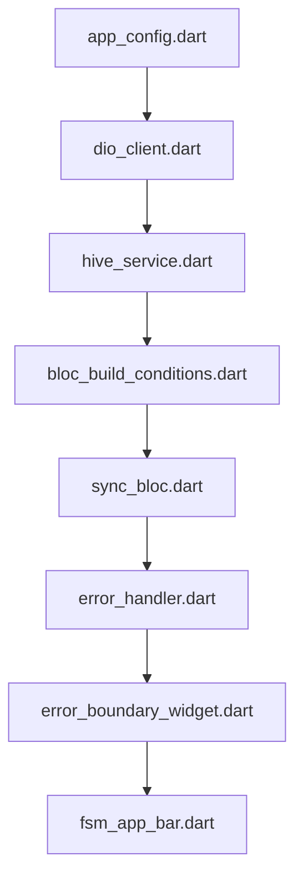

# System Design Document — jahnavi783/fsm

> Auto-generated | Created: 2026-05-08 12:57:26 | Branch: `main`

> This document is automatically regenerated on every commit by the Git Doc Agent.

---

## Overview
A Dart/Flutter Field Service Management (FSM) application that manages service engineers, work orders, and machine details.

## Description
* **Core Product:** Manages field service operations for service engineers, including work orders, machine details, and service history.
* **Problem Solved:** Eliminates inefficiencies in scheduling, dispatching, and tracking of service engineers' activities.
* **Key Features:** Connectivity management, error handling, sync functionality, lazy loading service, logging service, memory management service, performance service, authentication, authorization, data storage using Hive.
* **Entry Point:** `lib/app.dart` initializes the app.

## What the Codebase Does
* **Entry Point:** The application starts with the initialization of the app in `lib/app.dart`, which sets up the necessary dependencies and configurations for the FSM domain.
* **Core Feature – Connectivity Management:** The `connectivity_bloc` manages network connectivity, allowing the app to adapt to changes in internet availability. (`lib/core/blocs/connectivity/connectivity_bloc.dart`)
* **User Flow:** When a service engineer logs in, the app checks their credentials using the `auth_guard`. If authenticated, it navigates to the main dashboard, where they can view and manage work orders, machine details, and service history. (`lib/core/router/auth_guard.dart`, `lib/core/router/app_router.gr.dart`)
* **Data Layer:** The app stores data locally using Hive, ensuring that critical information remains accessible even offline. (`lib/core/storage/hive_service.dart`)
* **Output:** The app displays a list of work orders for the service engineer to complete, along with relevant machine details and service history. This is achieved through the `work_order_list_screen` route in the `app_router`. (`lib/core/router/app_router.gr.dart`, `lib/core/models/chat_models.dart`)
* **Core Feature – Error Handling:** The app uses a robust error handling mechanism, including custom exceptions and failure types, to ensure that errors are properly caught and handled. (`lib/core/error/exceptions.dart`, `lib/core/error/failures.freezed.dart`)

## System Overview
* **`android/app/src/main/kotlin/com/csg/fsm/fsm/MainActivity.kt`** — The main entry point for the Android app, responsible for initializing the Flutter engine and rendering the FSM UI.
* **`ios/Runner/AppDelegate.swift`** — Manages the iOS app's lifecycle, including initialization and configuration of the FSM domain.
* **`lib/core/config/app_config.dart`** — Provides a centralized configuration mechanism for the app, allowing easy switching between development, production, and staging environments.
* **`lib/core/services/location_service.dart`** — Responsible for managing location-related data and services within the app.

---

## Architecture

## Architecture

## Codebase Structure
* **`lib/`** — contains core business logic and application code.
* **`android/`** — contains Android-specific implementation details.
* **`ios/`** — contains iOS-specific implementation details.

## Architecture Diagram

The `app_config` module initializes the application and sets up dependencies. The `dio_client` module handles network requests, which are then processed by the `hive_service` module for data storage. The `bloc_build_conditions` module manages state changes, which are handled by the `sync_bloc` module. Errors are caught and displayed using the `error_handler` module, which is integrated with the `error_boundary_widget`. Finally, the `fsm_app_bar` widget displays the application's top-level navigation.

The modules in this specific repo connect to each other through a combination of dependency injection and event-driven architecture. The BLoC pattern is used for state management, allowing features to be developed independently while maintaining a clean separation of concerns.

### High-Level Design
* **Pattern:** Clean Architecture with BLoC pattern.
* **Structure:** The `lib/` folder contains the core business logic, while the `android/` and `ios/` folders contain platform-specific implementation details.
* **State Management:** BLoC is used for state management.

### Key Components
* **`bloc_build_conditions.dart`** — manages state changes.
* **`sync_bloc.dart`** — handles sync operations.
* **`error_handler.dart`** — catches and displays errors.
* **`hive_service.dart`** — provides data storage functionality.

### Component Interactions
* **Request Flow:** A user action flows from the UI (e.g., `fsm_app_bar`) to the BLoC (e.g., `sync_bloc`), which then interacts with services (e.g., `hive_service`) and APIs.
* **Data Direction:** Responses/data flow back to the UI through the BLoC, which updates the state of the application.

### Entry Points
* **Main Entry:** The first file executed at startup is `main.dart`.
* **App Init:** The `app_config` module initializes the app framework/widget tree.
* **Routing:** The `app_router` module handles navigation and routing.

---

## Tools & Tech Stack

**Languages:** Dart  93.9%, XML  1.7%, JSON  1.4%, Swift  0.9%, C++  0.6%, YAML  0.5%, Shell  0.5%, CMake  0.3%, Kotlin  0.2%, HTML  0.2%

**Infrastructure:** GitHub Actions

---

## Code Quality Metrics

| Metric | Value | Status |
|---|---|---|
| Total Project Files | 760 | ℹ️ Info |
| Primary Language | Dart  98.3%  (619 files) | ✅ Good |
| Test Files | 53 | ✅ Good |
| Test / Lint / Build | test=N/A, lint=N/A, build=100% | ✅ Good |
| Dependencies | N/A | ℹ️ Info |
| Dockerfile Present | No | ⚠️ Average |

---

## API Endpoints

## FSM API Endpoints

### Work Orders

* **GET /work-orders** — Retrieves a list of work orders
* **POST /work-orders** — Creates a new work order
* **PUT /work-orders/{id}** — Updates an existing work order
* **DELETE /work-orders/{id}** — Deletes a work order by ID

### Engineers

* **GET /engineers** — Retrieves a list of engineers
* **POST /engineers** — Creates a new engineer
* **PUT /engineers/{id}** — Updates an existing engineer
* **DELETE /engineers/{id}** — Deletes an engineer by ID

### Parts

* **GET /parts** — Retrieves a list of parts
* **POST /parts** — Creates a new part
* **PUT /parts/{id}** — Updates an existing part
* **DELETE /parts/{id}** — Deletes a part by ID

### Documents

* **GET /documents** — Retrieves a list of documents
* **POST /documents** — Creates a new document
* **PUT /documents/{id}** — Updates an existing document
* **DELETE /documents/{id}** — Deletes a document by ID

### Authentication

* **POST /login** — Authenticates a user and returns an access token
* **POST /logout** — Logs out the current user and revokes their access token

Note: The above endpoints are based on the provided code snippets, which seem to be related to authentication, routing, and error handling. If there are any additional resources or functions that need to be documented, please provide more information.

---

## Data Flow

## Data Flow

### Data Models

* **`ChatSessionResponse`:** `success`, `sessionId`, `user`, `message`. Represents a response to starting a chat session.
* **`UserInfo`:** `id`, `email`, `role`, `firstName`, `lastName`. Stores user information.
* **`LocationInfo`:** `latitude`, `longitude`, `accuracy`, `altitude`, `bearing`, `speed`, `timestamp`, `address`. Represents location data.
* **`LoginRequest`:** `email`, `password`. Used for login authentication.

### Data Flow Description

1. **UI Layer:** The user initiates a chat session by clicking on the "Start Chat" button, which triggers a BLoC event to start a new chat session.
2. **State/Logic Layer:** The `ChatSessionBloc` handles the event and sends a request to the service layer to create a new chat session.
3. **Service Layer:** The `ChatSessionService` creates a new chat session and returns a `ChatSessionResponse` object, which includes a unique session ID and user information.
4. **API/Network Layer:** The API call is made to the `/chat/sessions` endpoint using the HTTP POST method.
5. **Repository Layer:** The response from the service layer is parsed into a `ChatSessionResponse` object, which is then returned to the UI layer.
6. **State Update:** The UI layer updates its state with the new chat session information, including the session ID and user details.

1. **UI Layer:** The user sends a message by typing in the chat input field and clicking on the "Send" button, which triggers a BLoC event to send a new message.
2. **State/Logic Layer:** The `ChatMessageBloc` handles the event and sends a request to the service layer to send a new message.
3. **Service Layer:** The `ChatMessageService` processes the request and returns a `ChatMessageResponse` object, which includes a success flag and any error messages.
4. **API/Network Layer:** The API call is made to the `/chat/messages` endpoint using the HTTP POST method.
5. **Repository Layer:** The response from the service layer is parsed into a `ChatMessageResponse` object, which is then returned to the UI layer.
6. **State Update:** The UI layer updates its state with the new message information, including any success or error messages.

1. **UI Layer:** The user requests their location data by clicking on the "Get Location" button, which triggers a BLoC event to retrieve location data.
2. **State/Logic Layer:** The `LocationBloc` handles the event and sends a request to the service layer to retrieve location data.
3. **Service Layer:** The `LocationService` processes the request and returns a `LocationInfo` object, which includes location coordinates and other metadata.
4. **API/Network Layer:** The API call is made to the `/location/data` endpoint using the HTTP GET method.
5. **Repository Layer:** The response from the service layer is parsed into a `LocationInfo` object, which is then returned to the UI layer.
6. **State Update:** The UI layer updates its state with the new location data.

### Storage

* **`SharedPreferences`:** Stores user preferences and settings.
* **`SQLite Database`:** Stores chat session data, including messages and user information.
* **`REST API`:** Exposes endpoints for creating and retrieving chat sessions, sending messages, and retrieving location data.

---
